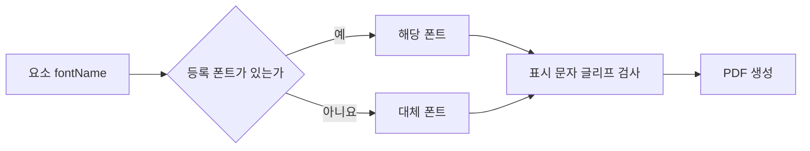

# DAT-009 이미지·에셋과 폰트

최종 갱신: 2026-09-28

## 개요

양식과 전표가 참조하는 이미지 자원과 실행 환경에서 주입하는 폰트의 구조, 확인 시점과 보존 원칙을
정의합니다.

## 변경 이력

| 날짜 | 구분 | 변경 내용 |
| --- | --- | --- |
| 2026-09-28 | 신규 작성 | 이미지 참조, 에셋, 변동 이미지와 폰트 제공 계약을 정의했습니다. |

## 소유 계층

양식은 이미지 참조와 폰트 이름만 보관합니다. 디자이너는 이미지 파일을 읽어 내장 값으로 바꾸고,
호스트와 MCP가 실행 시 폰트 바이트를 제공합니다. Core가 실제 이미지와 글리프를 확인합니다.

## 구조와 주요 항목

| 경로 | 자료형 | 필수 여부 | 기본값 | 허용 범위·형식 | 의미 |
| --- | --- | --- | --- | --- | --- |
| `assets[].id` | 문자열 | 에셋에 필수 | 없음 | 양식 안에서 고유 | `asset://` 참조 대상 이름 |
| `assets[].mimeType` | 문자열 | 에셋에 필수 | 없음 | `type/subtype` 형식 | 자원에 선언한 MIME |
| `assets[].src` | 문자열 | 에셋에 필수 | 없음 | 아래 세 이미지 참조 형식 | 실제 이미지 위치 또는 내장 값 |
| 이미지 data URI | 문자열 | 선택 | 이미지 없음 | PNG·JPEG Base64, 디코딩 후 2MiB 이하 | 파일에 포함한 이미지 |
| `asset://식별자` | 문자열 | 선택 | 없음 | 공백 없는 에셋 ID | 양식 에셋을 가리키는 고정 이미지 참조 |
| HTTP·HTTPS URL | 문자열 | 작성 중 양식에 선택 | 없음 | 공백 없는 절대 URL | 호스트가 내장하기 전 외부 이미지 위치 |
| `fontName` | 문자열 | 선택 | 대체 폰트 | 제공 목록의 이름 | 요소가 요청하는 글꼴 묶음 |
| 폰트 제공 항목 | 객체 | 실행 시 선택 | 동봉 폰트 | 이름, 바이트, 대체 여부 | 렌더러에 등록할 실제 폰트 |

## 데이터 관계

| 기준 데이터 | 대상 데이터 | 관계·개수 | 연결 키 | 삭제·변경 시 처리 |
| --- | --- | --- | --- | --- |
| 이미지 요소 | 에셋 | N:1 | `asset://` 뒤 ID | 사용 중인 에셋이 없으면 검증 또는 렌더링에 실패합니다. |
| 이미지 요소 | 전표 값 | N:0..1 | 이미지 파라미터 키 | 값이 비면 빈 이미지로 표시하고 잘못된 값은 오류로 처리합니다. |
| 글자 요소·셀 | 폰트 항목 | N:M | 폰트 이름과 변형 | 이름·변형이 없으면 정한 대체 규칙을 적용합니다. |

## 이미지 참조

에셋 항목은 고유한 ID와 이미지 `src`를 가집니다. `asset://` 참조 대상이 없거나 이미지가 아닌
데이터이면 검증 또는 렌더링에 실패합니다. 이미지 data URI는 선언한 MIME, 디코딩한 파일 서명과
바이트 상한이 모두 맞아야 합니다.

## 고정·변동 이미지

고정 이미지는 요소에 `src`를 저장합니다. 변동 이미지는 이미지 종류 파라미터를 참조하고 전표
`values`에서 data URI를 읽습니다. 두 값 소스는 함께 사용할 수 없습니다. 발행 전표는 모든 고정·변동
이미지를 내장해야 하며 외부 URL에 의존할 수 없습니다.

## 폰트

폰트 파일은 `.slip`에 넣지 않습니다. 요소에는 `fontName`만 저장하고 호스트가 `getFonts()` 또는
MCP 설정으로 실제 TTF·OTF 바이트를 제공합니다. 제공 목록에는 이름, 바이트와 선택적인 대체 폰트
표시가 있습니다.

등록되지 않은 이름은 대체 폰트를 사용하지만 원본 `fontName`은 바꾸지 않습니다. 실제 표시할 문자에
글리프가 없으면 요소 이름, 문자와 코드 포인트를 포함한 렌더링 오류가 발생합니다.

## 불변 조건

- 이미지 data URI는 선언 MIME, 디코딩한 파일 서명과 내용이 일치해야 합니다.
- 한 이미지의 디코딩 크기는 2MiB를 넘지 않습니다.
- 고정 이미지와 변동 이미지 값 소스는 한 요소에서 함께 사용할 수 없습니다.
- 발행 전표는 HTTP·HTTPS 이미지에 의존하지 않습니다.
- 폰트 바이트는 `.slip` 파일에 저장하지 않고 원본 폰트 이름은 대체 결과와 무관하게 보존합니다.

## 보안과 보존

이미지와 폰트에는 개인정보나 라이선스 제한이 있을 수 있으므로 호스트가 수집·배포 정책을 관리합니다.
읽기 요약이나 로그에는 Base64 전체 내용을 남기지 않습니다. Core 렌더러는 확인한 이미지 원본 문자열을
한 렌더링 실행 안에서 재사용하여 출력 페이지마다 다시 디코딩하지 않습니다.

## 생명주기

업로드한 이미지는 검증에 성공한 뒤 양식에 내장합니다. 양식 에셋은 참조하는 요소와 별도로 관리하며,
삭제 전 사용 여부를 확인합니다. 폰트 바이트는 실행 환경에서만 사용하고 `.slip`에 저장하지 않습니다.

## 버전·검증·정규화·마이그레이션

이미지는 참조 문자열 형식, Base64 문법, MIME, 파일 서명과 디코딩 크기 순서로 확인합니다. 폰트는
이름과 실제 바이트를 등록한 뒤 렌더할 모든 문자에 글리프가 있는지 확인합니다.

## 관련 설계와 근거

- 기능: FNC-011 이미지 확인과 해석, FNC-014 폰트 제공과 대체
- 오류: ERR-003
- 인터페이스: IF-001·IF-010
- [파일 형식 명세 7·12·19.1·20](../../SPEC.md)
- [ADR-014·036·040·042·081](../../DECISIONS.md)
