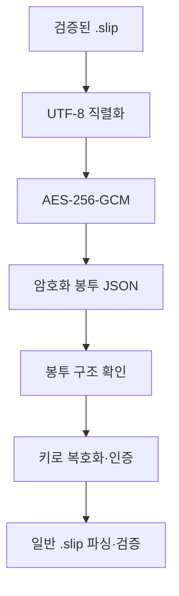

# DAT-010 암호화 봉투

최종 갱신: 2026-09-28

## 개요

일반 `.slip` JSON을 AES-256-GCM으로 보호하는 암호화 봉투와 키 종류, 복호화 검증 순서를
정의합니다.

## 변경 이력

| 날짜 | 구분 | 변경 내용 |
| --- | --- | --- |
| 2026-09-28 | 신규 작성 | 봉투 구조, 암호 알고리즘, 키 파생과 복호화 불변 조건을 정의했습니다. |

## 소유 계층

Core 암호화 계층이 봉투를 만들고 해석합니다. 저장소와 MCP는 설정된 키를 전달할 뿐 키와 평문을
파일, 목록 메타데이터나 로그에 기록하지 않습니다.

## 구조와 주요 항목

| 경로 | 자료형 | 필수 여부 | 기본값 | 허용 범위·형식 | 의미 |
| --- | --- | --- | --- | --- | --- |
| `slipkit` | 문자열 | 필수 | 없음 | `encrypted` | 암호화 봉투 판별값 |
| `v` | 정수 | 필수 | 없음 | 현재 `1` | 봉투 형식 버전 |
| `cipher` | 문자열 | 필수 | 없음 | `A256GCM` | 인증 암호 알고리즘 |
| `kdf` | 객체 | 문자열 키에 필수 | 원시 키에는 없음 | PBKDF2-SHA256, 16바이트 솔트, 600,000회 | 문자열에서 256비트 키를 만드는 정보 |
| `iv` | 문자열 | 필수 | 없음 | 무작위 12바이트의 패딩 없는 base64url | AES-GCM 초기화 벡터 |
| `data` | 문자열 | 필수 | 없음 | 암호문과 128비트 인증 태그의 패딩 없는 base64url | 보호한 UTF-8 `.slip` JSON |

## 데이터 관계

| 기준 데이터 | 대상 데이터 | 관계·개수 | 연결 키 | 삭제·변경 시 처리 |
| --- | --- | --- | --- | --- |
| 암호화 봉투 | 일반 `.slip` 파일 | 1:1 | 복호화한 `data` | 평문이 전체 검증을 통과해야 반환합니다. |
| 문자열 암호 문구 | `kdf` | 1:1 | 봉투 안 솔트와 반복 수 | 암호 문구를 바꾸면 새 봉투를 만들어야 합니다. |
| 현재 키 | 이전 키 목록 | 1:N | 시도 순서 | 키 불일치일 때만 다음 이전 키를 시도합니다. |

## 봉투 구조

암호화 봉투는 일반 `.slip` JSON Schema 대상이 아닙니다. `data`를 복호화한 UTF-8 JSON이 현재
`.slip` 검증을 통과해야 합니다.

## 키 종류

문자열 암호 문구는 NFC로 정규화한 UTF-8 바이트를 PBKDF2-SHA256, 무작위 16바이트 솔트와
600,000회 반복으로 파생합니다. 이때 봉투에 `kdf`를 포함합니다. 원시 키는 정확히 32바이트이고
`kdf`를 포함하지 않습니다.

## 암호화와 복호화

복호화는 현재 키를 먼저 시도하고 키 불일치일 때만 이전 키를 순서대로 시도합니다. 봉투 손상,
지원하지 않는 알고리즘과 복호화한 파일의 검증 실패는 다른 키로 넘어가지 않고 즉시 반환합니다.

## 불변 조건

- 새 봉투는 항상 무작위 IV를 사용하며 같은 파일과 키도 다른 암호문을 만듭니다.
- Base64url은 패딩 없이 저장하고 디코딩한 IV·솔트 길이를 확인합니다.
- 문자열 맨 앞 BOM 한 개는 읽을 때 제거하지만 쓰지 않습니다.
- 키와 평문 전체는 디스크 보조 파일, 목록 메타데이터와 로그에 남기지 않습니다.
- 암호화는 권한 관리, 서명과 감사 기록을 대신하지 않습니다.

## 생명주기

저장할 때마다 새 IV와 필요한 새 솔트로 봉투를 만듭니다. 읽을 때는 구조와 키 인증을 통과한 평문을
검증하고 즉시 호출자에게 반환합니다. 키 교체 뒤 새 저장은 현재 키만 사용하며 이전 키는 기존 봉투를
읽는 동안에만 사용합니다.

## 버전·검증·정규화·마이그레이션

봉투 판별값, 버전, 알고리즘, KDF 조합과 디코딩 길이를 복호화 전에 검사합니다. 지원하지 않는 봉투를
일반 파일이나 다른 암호 방식으로 추정하지 않습니다. 복호화한 문자열의 맨 앞 BOM 한 개만 제거합니다.

## 관련 설계와 근거

- 기능: FNC-015 파일 암호화와 키 교체
- 공통: SYS-004·SYS-006
- 오류: ERR-004
- [파일 형식 명세 21](../../SPEC.md)
- [ADR-053~056·064](../../DECISIONS.md)
- `packages/core/src/encryption/`
