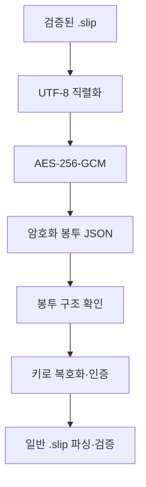

# DAT-010 암호화 봉투

최종 갱신: 2026-09-28

## 개요

일반 `.slip` JSON을 AES-256-GCM으로 보호하는 암호화 봉투와 키 종류, 복호화 검증 순서를
정의합니다.

## 변경 이력

| 날짜 | 구분 | 변경 내용 |
| --- | --- | --- |
| 2026-09-28 | 신규 작성 | 봉투 구조, 암호 알고리즘, 키 파생과 복호화 불변 조건을 정의했습니다. |

## 봉투 구조

| 항목 | 값 또는 역할 |
| --- | --- |
| `slipkit` | 항상 `encrypted`입니다. |
| `v` | 봉투 버전이며 현재 `1`입니다. |
| `cipher` | 항상 `A256GCM`입니다. |
| `kdf` | 문자열 암호 문구를 쓸 때 PBKDF2 정보입니다. |
| `iv` | 무작위 12바이트 초기화 벡터의 base64url입니다. |
| `data` | 암호문과 128비트 인증 태그의 base64url입니다. |

암호화 봉투는 일반 `.slip` JSON Schema 대상이 아닙니다. `data`를 복호화한 UTF-8 JSON이 현재
`.slip` 검증을 통과해야 합니다.

## 키 종류

문자열 암호 문구는 NFC로 정규화한 UTF-8 바이트를 PBKDF2-SHA256, 무작위 16바이트 솔트와
600,000회 반복으로 파생합니다. 이때 봉투에 `kdf`를 포함합니다. 원시 키는 정확히 32바이트이고
`kdf`를 포함하지 않습니다.

## 암호화와 복호화

복호화는 현재 키를 먼저 시도하고 키 불일치일 때만 이전 키를 순서대로 시도합니다. 봉투 손상,
지원하지 않는 알고리즘과 복호화한 파일의 검증 실패는 다른 키로 넘어가지 않고 즉시 반환합니다.

## 불변 조건

- 새 봉투는 항상 무작위 IV를 사용하며 같은 파일과 키도 다른 암호문을 만듭니다.
- Base64url은 패딩 없이 저장하고 디코딩한 IV·솔트 길이를 확인합니다.
- 문자열 맨 앞 BOM 한 개는 읽을 때 제거하지만 쓰지 않습니다.
- 키와 평문 전체는 디스크 보조 파일, 목록 메타데이터와 로그에 남기지 않습니다.
- 암호화는 권한 관리, 서명과 감사 기록을 대신하지 않습니다.

## 관련 설계와 근거

- 기능: FNC-015 파일 암호화와 키 교체
- 공통: SYS-004·SYS-006
- 오류: ERR-004
- [파일 형식 명세 21](../../SPEC.md)
- [ADR-053~056·064](../../DECISIONS.md)
- `packages/core/src/encryption/`
