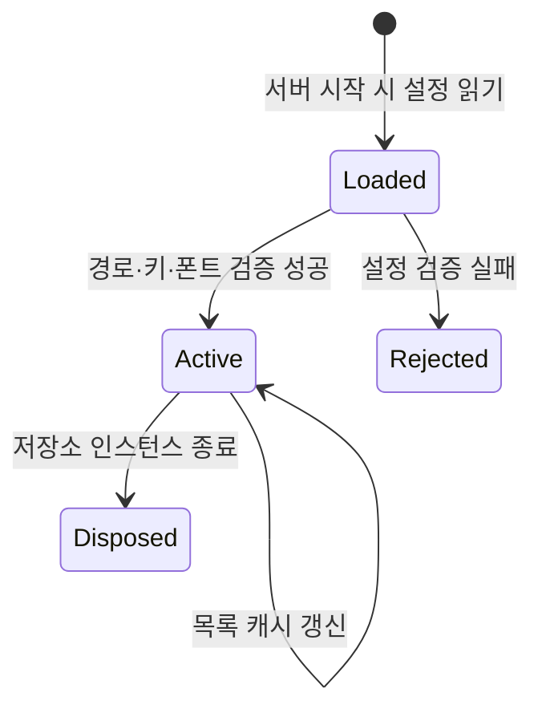

# DAT-011 저장 메타데이터와 MCP 설정

최종 갱신: 2026-09-28

## 개요

저장소 목록에서 사용하는 최소 메타데이터와 로컬 MCP 서버의 실행 설정을 정의합니다. 파일 본문과
암호화 키는 목록 자료나 설정 파일에 보관하지 않습니다.

## 변경 이력

| 날짜 | 구분 | 변경 내용 |
| --- | --- | --- |
| 2026-09-28 | 신규 작성 | 저장 목록 항목, 페이지 커서, MCP 설정과 목록 캐시 자료를 정의했습니다. |

## 소유 계층

각 저장소 구현이 목록 메타데이터와 커서를 만들고 MCP 서버가 로컬 설정을 읽어 저장소, 폰트와 암호화
기능을 구성합니다. 파일 본문, 복호화한 평문과 키는 이 데이터에 포함하지 않습니다.

## 구조와 주요 항목

| 경로 | 자료형 | 필수 여부 | 기본값 | 허용 범위·형식 | 의미 |
| --- | --- | --- | --- | --- | --- |
| 목록 `id` | 문자열 | 필수 | 없음 | 저장소가 정한 불투명 식별자 | 불러오기·저장·삭제 대상 |
| 목록 `kind` | 문자열 | 필수 | 없음 | `template` 또는 `voucher` | 파일 종류 필터 |
| 목록 `title` | 문자열 | 필수 | 없음 | 양식 메타데이터 제목 | 사용자와 AI가 파일을 구분할 이름 |
| 목록 `updatedAt` | 문자열 | 선택 | 알 수 없음 | 저장소가 제공하는 일시 | 최근 수정순 정렬 자료 |
| 목록 `nextCursor` | 문자열 | 선택 | 마지막 페이지 | 같은 저장소 구현만 해석 | 다음 목록 페이지 시작점 |
| 설정 `rootDir` | 문자열 | 선택 | 현재 작업 디렉터리 | 존재하는 디렉터리 경로 | `.slip` 파일을 읽고 쓸 경계 |
| 설정 `locale` | 비어 있지 않은 문자열 | 선택 | 지정하지 않음 | BCP 47 로케일 권장 | 오류 문구와 동봉 대체 폰트 선택 기준 |
| 설정 `fonts` | 배열 | 선택 | 폰트 없음 | 이름·파일 경로·대체 여부 | PDF에 등록할 로컬 폰트 |
| 설정 `httpPort` | 정수 | 선택 | 서버를 열지 않음 | 1~65,535 | PDF 링크 서버 시작 포트 |
| 설정 `encryption.keyEnv` | 문자열 | 선택 | `SLIPKIT_MCP_KEY` | 비어 있지 않은 환경변수 이름 | 현재 키를 읽을 위치 |
| 설정 `encryption.previousKeysEnv` | 문자열 | 선택 | `SLIPKIT_MCP_PREVIOUS_KEYS` | 비어 있지 않은 환경변수 이름 | 쉼표로 구분한 이전 키 목록을 읽을 위치 |

## 데이터 관계

| 기준 데이터 | 대상 데이터 | 관계·개수 | 연결 키 | 삭제·변경 시 처리 |
| --- | --- | --- | --- | --- |
| 목록 항목 | 저장 파일 | 1:1 | 목록 `id` | 파일이 없어지면 다음 목록에서 항목도 제외합니다. |
| 목록 커서 | 필터 조건 | 1:1 | 저장소가 발급한 값 | 다른 필터나 구현에 재사용하면 잘못된 커서 오류입니다. |
| 설정 파일 | 환경변수 | 1:N | 키 변수 이름 | 변수가 없거나 비면 서버 시작을 중단합니다. |
| 목록 캐시 | 파일 상태 | 1:1 | 경로와 상태 식별값 | 상태가 달라지면 메타데이터를 다시 읽습니다. |

## 저장 목록 데이터

목록은 종류와 검색어 필터, 불투명한 커서를 받을 수 있고 다음 페이지 커서를 선택적으로 반환합니다.
본문은 `load()`에서만 반환합니다. 저장소가 지원하지 않는 동작과 없음·입출력·취소 오류는 구분합니다.

## 파일 시스템 목록 캐시

MCP `FileSystemStorage`는 인스턴스 안에서 파일 경로와 `lstat` 지문을 키로 메타데이터 또는 제외
결과를 재사용합니다. 지문은 장치, inode, 크기, 나노초 수정·변경 시각과 모드를 포함합니다. 전체
파일, 복호화한 평문과 키는 캐시하지 않습니다.

각 목록 호출은 이름 탐색과 최대 32개 동시 `lstat`을 다시 수행합니다. 지문이 같은 파일만 본문
읽기·복호화·파싱을 생략합니다. 저장·삭제와 외부 생성·수정·교체·삭제·이름 변경은 다음 탐색에서
반영되며 인스턴스별 키 구성은 서로 격리됩니다.

## MCP 설정 파일

`slipkit-mcp.json`은 다음 항목을 선택적으로 가집니다.

| 항목 | 설명 |
| --- | --- |
| `rootDir` | `.slip` 파일을 읽고 쓸 작업 디렉터리입니다. |
| `locale` | 오류 메시지와 동봉 대체 폰트를 고르는 로케일입니다. `ja`로 시작하면 일본어 폰트를, 그 밖에는 한국어 폰트를 사용하며 지원하지 않는 오류 문구는 영문으로 대체합니다. |
| `fonts` | 이름, 파일 경로와 선택적 대체 폰트 표시입니다. |
| `httpPort` | PDF 링크 서버가 사용할 `127.0.0.1` 포트입니다. 생략하면 링크 서버를 열지 않습니다. |
| `encryption.keyEnv` | 현재 키를 읽을 환경변수 이름입니다. |
| `encryption.previousKeysEnv` | 쉼표로 구분한 이전 키 목록의 환경변수 이름입니다. |

CLI 인자는 설정 파일보다 우선합니다. 키 값은 설정 파일에 적지 않고 환경변수에서 읽습니다. 명시한
키 변수가 없거나 비어 있으면 시작 단계에서 오류가 발생합니다. 상대 폰트 경로는 설정 파일 위치를
기준으로 해석합니다.

## 불변 조건

- 목록 항목과 캐시는 전체 파일 본문, 복호화한 평문과 암호화 키를 포함하지 않습니다.
- 목록 커서는 발급한 저장소 구현과 필터 조합 밖에서 의미를 갖지 않습니다.
- 파일 시스템 캐시는 인스턴스 사이에서 공유하거나 디스크에 기록하지 않습니다.
- 키 값은 설정 파일이 아니라 지정한 환경변수에서만 읽습니다.
- 작업 디렉터리 밖의 경로와 심볼릭 링크 대상은 파일 작업 대상으로 사용하지 않습니다.

## 생명주기

설정은 서버 시작 때 읽고 검증합니다. 작업 디렉터리가 없거나 디렉터리가 아니면 시작하지 않습니다.
캐시는 `FileSystemStorage` 인스턴스와 함께 사라지며 디스크 sidecar, 전역 캐시와 `fs.watch`를
사용하지 않습니다.

## 버전·검증·정규화·마이그레이션

CLI 인자를 설정 파일 위에 덮어쓴 뒤 경로, 포트, 로케일, 폰트와 환경변수 키를 검증합니다. 문자열
이전 키는 쉼표로 나누고 각 항목의 공백을 정리한 뒤 FNC-015의 키 형식으로 확인합니다. 알 수 없는
설정 필드와 잘못된 키는 첫 파일 복호화까지 미루지 않고 서버 시작 단계에서 알립니다.

## 관련 설계와 근거

- 기능: FNC-016·FNC-024·FNC-025
- 인터페이스: IF-003·IF-009·IF-010
- 오류: ERR-004·ERR-005
- [아키텍처 3.4·10·12](../../ARCHITECTURE.md)
- `packages/core/src/storage/adapter.ts`
- `packages/mcp/src/config.ts`, `packages/mcp/src/storage.ts`
