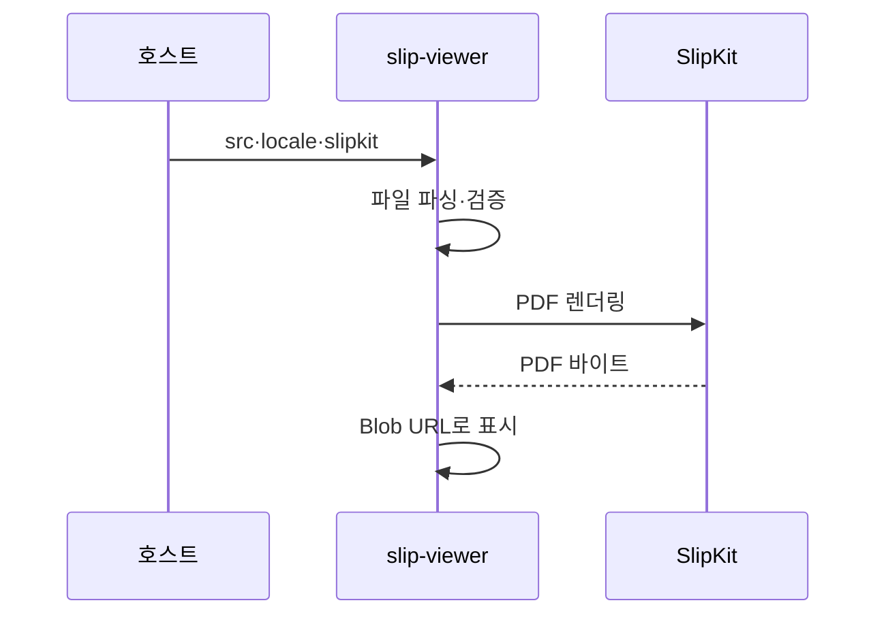

# IF-007 `<slip-viewer>`

최종 갱신: 2026-09-28

## 개요

양식 또는 전표를 읽기 전용 PDF 화면으로 표시하는 Web Component의 입력과 생명주기를 정의합니다.

## 변경 이력

| 날짜 | 구분 | 변경 내용 |
| --- | --- | --- |
| 2026-09-28 | 신규 작성 | 뷰어의 입력, PDF 표시, 무결성 경계와 오류 처리를 정의했습니다. |

## 제공자와 소비자

Elements 패키지가 제공하고 PDF 읽기 화면을 포함하는 호스트와 프레임워크 래퍼가 소비합니다. 뷰어는
입력 파일을 표시하기만 하며 호스트 데이터와 파일을 변경하지 않습니다.

## 호출 방향과 사용 조건

요소를 연결한 뒤 양식 또는 전표 JSON과 선택적인 로케일·SlipKit 인스턴스를 전달합니다. 호스트는
업무상 신뢰할 수 있는 파일인지 별도로 판단하고 뷰어는 형식과 렌더링 가능 여부를 확인합니다.

## 입력·출력 또는 이벤트 계약

| 이름 | 방향 | 호출·발생 시점 | 입력·상세 자료형 | 반환·전달값 | 생략·오류 처리 |
| --- | --- | --- | --- | --- | --- |
| `src` | 호스트→요소 | 최초 연결 또는 표시 파일 변경 | 양식·전표 `.slip` JSON 문자열 | PDF 미리보기 | 없으면 빈 상태, 손상 파일이면 오류 화면 |
| `locale` | 호스트→요소 | 연결 전후 | 로케일 문자열 | 화면 문구 변경 | 생략하면 SlipKit 로케일 또는 기본값 |
| `slipkit` | 호스트→요소 | 연결 전후 | `SlipKit` 인스턴스 | PDF·폰트 설정 공유 | 생략하면 기본 인스턴스 사용 |

뷰어는 값을 편집하거나 발행 상태를 바꾸지 않으며 변경 이벤트를 제공하지 않습니다.

## 표시 흐름

새 입력이나 설정이 오면 이전 미리보기 요청을 무효화하고 Blob URL을 정리합니다. 늦게 끝난 이전
렌더링 결과가 최신 화면을 덮지 않습니다.

## 동기·비동기 처리

파일 파싱은 입력 갱신 안에서 수행하고 PDF 생성은 비동기로 실행합니다. PDF 생성 중에는 진행 상태를
표시하며 현재 요청과 일치하는 성공 또는 오류만 화면에 반영합니다.

## 양식과 전표 표시

양식은 빈 값으로 렌더링합니다. 전표는 `templateSnapshot`과 `values`를 사용합니다. 발행 상태는 화면
표시 데이터를 바꾸지 않지만 호스트가 전표 상태를 구분하는 근거가 됩니다.

## 생명주기

연결할 때 첫 입력을 렌더링하고 새 입력·설정에는 새 PDF를 만듭니다. 교체 전 기존 Blob URL을 해제하고
연결 해제 때 진행 중인 결과를 무효로 만들며 남은 URL과 리스너를 정리합니다.

## 반복 호출·동시 호출

입력 세대마다 렌더 요청을 하나만 유지합니다. 같은 문자열을 다시 설정해도 사용자가 볼 파일 의미가
달라지지 않으며, 동시에 끝난 결과 가운데 최신 세대만 표시합니다.

## 오류 처리

파싱·검증 또는 렌더링이 실패하면 PDF 대신 로케일화된 오류를 표시합니다. 뷰어는 발행자의 신원,
전자서명이나 외부 감사 기록을 검증하지 않습니다. 호스트가 신뢰한 파일만 전달하고 업무상 무결성
검사를 별도로 적용합니다.

## 호환성·보안·확장 경계

세 입력 프로퍼티와 읽기 전용 동작이 공개 계약입니다. PDF 표시용 내부 요소와 Blob URL은 공개하지
않습니다. 뷰어는 외부 이미지 URL을 대신 가져오거나 파일의 발행자를 신뢰한다고 표시하지 않습니다.

## 관련 설계와 근거

- 화면: SCR-015
- 기능: FNC-013·FNC-022
- 데이터: DAT-003·DAT-009
- 오류: ERR-001·ERR-003·ERR-005
- `packages/elements/src/slip-viewer.ts`
