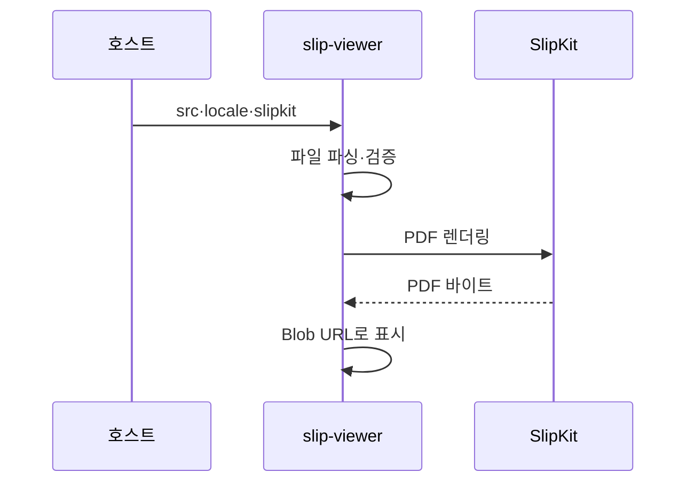

# IF-007 `<slip-viewer>`

최종 갱신: 2026-09-28

## 개요

양식 또는 전표를 읽기 전용 PDF 화면으로 표시하는 Web Component의 입력과 생명주기를 정의합니다.

## 변경 이력

| 날짜 | 구분 | 변경 내용 |
| --- | --- | --- |
| 2026-09-28 | 신규 작성 | 뷰어의 입력, PDF 표시, 무결성 경계와 오류 처리를 정의했습니다. |

## 입력 계약

`src`는 양식 또는 전표의 직렬화 JSON입니다. `locale`과 `slipkit`은 IF-004의 공통 우선순위를
따릅니다. 뷰어는 값을 편집하거나 발행 상태를 바꾸지 않으며 변경 이벤트를 제공하지 않습니다.

## 표시 흐름

새 입력이나 설정이 오면 이전 미리보기 요청을 무효화하고 Blob URL을 정리합니다. 늦게 끝난 이전
렌더링 결과가 최신 화면을 덮지 않습니다.

## 양식과 전표 표시

양식은 빈 값으로 렌더링합니다. 전표는 `templateSnapshot`과 `values`를 사용합니다. 발행 상태는 화면
표시 데이터를 바꾸지 않지만 호스트가 전표 상태를 구분하는 근거가 됩니다.

## 오류 처리

파싱·검증 또는 렌더링이 실패하면 PDF 대신 로케일화된 오류를 표시합니다. 뷰어는 발행자의 신원,
전자서명이나 외부 감사 기록을 검증하지 않습니다. 호스트가 신뢰한 파일만 전달하고 업무상 무결성
검사를 별도로 적용합니다.

## 관련 설계와 근거

- 화면: SCR-015
- 기능: FNC-013·FNC-022
- 데이터: DAT-003·DAT-009
- 오류: ERR-001·ERR-003·ERR-005
- `packages/elements/src/slip-viewer.ts`
