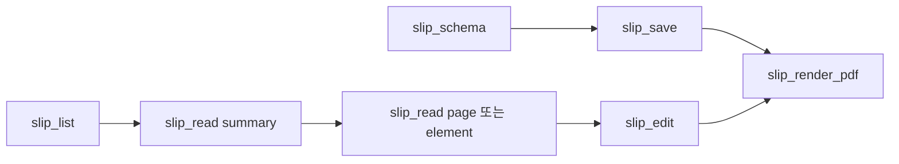

# IF-009 MCP 도구 계약

최종 갱신: 2026-09-28

## 개요

AI가 작업 디렉터리의 `.slip` 파일을 조회·생성·수정하고 전표와 PDF를 만들 때 사용하는 7개 MCP
도구와 JSON Schema 리소스의 계약을 정의합니다.

## 변경 이력

| 날짜 | 구분 | 변경 내용 |
| --- | --- | --- |
| 2026-09-28 | 신규 작성 | MCP 도구 입력, 출력, 변경 원자성과 발행 전표 제한을 정의했습니다. |

## 제공자와 소비자

MCP 패키지가 도구와 스키마 리소스를 제공하고 MCP 호환 AI 클라이언트가 소비합니다. 도구는 작업
디렉터리 경계 안의 파일만 다루며 AI가 파일 형식과 경로 보안을 대신 판단하게 하지 않습니다.

## 호출 방향과 사용 조건

클라이언트가 서버 연결 뒤 도구 목록과 스키마 리소스를 확인하고 도구별 JSON 입력을 전달합니다. 변경
도구를 호출하기 전에 목록과 부분 읽기로 최신 파일 ID와 대상 구조를 확인합니다.

## 입력·출력 또는 이벤트 계약

| 이름 | 방향 | 호출·발생 시점 | 입력·상세 자료형 | 반환·전달값 | 생략·오류 처리 |
| --- | --- | --- | --- | --- | --- |
| `slip_list` | 클라이언트→서버 | 파일 탐색 | 종류·검색어·불투명 커서 | 최대 50개 목록과 다음 커서 | 필터 생략 시 전체, 잘못된 커서는 도구 오류 |
| `slip_read` | 클라이언트→서버 | 파일 구조 확인 | ID와 `summary`, `element`, `page`, `full` 범위 | 구조 데이터와 설명 텍스트 | 대상 범위·ID가 없으면 도구 오류 |
| `slip_save` | 클라이언트→서버 | 새 전체 파일 저장 | ID, 전체 파일, 덮어쓰기 여부 | 저장한 파일의 요약 | 기존 파일 덮어쓰기는 명시하지 않으면 거부 |
| `slip_edit` | 클라이언트→서버 | 기존 양식 부분 변경 | ID와 순서가 있는 편집 연산 | 검증·저장한 파일 요약 | 한 연산이라도 실패하면 전체 저장 취소 |
| `slip_build_voucher` | 클라이언트→서버 | 양식에서 전표 작성 | 양식 ID, 값, 저장 ID | 미발행 전표 요약 | 발행 전표 생성·교체는 거부 |
| `slip_render_pdf` | 클라이언트→서버 | 파일 출력 확인 | 파일 ID, PDF 경로, 선택적 미리보기 페이지 | PDF 경로·링크와 선택적 PNG | 범위 밖 경로·페이지는 거부 |
| `slip_schema` | 클라이언트→서버 | 작성 전 형식 확인 | 선택적 주제 | 주제별 안내 또는 전체 JSON Schema | 모르는 주제는 도구 오류 |
| `slip://schema` | 서버→클라이언트 | 리소스 읽기 | 리소스 URI | 현재 JSON Schema | 항상 `application/schema+json` |

`slip://schema` 리소스는 현재 `.slip` JSON Schema를 `application/schema+json`으로 제공합니다.

## 권장 호출 흐름

새 양식은 필요한 스키마 주제를 확인한 뒤 완성된 파일을 저장합니다. 기존 파일은 요약으로 ID와 구조를
확인하고 필요한 부분만 읽은 뒤 표적 편집을 적용합니다.

## 읽기와 민감 데이터

`slip_read`는 Base64 payload가 있는 실제 data URL만 크기 표시로 바꿉니다. `data:`로 시작하더라도
일반 문자열이면 그대로 반환합니다. 요약은 페이지, 요소 ID·종류·위치, 파라미터와 에셋 구조를
제공하고 전체 이미지 본문은 반환하지 않습니다.

## 변경 원자성

같은 파일을 다루는 작업은 경로별 큐에서 직렬 실행합니다. `slip_edit`는 복사본에 연산을 순서대로
적용한 뒤 전체 검증이 성공할 때만 원자적으로 저장합니다. 이미지 입력은 작업 루트 안의 PNG·JPEG
파일 경로로 받고 확장자뿐 아니라 서명과 크기를 검사합니다.

발행 전표는 만들거나 교체하거나 수정할 수 없습니다. MCP는 전표를 발행하지 않으며
`slip_build_voucher`는 항상 미발행 전표를 만듭니다.

## 동기·비동기 처리

모든 도구 호출은 비동기 결과를 반환합니다. 파일 읽기, 검증, 이미지 처리와 PDF 생성이 끝난 뒤 한 번의
성공 응답을 만들며 진행 중인 부분 결과를 노출하지 않습니다.

## 생명주기

도구 집합은 MCP 서버를 만들 때 저장소와 SlipKit 인스턴스에 연결합니다. 서버 종료 시 파일 큐, 목록
캐시와 PDF 링크 서버를 정리합니다. 스키마 리소스는 서버 수명 동안 현재 버전을 유지합니다.

## 반복 호출·동시 호출

같은 파일의 변경은 경로별 큐에서 순서대로 처리하고 다른 파일은 동시에 처리할 수 있습니다. 같은 파일
분석이 겹치면 진행 중인 읽기를 공유할 수 있으나 반환 객체는 호출별로 분리합니다. 읽기와 목록 호출은
파일을 바꾸지 않습니다.

## 오류 처리

도구 실패는 `isError: true`인 텍스트 응답으로 원인을 반환하고 부분 결과를 저장하지 않습니다. 파일
없음, 경로 위반, 스키마 오류, 이미지 오류와 렌더링 오류를 AI가 수정할 수 있는 문장으로 설명합니다.

## 호환성·보안·확장 경계

도구 이름, 입력 스키마, 구조화 결과와 리소스 URI가 공개 계약입니다. 도구 추가는 가능하지만 기존 필수
입력과 의미를 바꾸지 않습니다. 경로, 파일, 이미지와 편집 연산은 신뢰하지 않으며 작업 루트 경계와
전체 파일 검증을 모두 통과해야 합니다.

## 관련 설계와 근거

- 기능: FNC-024·FNC-025
- 데이터: DAT-011
- 오류: ERR-005
- `packages/mcp/src/server.ts`
- `packages/mcp/src/edit.ts`
