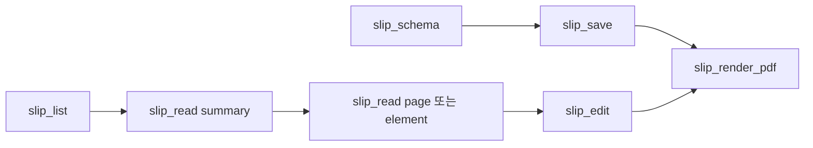

# IF-009 MCP 도구 계약

최종 갱신: 2026-09-28

## 개요

AI가 작업 디렉터리의 `.slip` 파일을 조회·생성·수정하고 전표와 PDF를 만들 때 사용하는 7개 MCP
도구와 JSON Schema 리소스의 계약을 정의합니다.

## 변경 이력

| 날짜 | 구분 | 변경 내용 |
| --- | --- | --- |
| 2026-09-28 | 신규 작성 | MCP 도구 입력, 출력, 변경 원자성과 발행 전표 제한을 정의했습니다. |

## 도구 목록

| 도구 | 성격 | 주요 계약 |
| --- | --- | --- |
| `slip_list` | 읽기 | 종류·검색어·커서로 최대 50개 목록 항목을 반환합니다. |
| `slip_read` | 읽기 | 요약, 요소, 페이지 또는 전체 파일을 반환합니다. |
| `slip_save` | 변경 | 새 전체 파일을 검증해 저장하며 덮어쓰기는 명시해야 합니다. |
| `slip_edit` | 변경 | ID·키·페이지를 대상으로 여러 연산을 순서대로 적용합니다. |
| `slip_build_voucher` | 변경 | 양식과 값으로 미발행 전표를 저장합니다. |
| `slip_render_pdf` | 변경 | PDF를 저장하고 선택적으로 한 페이지 PNG 미리보기를 반환합니다. |
| `slip_schema` | 읽기 | 주제별 작성 안내 또는 전체 JSON Schema를 반환합니다. |

`slip://schema` 리소스는 현재 `.slip` JSON Schema를 `application/schema+json`으로 제공합니다.

## 권장 호출 흐름

새 양식은 필요한 스키마 주제를 확인한 뒤 완성된 파일을 저장합니다. 기존 파일은 요약으로 ID와 구조를
확인하고 필요한 부분만 읽은 뒤 표적 편집을 적용합니다.

## 읽기와 민감 데이터

`slip_read`는 Base64 payload가 있는 실제 data URL만 크기 표시로 바꿉니다. `data:`로 시작하더라도
일반 문자열이면 그대로 반환합니다. 요약은 페이지, 요소 ID·종류·위치, 파라미터와 에셋 구조를
제공하고 전체 이미지 본문은 반환하지 않습니다.

## 변경 원자성

같은 파일을 다루는 작업은 경로별 큐에서 직렬 실행합니다. `slip_edit`는 복사본에 연산을 순서대로
적용한 뒤 전체 검증이 성공할 때만 원자적으로 저장합니다. 이미지 입력은 작업 루트 안의 PNG·JPEG
파일 경로로 받고 확장자뿐 아니라 서명과 크기를 검사합니다.

발행 전표는 만들거나 교체하거나 수정할 수 없습니다. MCP는 전표를 발행하지 않으며
`slip_build_voucher`는 항상 미발행 전표를 만듭니다.

## 오류 처리

도구 실패는 `isError: true`인 텍스트 응답으로 원인을 반환하고 부분 결과를 저장하지 않습니다. 파일
없음, 경로 위반, 스키마 오류, 이미지 오류와 렌더링 오류를 AI가 수정할 수 있는 문장으로 설명합니다.

## 관련 설계와 근거

- 기능: FNC-024·FNC-025
- 데이터: DAT-011
- 오류: ERR-005
- `packages/mcp/src/server.ts`
- `packages/mcp/src/edit.ts`
