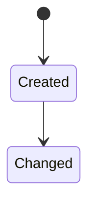

# DAT-### 데이터 설계 제목

최종 갱신: YYYY-MM-DD

## 개요

데이터의 목적, 소유 계층과 적용 범위를 설명합니다.

## 변경 이력

| 날짜 | 구분 | 변경 내용 |
| --- | --- | --- |
| YYYY-MM-DD | 신규 작성 | 작성한 구조, 관계와 생명주기를 구체적으로 요약합니다. |

## 소유 계층

생성, 변경과 삭제를 책임지는 계층을 각각 적습니다.

## 구조와 주요 항목

| 경로 | 자료형 | 필수 여부 | 기본값 | 허용 범위·형식 | 의미 |
| --- | --- | --- | --- | --- | --- |
| 필드 경로 | 실제 자료형 | 필수·선택 | 생략 시 값 | 길이, 범위, 열거값 | 업무상 의미 |

## 데이터 관계

| 기준 데이터 | 대상 데이터 | 관계·개수 | 연결 키 | 삭제·변경 시 처리 |
| --- | --- | --- | --- | --- |
| 소유자 | 참조 대상 | 1:1, 1:N 등 | 연결 기준 | 연쇄 변경 또는 보존 규칙 |

## 불변 조건

저장 시점마다 반드시 지켜야 하는 고유성, 참조, 합계와 범위 조건을 적습니다.

## 생명주기

각 전이의 주체, 시작 조건, 변경 필드와 되돌릴 수 있는 범위를 적습니다.

## 버전·검증·정규화·마이그레이션

검증 순서, 정규화 전후 값과 지원 버전 사이의 변환 규칙을 적습니다.

## 관련 기능·인터페이스·오류

## 근거
