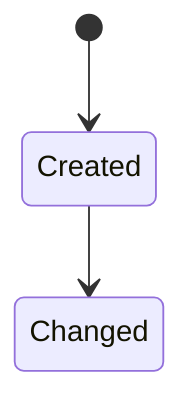

# DAT-### 데이터 설계 제목

최종 갱신: YYYY-MM-DD

## 개요

데이터의 목적, 소유 계층과 적용 범위를 설명합니다.

## 변경 이력

| 날짜 | 구분 | 변경 내용 |
| --- | --- | --- |
| YYYY-MM-DD | 신규 작성 | 작성한 구조, 관계와 생명주기를 구체적으로 요약합니다. |

## 소유 계층

## 구조와 주요 항목

## 데이터 관계

## 불변 조건

## 생명주기

## 버전·검증·정규화·마이그레이션

## 관련 기능·인터페이스·오류

## 근거
