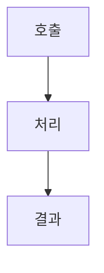

# FNC-### 기능 설계 제목

최종 갱신: YYYY-MM-DD

## 개요

기능의 목적, 호출 주체와 적용 범위를 설명합니다.

## 변경 이력

| 날짜 | 구분 | 변경 내용 |
| --- | --- | --- |
| YYYY-MM-DD | 신규 작성 | 작성한 처리 흐름, 분기와 오류 처리를 구체적으로 요약합니다. |

## 호출 조건

호출 주체, 시작 조건과 이 기능이 맡지 않는 범위를 구분해 적습니다.

## 입력·출력

| 구분 | 항목 | 자료형·단위 | 필수 여부·기본값 | 제약과 보장 |
| --- | --- | --- | --- | --- |
| 입력 | 입력 이름과 출처 | 실제 자료형과 단위 | 필수 여부와 생략 시 값 | 허용 범위와 정규화 규칙 |
| 출력 | 결과 이름과 전달 대상 | 실제 자료형과 단위 | 반환 또는 발생 조건 | 성공 시 보장하는 값 |

## 사전·사후 조건

실행 전 반드시 성립할 조건과 성공 뒤 반드시 성립할 조건을 분리해 적습니다.

## 정상 처리 흐름

| 순서 | 처리 | 읽는 값 | 만드는 값·변경하는 값 | 다음 단계 |
| --- | --- | --- | --- | --- |
| 1 | 추측 없이 구현할 수 있는 처리 | 입력 또는 기존 상태 | 중간 결과 또는 새 상태 | 분기나 다음 순서 |

## 분기와 예외 흐름

| 분기 조건 | 처리 | 반환·표시 결과 | 유지하는 값 | 재시도 지점 |
| --- | --- | --- | --- | --- |
| 조건을 정확히 적습니다. | 실행할 처리를 적습니다. | 호출자가 받는 결과 | 실패해도 바꾸지 않는 값 | 다시 시작할 단계 |

## 데이터 조회·변경

조회 대상, 변경 필드, 원자성 경계와 다른 데이터에 미치는 영향을 적습니다.

## 하위 기능과 시퀀스

하위 기능의 호출 순서와 각 호출 사이에 넘기는 값을 적습니다.

## 오류·복구

오류를 검출하는 단계, 오류 정보, 부분 결과 처리와 재시도 방법을 적습니다.

## 동시 실행·반복 호출

같은 요청을 반복하거나 여러 요청이 겹칠 때 공유하는 값, 버리는 결과와 최종 상태를 적습니다.

## 검증 기준

정상, 경계, 오류와 동시 실행 사례를 입력과 기대 결과가 드러나게 적습니다.

## 관련 설계와 근거
