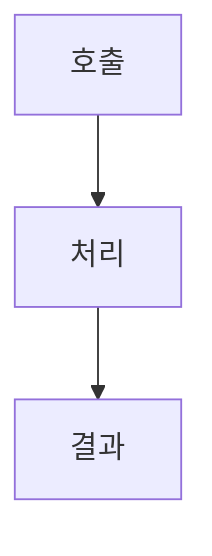

# FNC-### 기능 설계 제목

최종 갱신: YYYY-MM-DD

## 개요

기능의 목적, 호출 주체와 적용 범위를 설명합니다.

## 변경 이력

| 날짜 | 구분 | 변경 내용 |
| --- | --- | --- |
| YYYY-MM-DD | 신규 작성 | 작성한 처리 흐름, 분기와 오류 처리를 구체적으로 요약합니다. |

## 호출 조건

## 입력·출력

| 구분 | 항목 | 조건 |
| --- | --- | --- |
| 입력 | 입력을 설명합니다. | 제약을 설명합니다. |
| 출력 | 출력을 설명합니다. | 보장 내용을 설명합니다. |

## 사전·사후 조건

## 정상 처리 흐름

## 분기와 예외 흐름

## 데이터 조회·변경

## 하위 기능과 시퀀스

## 오류·복구

## 검증 기준

## 관련 설계와 근거

