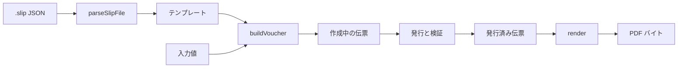

# Core 利用ガイド

[한국어](core.ko.md) · [English](core.md)

`@omdc-slipkit/core` は、`.slip` ファイルの検証、伝票の組み立て、数式の評価、PDF 生成、ファイル暗号化を提供する TypeScript ライブラリです。

DOM に依存しないため、Node.js サーバーとブラウザアプリケーションのどちらでも利用できます。テンプレートデザイナーや伝票入力画面のような UI は提供しません。

このドキュメントでは、Core を使って次の作業を行う方法を説明します。

- 外部から受け取った `.slip` ファイルのパースと検証
- テンプレートと入力値からの伝票作成
- テンプレートまたは伝票の PDF への変換
- アプリケーションでの数式の直接評価
- `.slip` ファイルの暗号化と復号

> [!NOTE]
> UI コンポーネントをアプリケーションに接続するには[はじめに](getting-started.ja.md)を、デザイナー・入力フォーム・ビューアーの状態と保存フローを接続するには[アプリケーション統合ガイド](integration.ja.md)を参照してください。

## Core の利用フロー

サーバーでテンプレートを読み込み、伝票と PDF を作成する一般的なフローは次のとおりです。



ファイルの読み込みと検証には独立した関数を使い、フォント・ロケール・暗号化キーのように複数の作業で共有する設定は `createSlipKit` に一度だけ渡す方法を推奨します。

| 作業 | 推奨 API |
|---|---|
| JSON 文字列のパースと検証 | `parseSlipFile` |
| すでにパース済みの値の検証 | `validateSlipFile` |
| 保存用の JSON 文字列の生成 | `serializeSlipFile` |
| テンプレートと値からの伝票の組み立て | `buildVoucher` または `slip.buildVoucher` |
| PDF の生成 | `slip.render` |
| 数式の評価 | `slip.evaluate` |
| ファイルの暗号化・復号 | `slip.encrypt`, `slip.decrypt` |

## インストールと実行環境

> [!IMPORTANT]
> SlipKit は現在公開前のレビュー段階であり、`@omdc-slipkit/*` パッケージは npm レジストリにまだ公開されていません。
> 現時点ではリポジトリをクローンして、同梱のソースとデモで確認できます。

パッケージが公開された後は、次のようにインストールします。

```bash
npm install @omdc-slipkit/core
```

主にサポートする実行環境は次のとおりです。

- Node.js 22.13 以上
- ESM と TypeScript をサポートするブラウザビルド環境
- 暗号化機能を使う場合は Web Crypto API をサポートする環境

> [!TIP]
> `@omdc-slipkit/elements`、`@omdc-slipkit/react`、`@omdc-slipkit/vue` を使う場合でも、アプリケーションコードで Core を直接 import するなら、`@omdc-slipkit/core` を直接の依存関係としてインストールしてください。

## クイック例: テンプレートから PDF を作成する

次の例は、Node.js でテンプレートファイルを読み込み、値を入力した伝票を発行してから PDF ファイルとして保存します。

プロジェクトに次のファイルがあると仮定します。

```text
templates/
└── trade-statement.slip

fonts/
├── Pretendard-Regular.otf
└── Pretendard-Bold.otf

src/
└── generate-voucher.ts
```

`src/generate-voucher.ts`:

```ts
import { readFile, writeFile } from 'node:fs/promises';

import {
  createSlipKit,
  parseSlipFile,
  validateSlipFile,
} from '@omdc-slipkit/core';

const [regularFont, boldFont] = await Promise.all([
  readFile(
    new URL(
      '../fonts/Pretendard-Regular.otf',
      import.meta.url,
    ),
  ),
  readFile(
    new URL(
      '../fonts/Pretendard-Bold.otf',
      import.meta.url,
    ),
  ),
]);

const slip = createSlipKit({
  locale: 'ko-KR',
  getFonts: () => [
    {
      name: 'Pretendard',
      data: regularFont,
      fallback: true,
    },
    {
      name: 'Pretendard-Bold',
      data: boldFont,
    },
  ],
});

const templateJson = await readFile(
  new URL(
    '../templates/trade-statement.slip',
    import.meta.url,
  ),
  'utf8',
);

const file = parseSlipFile(templateJson);

if (file.kind !== 'template') {
  throw new Error('テンプレートファイルではありません。');
}

const draftVoucher = slip.buildVoucher(file, {
  tradeDate: '2026-08-25',
  customerName: '株式会社サンプル',
  items: [
    {
      itemName: '鉛筆',
      quantity: 12,
      unitPrice: 300,
      amount: 3600,
    },
    {
      itemName: 'ノート',
      quantity: 5,
      unitPrice: 1200,
      amount: 6000,
    },
  ],
});

const issuedVoucher = validateSlipFile({
  ...draftVoucher,
  issued: true,
});

const pdfBytes = await slip.render(issuedVoucher);

await writeFile('trade-statement.pdf', pdfBytes);
```

この例では次の順序で処理します。

1. PDF に使うフォントを準備します。
2. `parseSlipFile` でテンプレートファイルを検証します。
3. `buildVoucher` で入力値を埋めた伝票を作成します。
4. 伝票を発行状態に変更してから、再度検証します。
5. `render` で PDF バイトを生成します。
6. 生成されたバイトを PDF ファイルとして保存します。

> [!IMPORTANT]
> 韓国語・日本語のように標準 PDF フォントにない文字を出力するには、その文字を含むフォントを必ず供給する必要があります。
> Core には UI パッケージの同梱フォントが自動的に適用されません。

## `.slip` ファイルのパースと検証

### JSON 文字列のパース

ファイル、データベース、または HTTP レスポンスから受け取った JSON 文字列は `parseSlipFile` で読み込みます。

```ts
import {
  parseSlipFile,
  type SlipFile,
} from '@omdc-slipkit/core';

function readSlip(json: string): SlipFile {
  return parseSlipFile(json);
}
```

`parseSlipFile` は次の作業をまとめて行います。

1. JSON 文字列のパース
2. `schemaVersion` と `kind` の確認
3. テンプレートまたは伝票本体の検証
4. サポートされるマイグレーション経路があれば現在の形式へ変換

不正な JSON や `.slip` のルールに合わない場合は `SlipParseError` が発生します。

### すでにパース済みの値の検証

HTTP フレームワークがリクエストボディをすでにオブジェクトに変換している場合や、`JSON.parse` を直接使った場合は `validateSlipFile` を使います。

```ts
import {
  validateSlipFile,
  type SlipFile,
} from '@omdc-slipkit/core';

function validateRequestBody(body: unknown): SlipFile {
  return validateSlipFile(body);
}
```

> [!IMPORTANT]
> TypeScript の型宣言は、実行中に入ってくる値を検証しません。
> ファイルアップロード、HTTP リクエスト、データベースのような外部境界から受け取った値は、必ず `parseSlipFile` または `validateSlipFile` で検証してください。

### テンプレートと伝票の区別

検証済みのファイルは `kind` で区別します。

```ts
const file = parseSlipFile(json);

if (file.kind === 'template') {
  console.log(file.template.meta.title);
} else {
  console.log(file.templateSnapshot.meta.title);
  console.log(file.values);
  console.log(file.issued);
}
```

| `kind` | 意味 | 主な本体 |
|---|---|---|
| `'template'` | 伝票の構造と表示方法を定義するテンプレート | `template` |
| `'voucher'` | テンプレートに実際の値を入力した伝票 | `templateSnapshot`, `values`, `issued` |

伝票には、作成時点のテンプレート全体が `templateSnapshot` として入っています。元のテンプレートが後で変更されても、既存の伝票は自身のスナップショットを使います。

### JSON 文字列として保存

検証済みのファイルオブジェクトを保存または送信するときは `serializeSlipFile` を使います。

```ts
import {
  serializeSlipFile,
  type SlipFile,
} from '@omdc-slipkit/core';

function toJson(file: SlipFile): string {
  return serializeSlipFile(file);
}
```

> [!CAUTION]
> `serializeSlipFile` はオブジェクトを JSON 文字列に変換しますが、オブジェクト自体を再検証はしません。
> アプリケーションで直接組み立てたり修正したりしたオブジェクトなら、保存前に `validateSlipFile` で検証してください。

## テンプレートと値から伝票を作成する

`buildVoucher` は、テンプレートと入力値を組み合わせて作成中の伝票を作ります。

```ts
import {
  buildVoucher,
  type JsonValue,
  type SlipTemplateFile,
  type SlipVoucherFile,
} from '@omdc-slipkit/core';

function createVoucher(
  template: SlipTemplateFile,
  values: Record<string, JsonValue>,
): SlipVoucherFile {
  return buildVoucher(template, values);
}
```

`createSlipKit` を使っている場合は、同じ機能をインスタンスから呼び出せます。

```ts
const voucher = slip.buildVoucher(template, values);
```

`buildVoucher` が返す伝票は次の状態です。

```ts
{
  kind: 'voucher',
  issued: false,
  templateSnapshot: /* 作成時点のテンプレート */,
  values: /* 渡した入力値 */,
}
```

入力したテンプレートと値はディープコピーされるため、返された伝票と元のオブジェクトは参照を共有しません。

### パラメータごとの値の形

`values` のキーは、テンプレートに定義したパラメータの物理名です。

| パラメータのタイプ | 値の形 | 例 |
|---|---|---|
| 文字 | `string` | `'株式会社サンプル'` |
| 数値 | `number` | `12000` |
| 日付 | ISO 日付文字列 | `'2026-08-25'` |
| 真偽 | `boolean` | `true` |
| 画像 | `data:` Base64 文字列 | `'data:image/png;base64,...'` |
| リスト | オブジェクトの配列 | `[{ itemName: '鉛筆' }]` |

リストパラメータは、項目ごとに下位フィールドの物理名をキーとして持つオブジェクトの配列を使います。

```ts
const values = {
  customerName: '株式会社サンプル',
  items: [
    {
      itemName: '鉛筆',
      quantity: 12,
      unitPrice: 300,
    },
    {
      itemName: 'ノート',
      quantity: 5,
      unitPrice: 1200,
    },
  ],
};
```

`valueType: 'number'` として定義した最上位パラメータが未入力、`null`、または空文字列の場合、`buildVoucher` が `0` に正規化します。

数式で計算される値は、`values` にあらかじめ入れる必要はありません。PDF レンダリングの過程で、伝票の値とテンプレートの数式を使って計算されます。

## 伝票を発行する

`buildVoucher` が作る伝票は `issued: false` の作成中の伝票です。

値を確定するには、`issued` を `true` に変更してからファイル全体を検証します。

```ts
import {
  validateSlipFile,
  type SlipVoucherFile,
} from '@omdc-slipkit/core';

function issueVoucher(
  draft: SlipVoucherFile,
): SlipVoucherFile {
  const validated = validateSlipFile({
    ...draft,
    issued: true,
  });

  if (validated.kind !== 'voucher') {
    throw new Error('伝票ファイルではありません。');
  }

  return validated;
}
```

発行検証では、外部 URL 画像のように、発行済み伝票が単独で保管できなくなる値も確認します。発行済み伝票に必要な画像は `data:` Base64 の形で含める必要があります。

> [!WARNING]
> `issued: true` は伝票の業務上の状態を表します。
> 電子署名や暗号学的な改ざん防止機能ではないため、サーバー側で発行済み伝票の編集権限と保存履歴を別途管理する必要があります。

> [!IMPORTANT]
> 伝票を保存するときは、`values` だけを別に保存せず、`SlipVoucherFile` 全体を保存してください。
> `templateSnapshot` と `issued` の状態が一緒にあってこそ、後で同じテンプレートで伝票をレンダリングできます。

## PDF を生成する

### 設定を再利用する方法

同じフォントとロケールで複数のファイルをレンダリングするなら、`createSlipKit` で設定を一度構成します。

```ts
import { createSlipKit } from '@omdc-slipkit/core';

const slip = createSlipKit({
  locale: 'ko-KR',
  getFonts: () => [
    {
      name: 'Pretendard',
      data: regularFont,
      fallback: true,
    },
  ],
});

const firstPdf = await slip.render(firstVoucher);
const secondPdf = await slip.render(secondVoucher);
```

- テンプレートをレンダリングすると、値が空のドキュメントが生成されます。
- 伝票をレンダリングすると、`templateSnapshot` と `values` が反映されます。
- 戻り値は PDF ファイルの `Uint8Array` です。
- `locale` は `FORMAT_NUMBER` のような数式のフォーマット関数の表示方法とエラーメッセージの言語に使われます。省略すると英語（`en-US`）です。

フォントの構成方法は[設定ガイド](configuration.ja.md)を参照してください。

### ファイルを一つそのままレンダリングする方法

設定を再利用する必要がなければ、`renderSlipToPdf` を直接使えます。

```ts
import {
  renderSlipToPdf,
  type SlipFile,
} from '@omdc-slipkit/core';

async function renderOne(
  file: SlipFile,
): Promise<Uint8Array> {
  return renderSlipToPdf(file, {
    locale: 'ko-KR',
    getFonts: () => [
      {
        name: 'Pretendard',
        data: regularFont,
        fallback: true,
      },
    ],
  });
}
```

### ブラウザで PDF をダウンロードする

ブラウザでは、PDF バイトを `Blob` に変換してダウンロードできます。

```ts
function downloadPdf(
  filename: string,
  pdfBytes: Uint8Array,
): void {
  const blob = new Blob(
    [pdfBytes.buffer as ArrayBuffer],
    {
      type: 'application/pdf',
    },
  );

  const url = URL.createObjectURL(blob);

  try {
    const anchor = document.createElement('a');

    anchor.href = url;
    anchor.download = filename;
    anchor.click();
  } finally {
    URL.revokeObjectURL(url);
  }
}
```

## 数式を評価する

テンプレートレンダリングの外で数式を直接計算するには `evaluate` を使います。

```ts
const result = slip.evaluate(
  'SUM($(items).$(amount))',
  {
    values: {
      items: [
        { amount: 3600 },
        { amount: 6000 },
      ],
    },
  },
);

console.log(result);
// 9600
```

`TODAY()` のように現在時刻によって結果が変わる数式は、基準時刻を渡すことで再現できます。

```ts
const result = slip.evaluate(
  'TODAY()',
  {
    values: {},
    now: new Date('2026-08-25T00:00:00Z'),
  },
);
```

`createSlipKit` に指定した `locale` は、評価コンテキストに個別の `locale` がない場合に使われます。

```ts
const slip = createSlipKit({
  locale: 'de-DE',
});

const formatted = slip.evaluate(
  'FORMAT_NUMBER(1234.5)',
  {
    values: {},
  },
);

console.log(formatted);
// 1.234,5
```

設定が不要なら、`evaluateFormula` 独立関数を直接使えます。

```ts
import {
  evaluateFormula,
} from '@omdc-slipkit/core';

const result = evaluateFormula(
  '$(quantity) * $(unitPrice)',
  {
    values: {
      quantity: 12,
      unitPrice: 300,
    },
  },
);
```

サポート関数と数式の文法は[数式関数リファレンス](formula.ja.md)を確認してください。

## `.slip` ファイルを暗号化する

`.slip` ファイルは JSON なので、暗号化しなければ一般的なエディタでも内容を確認できます。

機密性の高いテンプレートや伝票をファイルの形で保管する必要があるなら、任意で AES-256-GCM 暗号化を使えます。

```ts
import {
  createSlipKit,
  isEncryptedSlipFile,
} from '@omdc-slipkit/core';

const encryptionKey =
  process.env.SLIPKIT_ENCRYPTION_KEY;

if (!encryptionKey) {
  throw new Error(
    'SLIPKIT_ENCRYPTION_KEY が設定されていません。',
  );
}

const slip = createSlipKit({
  encryption: {
    key: encryptionKey,
  },
});

const encryptedJson =
  await slip.encrypt(file);

console.log(
  isEncryptedSlipFile(encryptedJson),
);
// true

const restored =
  await slip.decrypt(encryptedJson);
```

暗号化キーには次の二つの形を使えます。

| キー | 動作 |
|---|---|
| `string` | パスフレーズとして使い、PBKDF2-SHA256 で AES キーを生成 |
| 32 バイトの `Uint8Array` | AES-256 の生キーとして直接使用 |

> [!CAUTION]
> 暗号化キーをソースコードや保存ファイルに一緒に入れないでください。
> キーの生成、保管、受け渡し、破棄は、ホストアプリケーションのセキュリティポリシーに従って管理する必要があります。

### キーの変更に備える

暗号化キーを変更した場合は、`previousKeys` に以前のキーを渡すことで、過去のファイルも復号できます。

```ts
const slip = createSlipKit({
  encryption: {
    key: currentKey,
    previousKeys: [
      previousKey,
    ],
  },
});

const restored =
  await slip.decrypt(encryptedJson);
```

`decrypt` は現在のキーを先に使い、失敗すると `previousKeys` を順番に試します。以前のファイルを読み込んだ後、再度暗号化して保存すれば、新しいキーに切り替えられます。

> [!IMPORTANT]
> 暗号化された結果は、標準の `.slip` ファイル構造ではなく、別個の暗号化エンベロープ JSON です。
> `parseSlipFile`、PDF レンダラー、または UI コンポーネントに直接渡すことはできず、先に `decrypt` で復号する必要があります。

`isEncryptedSlipFile` は暗号化エンベロープの目印を確認するためのものです。ファイルが正常に復号されることや、改ざんされていないことを保証するものではありません。

## エラー処理

Core は作業の段階に応じて、異なるエラータイプを提供します。

| エラー | 発生する作業 |
|---|---|
| `SlipParseError` | JSON パース、スキーマ検証、マイグレーション |
| `SlipRenderError` | PDF 変換またはフォント構成 |
| `FormulaSyntaxError` | 数式の文法解析 |
| `FormulaEvalError` | 数式の実行と型計算 |
| `SlipEncryptionError` | 暗号化、復号、キー検証 |

外部ファイルを処理するときは、エラーをユーザー向けのレスポンスやアプリケーションログに変換します。

```ts
import {
  parseSlipFile,
  SlipParseError,
} from '@omdc-slipkit/core';

function parseUploadedSlip(
  json: string,
) {
  try {
    return parseSlipFile(json);
  } catch (error) {
    if (error instanceof SlipParseError) {
      throw new Error(
        `正しい .slip ファイルではありません: ${error.message}`,
      );
    }

    throw error;
  }
}
```

> [!CAUTION]
> サーバーログに伝票全体、画像の Base64 データ、暗号化キー、またはユーザーの機密な入力値をそのまま記録しないでください。
> エラーの種類と必要な識別情報だけを残すのが安全です。

## 避けるべき実装

- 外部から受け取った JSON を型アサーションだけで使用
- `serializeSlipFile` がオブジェクトを検証すると仮定
- 伝票の `values` だけを保存し、テンプレートスナップショットを破棄
- 発行済み伝票で外部 URL 画像をそのまま使用
- `issued: true` を電子署名や改ざん防止と解釈
- 韓国語・日本語の PDF を作成しながら、その文字を含むフォントを供給しない
- ファイルをレンダリングするたびに同じフォントを読み直す
- 暗号化キーをソースコードやファイルと一緒に保存
- 暗号化エンベロープ JSON を復号せずに `.slip` パーサーへ渡す

## 完了確認

- [ ] 外部から受け取った `.slip` ファイルをパースして検証する。
- [ ] テンプレートと伝票を `kind` で区別する。
- [ ] 伝票全体を `templateSnapshot`、`values`、`issued` と一緒に保存する。
- [ ] 発行状態に変更した伝票を再度検証する。
- [ ] 出力言語に必要なフォントを供給する。
- [ ] PDF バイトをファイルまたは HTTP レスポンスとして正しく渡す。
- [ ] 数式エラーと PDF レンダリングエラーを区別して処理する。
- [ ] 暗号化キーをファイルデータと分離して管理する。

## 関連ドキュメント

- [はじめに](getting-started.ja.md)
- [アプリケーション統合ガイド](integration.ja.md)
- [サーバー統合ガイド](server-integration.ja.md)
- [設定ガイド](configuration.ja.md)
- [API リファレンス](api-reference.ja.md)
- [数式関数リファレンス](formula.ja.md)
