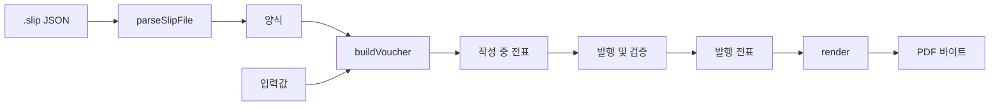

# Core 사용 가이드

[English](core.md) · [日本語](core.ja.md)

`@omdc-slipkit/core`는 `.slip` 파일 검증, 전표 조립, 수식 평가, PDF 생성 및 파일 암호화를 제공하는 TypeScript 라이브러리입니다.

DOM에 의존하지 않으므로 Node.js 서버와 브라우저 애플리케이션에서 모두 사용할 수 있습니다. 양식 디자이너나 전표 작성 화면 같은 UI는 제공하지 않습니다.

이 문서에서는 Core를 사용하여 다음 작업을 수행하는 방법을 설명합니다.

- 외부에서 받은 `.slip` 파일 파싱 및 검증
- 양식과 입력값으로 전표 만들기
- 양식 또는 전표를 PDF로 변환
- 수식을 애플리케이션에서 직접 평가
- `.slip` 파일 암호화 및 복호화

> [!NOTE]
> UI 컴포넌트를 애플리케이션에 연결하려면 [시작하기](getting-started.ko.md)를, 디자이너·작성폼·뷰어의 상태와 저장 흐름을 연결하려면 [애플리케이션 통합 가이드](integration.ko.md)를 참고하세요.

## Core 사용 흐름

서버에서 양식을 읽어 전표와 PDF를 만드는 일반적인 흐름은 다음과 같습니다.



파일을 읽고 검증하는 작업에는 독립 함수를 사용하고, 폰트·로케일·암호화 키처럼 여러 작업에서 공유하는 설정은 `createSlipKit`에 한 번 전달하는 방식을 권장합니다.

| 작업 | 권장 API |
|---|---|
| JSON 문자열 파싱 및 검증 | `parseSlipFile` |
| 이미 파싱된 값 검증 | `validateSlipFile` |
| 저장할 JSON 문자열 생성 | `serializeSlipFile` |
| 양식과 값으로 전표 조립 | `buildVoucher` 또는 `slip.buildVoucher` |
| PDF 생성 | `slip.render` |
| 수식 평가 | `slip.evaluate` |
| 파일 암호화·복호화 | `slip.encrypt`, `slip.decrypt` |

## 설치와 실행 환경

> [!IMPORTANT]
> SlipKit은 현재 공개 전 검토 단계이며 `@omdc-slipkit/*` 패키지는 npm 레지스트리에 아직 배포되지 않았습니다.
> 현재는 저장소를 복제하여 동봉된 소스와 데모에서 확인할 수 있습니다.

패키지가 공개된 이후에는 다음과 같이 설치합니다.

```bash
npm install @omdc-slipkit/core
```

지원하는 주요 실행 환경은 다음과 같습니다.

- Node.js 22.13 이상
- ESM과 TypeScript를 지원하는 브라우저 빌드 환경
- 암호화 기능을 사용할 경우 Web Crypto API를 지원하는 환경

> [!TIP]
> `@omdc-slipkit/elements`, `@omdc-slipkit/react`, `@omdc-slipkit/vue`를 사용하더라도 애플리케이션 코드에서 Core를 직접 import한다면 `@omdc-slipkit/core`를 직접 의존성으로 설치하세요.

## 빠른 예제: 양식에서 PDF 만들기

다음 예제는 Node.js에서 양식 파일을 읽고, 값을 채운 전표를 발행한 뒤 PDF 파일로 저장합니다.

프로젝트에 다음 파일이 있다고 가정합니다.

```text
templates/
└── trade-statement.slip

fonts/
├── Pretendard-Regular.otf
└── Pretendard-Bold.otf

src/
└── generate-voucher.ts
```

`src/generate-voucher.ts`:

```ts
import { readFile, writeFile } from 'node:fs/promises';

import {
  createSlipKit,
  parseSlipFile,
  validateSlipFile,
} from '@omdc-slipkit/core';

const [regularFont, boldFont] = await Promise.all([
  readFile(
    new URL(
      '../fonts/Pretendard-Regular.otf',
      import.meta.url,
    ),
  ),
  readFile(
    new URL(
      '../fonts/Pretendard-Bold.otf',
      import.meta.url,
    ),
  ),
]);

const slip = createSlipKit({
  locale: 'ko-KR',
  getFonts: () => [
    {
      name: 'Pretendard',
      data: regularFont,
      fallback: true,
    },
    {
      name: 'Pretendard-Bold',
      data: boldFont,
    },
  ],
});

const templateJson = await readFile(
  new URL(
    '../templates/trade-statement.slip',
    import.meta.url,
  ),
  'utf8',
);

const file = parseSlipFile(templateJson);

if (file.kind !== 'template') {
  throw new Error('양식 파일이 아닙니다.');
}

const draftVoucher = slip.buildVoucher(file, {
  tradeDate: '2026-08-25',
  customerName: '주식회사 예시',
  items: [
    {
      itemName: '연필',
      quantity: 12,
      unitPrice: 300,
      amount: 3600,
    },
    {
      itemName: '공책',
      quantity: 5,
      unitPrice: 1200,
      amount: 6000,
    },
  ],
});

const issuedVoucher = validateSlipFile({
  ...draftVoucher,
  issued: true,
});

const pdfBytes = await slip.render(issuedVoucher);

await writeFile('trade-statement.pdf', pdfBytes);
```

이 예제에서는 다음 순서로 처리합니다.

1. PDF에 사용할 폰트를 준비합니다.
2. `parseSlipFile`로 양식 파일을 검증합니다.
3. `buildVoucher`로 입력값을 채운 전표를 만듭니다.
4. 전표를 발행 상태로 변경한 뒤 다시 검증합니다.
5. `render`로 PDF 바이트를 생성합니다.
6. 생성된 바이트를 PDF 파일로 저장합니다.

> [!IMPORTANT]
> 한글·일본어처럼 기본 PDF 폰트에 없는 문자를 출력하려면 해당 문자를 포함하는 폰트를 반드시 공급해야 합니다.
> Core에는 UI 패키지의 동봉 폰트가 자동으로 적용되지 않습니다.

## `.slip` 파일 파싱과 검증

### JSON 문자열 파싱

파일, 데이터베이스 또는 HTTP 응답에서 받은 JSON 문자열은 `parseSlipFile`로 읽습니다.

```ts
import {
  parseSlipFile,
  type SlipFile,
} from '@omdc-slipkit/core';

function readSlip(json: string): SlipFile {
  return parseSlipFile(json);
}
```

`parseSlipFile`은 다음 작업을 함께 수행합니다.

1. JSON 문자열 파싱
2. `schemaVersion`과 `kind` 확인
3. 양식 또는 전표 본문 검증
4. 지원되는 마이그레이션 경로가 있다면 현재 형식으로 변환

잘못된 JSON이거나 `.slip` 규칙에 맞지 않으면 `SlipParseError`가 발생합니다.

### 이미 파싱된 값 검증

HTTP 프레임워크가 요청 본문을 이미 객체로 변환했거나 `JSON.parse`를 직접 사용했다면 `validateSlipFile`을 사용합니다.

```ts
import {
  validateSlipFile,
  type SlipFile,
} from '@omdc-slipkit/core';

function validateRequestBody(body: unknown): SlipFile {
  return validateSlipFile(body);
}
```

> [!IMPORTANT]
> TypeScript 타입 선언은 실행 중에 들어오는 값을 검증하지 않습니다.
> 파일 업로드, HTTP 요청, 데이터베이스와 같은 외부 경계에서 받은 값은 반드시 `parseSlipFile` 또는 `validateSlipFile`로 검증하세요.

### 양식과 전표 구분

검증된 파일은 `kind`로 구분합니다.

```ts
const file = parseSlipFile(json);

if (file.kind === 'template') {
  console.log(file.template.meta.title);
} else {
  console.log(file.templateSnapshot.meta.title);
  console.log(file.values);
  console.log(file.issued);
}
```

| `kind` | 의미 | 주요 본문 |
|---|---|---|
| `'template'` | 전표의 구조와 표시 방식을 정의하는 양식 | `template` |
| `'voucher'` | 양식에 실제 값을 채운 전표 | `templateSnapshot`, `values`, `issued` |

전표에는 생성 당시의 양식 전체가 `templateSnapshot`으로 들어 있습니다. 원본 양식이 나중에 변경되어도 기존 전표는 자신의 스냅샷을 사용합니다.

### JSON 문자열로 저장

검증된 파일 객체를 저장하거나 전송할 때는 `serializeSlipFile`을 사용합니다.

```ts
import {
  serializeSlipFile,
  type SlipFile,
} from '@omdc-slipkit/core';

function toJson(file: SlipFile): string {
  return serializeSlipFile(file);
}
```

> [!CAUTION]
> `serializeSlipFile`은 객체를 JSON 문자열로 변환하지만, 객체 자체를 다시 검증하지는 않습니다.
> 애플리케이션에서 직접 조립하거나 수정한 객체라면 저장 전에 `validateSlipFile`로 검증하세요.

## 양식과 값으로 전표 만들기

`buildVoucher`는 양식과 입력값을 결합하여 작성 중 전표를 만듭니다.

```ts
import {
  buildVoucher,
  type JsonValue,
  type SlipTemplateFile,
  type SlipVoucherFile,
} from '@omdc-slipkit/core';

function createVoucher(
  template: SlipTemplateFile,
  values: Record<string, JsonValue>,
): SlipVoucherFile {
  return buildVoucher(template, values);
}
```

`createSlipKit`을 사용하고 있다면 동일한 기능을 인스턴스에서 호출할 수 있습니다.

```ts
const voucher = slip.buildVoucher(template, values);
```

`buildVoucher`가 반환하는 전표는 다음 상태입니다.

```ts
{
  kind: 'voucher',
  issued: false,
  templateSnapshot: /* 생성 당시 양식 */,
  values: /* 전달한 입력값 */,
}
```

입력한 양식과 값은 깊은 복사되므로 반환된 전표와 원본 객체가 참조를 공유하지 않습니다.

### 파라미터별 값 형태

`values`의 키는 양식에 정의한 파라미터의 물리명입니다.

| 파라미터 타입 | 값 형태 | 예 |
|---|---|---|
| 글자 | `string` | `'주식회사 예시'` |
| 숫자 | `number` | `12000` |
| 날짜 | ISO 날짜 문자열 | `'2026-08-25'` |
| 참/거짓 | `boolean` | `true` |
| 이미지 | `data:` Base64 문자열 | `'data:image/png;base64,...'` |
| 목록 | 객체 배열 | `[{ itemName: '연필' }]` |

목록 파라미터는 항목마다 하위 필드의 물리명을 키로 갖는 객체 배열을 사용합니다.

```ts
const values = {
  customerName: '주식회사 예시',
  items: [
    {
      itemName: '연필',
      quantity: 12,
      unitPrice: 300,
    },
    {
      itemName: '공책',
      quantity: 5,
      unitPrice: 1200,
    },
  ],
};
```

`valueType: 'number'`로 정의한 최상위 파라미터가 미입력, `null` 또는 빈 문자열이면 `buildVoucher`가 `0`으로 정규화합니다.

수식으로 계산되는 값은 `values`에 미리 넣지 않아도 됩니다. PDF 렌더링 과정에서 전표 값과 양식의 수식을 이용해 계산됩니다.

## 전표 발행하기

`buildVoucher`가 만드는 전표는 `issued: false`인 작성 중 전표입니다.

값을 확정하려면 `issued`를 `true`로 변경한 뒤 전체 파일을 검증합니다.

```ts
import {
  validateSlipFile,
  type SlipVoucherFile,
} from '@omdc-slipkit/core';

function issueVoucher(
  draft: SlipVoucherFile,
): SlipVoucherFile {
  const validated = validateSlipFile({
    ...draft,
    issued: true,
  });

  if (validated.kind !== 'voucher') {
    throw new Error('전표 파일이 아닙니다.');
  }

  return validated;
}
```

발행 검증에서는 외부 URL 이미지처럼 발행 전표가 단독으로 보관될 수 없게 만드는 값도 확인합니다. 발행된 전표에 필요한 이미지는 `data:` Base64 형태로 포함해야 합니다.

> [!WARNING]
> `issued: true`는 전표의 업무 상태를 나타냅니다.
> 전자서명이나 암호학적 위변조 방지 기능이 아니므로 서버에서 발행 전표의 수정 권한과 저장 이력을 별도로 관리해야 합니다.

> [!IMPORTANT]
> 전표를 저장할 때 `values`만 따로 저장하지 말고 `SlipVoucherFile` 전체를 저장하세요.
> `templateSnapshot`과 `issued` 상태가 함께 있어야 나중에 같은 양식으로 전표를 렌더링할 수 있습니다.

## PDF 생성하기

### 설정을 재사용하는 방법

같은 폰트와 로케일로 여러 파일을 렌더링한다면 `createSlipKit`으로 설정을 한 번 구성합니다.

```ts
import { createSlipKit } from '@omdc-slipkit/core';

const slip = createSlipKit({
  locale: 'ko-KR',
  getFonts: () => [
    {
      name: 'Pretendard',
      data: regularFont,
      fallback: true,
    },
  ],
});

const firstPdf = await slip.render(firstVoucher);
const secondPdf = await slip.render(secondVoucher);
```

- 양식을 렌더링하면 값이 비어 있는 문서가 생성됩니다.
- 전표를 렌더링하면 `templateSnapshot`과 `values`가 반영됩니다.
- 반환값은 PDF 파일의 `Uint8Array`입니다.
- `locale`은 `FORMAT_NUMBER` 같은 수식 포맷 함수의 표시 방식과 오류 메시지 언어에 사용됩니다. 생략하면 `en-US`를 사용합니다.

폰트 구성 방법은 [설정 가이드](configuration.ko.md)를 참고하세요.

### 파일 하나를 바로 렌더링하는 방법

설정을 재사용할 필요가 없다면 `renderSlipToPdf`를 직접 사용할 수 있습니다.

```ts
import {
  renderSlipToPdf,
  type SlipFile,
} from '@omdc-slipkit/core';

async function renderOne(
  file: SlipFile,
): Promise<Uint8Array> {
  return renderSlipToPdf(file, {
    locale: 'ko-KR',
    getFonts: () => [
      {
        name: 'Pretendard',
        data: regularFont,
        fallback: true,
      },
    ],
  });
}
```

### 브라우저에서 PDF 내려받기

브라우저에서는 PDF 바이트를 `Blob`으로 변환해 내려받을 수 있습니다.

```ts
function downloadPdf(
  filename: string,
  pdfBytes: Uint8Array,
): void {
  const blob = new Blob(
    [pdfBytes.buffer as ArrayBuffer],
    {
      type: 'application/pdf',
    },
  );

  const url = URL.createObjectURL(blob);

  try {
    const anchor = document.createElement('a');

    anchor.href = url;
    anchor.download = filename;
    anchor.click();
  } finally {
    URL.revokeObjectURL(url);
  }
}
```

## 수식 평가하기

양식 렌더링 외부에서 수식을 직접 계산하려면 `evaluate`를 사용합니다.

```ts
const result = slip.evaluate(
  'SUM($(items).$(amount))',
  {
    values: {
      items: [
        { amount: 3600 },
        { amount: 6000 },
      ],
    },
  },
);

console.log(result);
// 9600
```

`TODAY()`처럼 현재 시각에 따라 결과가 달라지는 수식은 기준 시각을 전달하여 재현할 수 있습니다.

```ts
const result = slip.evaluate(
  'TODAY()',
  {
    values: {},
    now: new Date('2026-08-25T00:00:00Z'),
  },
);
```

`createSlipKit`에 지정한 `locale`은 평가 컨텍스트에 별도 `locale`이 없을 때 사용됩니다.

```ts
const slip = createSlipKit({
  locale: 'de-DE',
});

const formatted = slip.evaluate(
  'FORMAT_NUMBER(1234.5)',
  {
    values: {},
  },
);

console.log(formatted);
// 1.234,5
```

설정이 필요 없다면 `evaluateFormula` 독립 함수를 직접 사용할 수 있습니다.

```ts
import {
  evaluateFormula,
} from '@omdc-slipkit/core';

const result = evaluateFormula(
  '$(quantity) * $(unitPrice)',
  {
    values: {
      quantity: 12,
      unitPrice: 300,
    },
  },
);
```

지원 함수와 수식 문법은 [수식 함수 참조](formula.ko.md)를 확인하세요.

## `.slip` 파일 암호화하기

`.slip` 파일은 JSON이므로 암호화하지 않으면 일반 편집기에서도 내용을 확인할 수 있습니다.

민감한 양식이나 전표를 파일 형태로 보관해야 한다면 선택적으로 AES-256-GCM 암호화를 사용할 수 있습니다.

```ts
import {
  createSlipKit,
  isEncryptedSlipFile,
} from '@omdc-slipkit/core';

const encryptionKey =
  process.env.SLIPKIT_ENCRYPTION_KEY;

if (!encryptionKey) {
  throw new Error(
    'SLIPKIT_ENCRYPTION_KEY가 설정되지 않았습니다.',
  );
}

const slip = createSlipKit({
  encryption: {
    key: encryptionKey,
  },
});

const encryptedJson =
  await slip.encrypt(file);

console.log(
  isEncryptedSlipFile(encryptedJson),
);
// true

const restored =
  await slip.decrypt(encryptedJson);
```

암호화 키에는 다음 두 형태를 사용할 수 있습니다.

| 키 | 동작 |
|---|---|
| `string` | 암호 문구로 사용하고 PBKDF2-SHA256으로 AES 키를 생성 |
| 32바이트 `Uint8Array` | AES-256 원시 키로 직접 사용 |

> [!CAUTION]
> 암호화 키를 소스 코드나 저장 파일에 함께 넣지 마세요.
> 키 생성, 보관, 전달 및 폐기는 호스트 애플리케이션의 보안 정책에 따라 관리해야 합니다.

### 키 변경에 대비하기

암호화 키를 변경했다면 `previousKeys`에 이전 키를 전달하여 과거 파일도 복호화할 수 있습니다.

```ts
const slip = createSlipKit({
  encryption: {
    key: currentKey,
    previousKeys: [
      previousKey,
    ],
  },
});

const restored =
  await slip.decrypt(encryptedJson);
```

`decrypt`는 현재 키를 먼저 사용하고 실패하면 `previousKeys`를 순서대로 시도합니다. 이전 파일을 불러온 뒤 다시 암호화하여 저장하면 새 키로 전환할 수 있습니다.

> [!IMPORTANT]
> 암호화된 결과는 표준 `.slip` 파일 구조가 아니라 별도의 암호화 봉투 JSON입니다.
> `parseSlipFile`, PDF 렌더러 또는 UI 컴포넌트에 직접 전달할 수 없으며 먼저 `decrypt`로 복호화해야 합니다.

`isEncryptedSlipFile`은 암호화 봉투의 표식을 확인하는 용도입니다. 파일이 정상적으로 복호화되거나 변조되지 않았음을 보증하지는 않습니다.

## 오류 처리

Core는 작업 단계에 따라 서로 다른 오류 타입을 제공합니다.

| 오류 | 발생하는 작업 |
|---|---|
| `SlipParseError` | JSON 파싱, 스키마 검증 및 마이그레이션 |
| `SlipRenderError` | PDF 변환 또는 폰트 구성 |
| `FormulaSyntaxError` | 수식 문법 분석 |
| `FormulaEvalError` | 수식 실행과 타입 계산 |
| `SlipEncryptionError` | 암호화, 복호화 및 키 검증 |

외부 파일을 처리할 때는 오류를 사용자용 응답이나 애플리케이션 로그로 변환합니다.

```ts
import {
  parseSlipFile,
  SlipParseError,
} from '@omdc-slipkit/core';

function parseUploadedSlip(
  json: string,
) {
  try {
    return parseSlipFile(json);
  } catch (error) {
    if (error instanceof SlipParseError) {
      throw new Error(
        `올바른 .slip 파일이 아닙니다: ${error.message}`,
      );
    }

    throw error;
  }
}
```

> [!CAUTION]
> 서버 로그에 전표 전체, 이미지 Base64 데이터, 암호화 키 또는 사용자의 민감한 입력값을 그대로 기록하지 마세요.
> 오류 종류와 필요한 식별 정보만 남기는 것이 안전합니다.

## 피해야 할 구현

- 외부에서 받은 JSON을 타입 단언만 하고 사용
- `serializeSlipFile`이 객체를 검증한다고 가정
- 전표의 `values`만 저장하고 양식 스냅샷을 버림
- 발행 전표에서 외부 URL 이미지를 그대로 사용
- `issued: true`를 전자서명이나 위변조 방지로 해석
- 한글·일본어 PDF를 만들면서 해당 문자를 포함한 폰트를 공급하지 않음
- 파일을 렌더링할 때마다 같은 폰트를 다시 읽음
- 암호화 키를 소스 코드나 파일과 함께 저장
- 암호화된 봉투 JSON을 복호화하지 않고 `.slip` 파서에 전달

## 완료 확인

- [ ] 외부에서 받은 `.slip` 파일을 파싱하고 검증합니다.
- [ ] 양식과 전표를 `kind`로 구분합니다.
- [ ] 전표 전체를 `templateSnapshot`, `values`, `issued`와 함께 저장합니다.
- [ ] 발행 상태로 변경한 전표를 다시 검증합니다.
- [ ] 출력 언어에 필요한 폰트를 공급합니다.
- [ ] PDF 바이트를 파일 또는 HTTP 응답으로 올바르게 전달합니다.
- [ ] 수식 오류와 PDF 렌더링 오류를 구분해 처리합니다.
- [ ] 암호화 키를 파일 데이터와 분리하여 관리합니다.

## 관련 문서

- [시작하기](getting-started.ko.md)
- [애플리케이션 통합 가이드](integration.ko.md)
- [서버 통합 가이드](server-integration.ko.md)
- [설정 가이드](configuration.ko.md)
- [API 참조](api-reference.ko.md)
- [수식 함수 참조](formula.ko.md)
