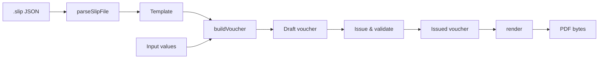

# Core Usage Guide

[한국어](core.ko.md) · [日本語](core.ja.md)

`@omdc-slipkit/core` is a TypeScript library that provides `.slip` file validation, voucher assembly, formula evaluation, PDF generation, and file encryption.

It does not depend on the DOM, so it can be used in both Node.js servers and browser applications. It does not provide any UI such as a form designer or voucher entry screen.

This document explains how to use Core to do the following.

- Parse and validate `.slip` files received from external sources
- Build a voucher from a template and input values
- Convert a template or voucher into a PDF
- Evaluate formulas directly in your application
- Encrypt and decrypt `.slip` files

> [!NOTE]
> To connect UI components to your application, see [Getting Started](getting-started.md). To wire up the state and saving flow of the designer, form, and viewer, see the [Application Integration Guide](integration.md).

## Core usage flow

The typical flow of reading a template on the server and producing a voucher and PDF is as follows.



For reading and validating files, use the standalone functions; for settings shared across multiple operations such as fonts, locale, and the encryption key, we recommend passing them once to `createSlipKit`.

| Task | Recommended API |
|---|---|
| Parse and validate a JSON string | `parseSlipFile` |
| Validate an already-parsed value | `validateSlipFile` |
| Produce a JSON string for storage | `serializeSlipFile` |
| Assemble a voucher from a template and values | `buildVoucher` or `slip.buildVoucher` |
| Generate a PDF | `slip.render` |
| Evaluate a formula | `slip.evaluate` |
| Encrypt and decrypt a file | `slip.encrypt`, `slip.decrypt` |

## Installation and runtime environment

> [!IMPORTANT]
> SlipKit is currently in a pre-release review stage, and the `@omdc-slipkit/*` packages are not yet published to the npm registry.
> For now, you can clone the repository and try them out with the bundled source and demos.

After the packages are published, install them as follows.

```bash
npm install @omdc-slipkit/core
```

The main supported runtime environments are as follows.

- Node.js 22.13 or later
- A browser build environment that supports ESM and TypeScript
- An environment that supports the Web Crypto API, if you use encryption

> [!TIP]
> Even when using `@omdc-slipkit/elements`, `@omdc-slipkit/react`, or `@omdc-slipkit/vue`, if your application code imports Core directly, install `@omdc-slipkit/core` as a direct dependency.

## Quick example: creating a PDF from a template

The following example reads a template file in Node.js, issues a voucher with values filled in, and saves it as a PDF file.

Assume the project has the following files.

```text
templates/
└── trade-statement.slip

fonts/
├── Pretendard-Regular.otf
└── Pretendard-Bold.otf

src/
└── generate-voucher.ts
```

`src/generate-voucher.ts`:

```ts
import { readFile, writeFile } from 'node:fs/promises';

import {
  createSlipKit,
  parseSlipFile,
  validateSlipFile,
} from '@omdc-slipkit/core';

const [regularFont, boldFont] = await Promise.all([
  readFile(
    new URL(
      '../fonts/Pretendard-Regular.otf',
      import.meta.url,
    ),
  ),
  readFile(
    new URL(
      '../fonts/Pretendard-Bold.otf',
      import.meta.url,
    ),
  ),
]);

const slip = createSlipKit({
  locale: 'ko-KR',
  getFonts: () => [
    {
      name: 'Pretendard',
      data: regularFont,
      fallback: true,
    },
    {
      name: 'Pretendard-Bold',
      data: boldFont,
    },
  ],
});

const templateJson = await readFile(
  new URL(
    '../templates/trade-statement.slip',
    import.meta.url,
  ),
  'utf8',
);

const file = parseSlipFile(templateJson);

if (file.kind !== 'template') {
  throw new Error('This is not a template file.');
}

const draftVoucher = slip.buildVoucher(file, {
  tradeDate: '2026-08-25',
  customerName: 'Example Co., Ltd.',
  items: [
    {
      itemName: 'Pencil',
      quantity: 12,
      unitPrice: 300,
      amount: 3600,
    },
    {
      itemName: 'Notebook',
      quantity: 5,
      unitPrice: 1200,
      amount: 6000,
    },
  ],
});

const issuedVoucher = validateSlipFile({
  ...draftVoucher,
  issued: true,
});

const pdfBytes = await slip.render(issuedVoucher);

await writeFile('trade-statement.pdf', pdfBytes);
```

This example proceeds in the following order.

1. Prepare the fonts to use in the PDF.
2. Validate the template file with `parseSlipFile`.
3. Build a voucher filled with input values using `buildVoucher`.
4. Change the voucher to the issued state and validate it again.
5. Generate the PDF bytes with `render`.
6. Save the generated bytes as a PDF file.

> [!IMPORTANT]
> To render characters that are not in the default PDF font, such as Korean or Japanese, you must supply a font that contains those characters.
> The bundled fonts of the UI packages are not automatically applied to Core.

## Parsing and validating `.slip` files

### Parsing a JSON string

For a JSON string received from a file, database, or HTTP response, read it with `parseSlipFile`.

```ts
import {
  parseSlipFile,
  type SlipFile,
} from '@omdc-slipkit/core';

function readSlip(json: string): SlipFile {
  return parseSlipFile(json);
}
```

`parseSlipFile` performs the following together.

1. Parses the JSON string
2. Checks `schemaVersion` and `kind`
3. Validates the template or voucher body
4. Converts to the current format if a supported migration path exists

If the JSON is invalid or does not match the `.slip` rules, a `SlipParseError` is thrown.

### Validating an already-parsed value

If your HTTP framework has already converted the request body into an object, or you used `JSON.parse` directly, use `validateSlipFile`.

```ts
import {
  validateSlipFile,
  type SlipFile,
} from '@omdc-slipkit/core';

function validateRequestBody(body: unknown): SlipFile {
  return validateSlipFile(body);
}
```

> [!IMPORTANT]
> TypeScript type declarations do not validate values coming in at runtime.
> Always validate values received at external boundaries such as file uploads, HTTP requests, and databases with `parseSlipFile` or `validateSlipFile`.

### Distinguishing template from voucher

A validated file is distinguished by `kind`.

```ts
const file = parseSlipFile(json);

if (file.kind === 'template') {
  console.log(file.template.meta.title);
} else {
  console.log(file.templateSnapshot.meta.title);
  console.log(file.values);
  console.log(file.issued);
}
```

| `kind` | Meaning | Main body |
|---|---|---|
| `'template'` | A template that defines the structure and appearance of a voucher | `template` |
| `'voucher'` | A voucher with actual values filled into a template | `templateSnapshot`, `values`, `issued` |

A voucher contains the entire template as it was at creation time in `templateSnapshot`. Even if the original template is later changed, an existing voucher uses its own snapshot.

### Saving as a JSON string

To store or transmit a validated file object, use `serializeSlipFile`.

```ts
import {
  serializeSlipFile,
  type SlipFile,
} from '@omdc-slipkit/core';

function toJson(file: SlipFile): string {
  return serializeSlipFile(file);
}
```

> [!CAUTION]
> `serializeSlipFile` converts an object into a JSON string, but it does not re-validate the object itself.
> If the object was assembled or modified directly in your application, validate it with `validateSlipFile` before saving.

## Building a voucher from a template and values

`buildVoucher` combines a template and input values to create a draft voucher.

```ts
import {
  buildVoucher,
  type JsonValue,
  type SlipTemplateFile,
  type SlipVoucherFile,
} from '@omdc-slipkit/core';

function createVoucher(
  template: SlipTemplateFile,
  values: Record<string, JsonValue>,
): SlipVoucherFile {
  return buildVoucher(template, values);
}
```

If you are using `createSlipKit`, you can call the same feature on the instance.

```ts
const voucher = slip.buildVoucher(template, values);
```

The voucher returned by `buildVoucher` is in the following state.

```ts
{
  kind: 'voucher',
  issued: false,
  templateSnapshot: /* the template at creation time */,
  values: /* the input values you passed */,
}
```

The template and values you pass in are deep-copied, so the returned voucher does not share references with the original objects.

### Value shape by parameter

The keys of `values` are the physical names of the parameters defined in the template.

| Parameter type | Value shape | Example |
|---|---|---|
| Text | `string` | `'Example Co., Ltd.'` |
| Number | `number` | `12000` |
| Date | ISO date string | `'2026-08-25'` |
| Boolean | `boolean` | `true` |
| Image | `data:` Base64 string | `'data:image/png;base64,...'` |
| List | Array of objects | `[{ itemName: 'Pencil' }]` |

A list parameter uses an array of objects, where each item has the physical names of its sub-fields as keys.

```ts
const values = {
  customerName: 'Example Co., Ltd.',
  items: [
    {
      itemName: 'Pencil',
      quantity: 12,
      unitPrice: 300,
    },
    {
      itemName: 'Notebook',
      quantity: 5,
      unitPrice: 1200,
    },
  ],
};
```

If a top-level parameter defined as `valueType: 'number'` is missing, `null`, or an empty string, `buildVoucher` normalizes it to `0`.

Values computed by formulas do not need to be put into `values` in advance. They are computed during PDF rendering using the voucher values and the template's formulas.

## Issuing a voucher

The voucher created by `buildVoucher` is a draft voucher with `issued: false`.

To finalize the values, change `issued` to `true` and then validate the entire file.

```ts
import {
  validateSlipFile,
  type SlipVoucherFile,
} from '@omdc-slipkit/core';

function issueVoucher(
  draft: SlipVoucherFile,
): SlipVoucherFile {
  const validated = validateSlipFile({
    ...draft,
    issued: true,
  });

  if (validated.kind !== 'voucher') {
    throw new Error('This is not a voucher file.');
  }

  return validated;
}
```

Issue validation also checks for values that would make the issued voucher unable to stand on its own when stored, such as external URL images. Images needed in an issued voucher must be included in `data:` Base64 form.

> [!WARNING]
> `issued: true` indicates the business state of the voucher.
> It is not a digital signature or cryptographic tamper-proofing feature, so the server must separately manage edit permissions and the storage history of issued vouchers.

> [!IMPORTANT]
> When saving a voucher, do not save only `values` — save the entire `SlipVoucherFile`.
> The `templateSnapshot` and `issued` state must be present together so that the voucher can later be rendered with the same template.

## Generating a PDF

### Reusing settings

If you render multiple files with the same fonts and locale, configure the settings once with `createSlipKit`.

```ts
import { createSlipKit } from '@omdc-slipkit/core';

const slip = createSlipKit({
  locale: 'ko-KR',
  getFonts: () => [
    {
      name: 'Pretendard',
      data: regularFont,
      fallback: true,
    },
  ],
});

const firstPdf = await slip.render(firstVoucher);
const secondPdf = await slip.render(secondVoucher);
```

- Rendering a template produces a document with empty values.
- Rendering a voucher reflects `templateSnapshot` and `values`.
- The return value is a `Uint8Array` of the PDF file.
- `locale` is used for the display of formula format functions such as `FORMAT_NUMBER` and for the error message language. When omitted, English (`en-US`) is used.

For how to configure fonts, see the [Configuration Guide](configuration.md).

### Rendering a single file directly

If you do not need to reuse settings, you can use `renderSlipToPdf` directly.

```ts
import {
  renderSlipToPdf,
  type SlipFile,
} from '@omdc-slipkit/core';

async function renderOne(
  file: SlipFile,
): Promise<Uint8Array> {
  return renderSlipToPdf(file, {
    locale: 'ko-KR',
    getFonts: () => [
      {
        name: 'Pretendard',
        data: regularFont,
        fallback: true,
      },
    ],
  });
}
```

### Downloading a PDF in the browser

In the browser, you can convert the PDF bytes into a `Blob` and download it.

```ts
function downloadPdf(
  filename: string,
  pdfBytes: Uint8Array,
): void {
  const blob = new Blob(
    [pdfBytes.buffer as ArrayBuffer],
    {
      type: 'application/pdf',
    },
  );

  const url = URL.createObjectURL(blob);

  try {
    const anchor = document.createElement('a');

    anchor.href = url;
    anchor.download = filename;
    anchor.click();
  } finally {
    URL.revokeObjectURL(url);
  }
}
```

## Evaluating formulas

To compute a formula directly outside of template rendering, use `evaluate`.

```ts
const result = slip.evaluate(
  'SUM($(items).$(amount))',
  {
    values: {
      items: [
        { amount: 3600 },
        { amount: 6000 },
      ],
    },
  },
);

console.log(result);
// 9600
```

A formula whose result depends on the current time, such as `TODAY()`, can be reproduced by passing a reference time.

```ts
const result = slip.evaluate(
  'TODAY()',
  {
    values: {},
    now: new Date('2026-08-25T00:00:00Z'),
  },
);
```

The `locale` specified in `createSlipKit` is used when the evaluation context has no `locale` of its own.

```ts
const slip = createSlipKit({
  locale: 'de-DE',
});

const formatted = slip.evaluate(
  'FORMAT_NUMBER(1234.5)',
  {
    values: {},
  },
);

console.log(formatted);
// 1.234,5
```

If you do not need settings, you can use the standalone `evaluateFormula` function directly.

```ts
import {
  evaluateFormula,
} from '@omdc-slipkit/core';

const result = evaluateFormula(
  '$(quantity) * $(unitPrice)',
  {
    values: {
      quantity: 12,
      unitPrice: 300,
    },
  },
);
```

For the supported functions and formula syntax, see the [Formula Function Reference](formula.md).

## Encrypting `.slip` files

A `.slip` file is JSON, so unless it is encrypted, its contents can be read even in an ordinary text editor.

If you need to store sensitive templates or vouchers as files, you can optionally use AES-256-GCM encryption.

```ts
import {
  createSlipKit,
  isEncryptedSlipFile,
} from '@omdc-slipkit/core';

const encryptionKey =
  process.env.SLIPKIT_ENCRYPTION_KEY;

if (!encryptionKey) {
  throw new Error(
    'SLIPKIT_ENCRYPTION_KEY is not set.',
  );
}

const slip = createSlipKit({
  encryption: {
    key: encryptionKey,
  },
});

const encryptedJson =
  await slip.encrypt(file);

console.log(
  isEncryptedSlipFile(encryptedJson),
);
// true

const restored =
  await slip.decrypt(encryptedJson);
```

Two forms of encryption key can be used.

| Key | Behavior |
|---|---|
| `string` | Used as a passphrase; an AES key is derived with PBKDF2-SHA256 |
| 32-byte `Uint8Array` | Used directly as a raw AES-256 key |

> [!CAUTION]
> Do not embed the encryption key in your source code or stored files.
> Key generation, storage, delivery, and disposal must be managed according to the security policy of the host application.

### Preparing for key changes

If you have changed the encryption key, pass the previous key in `previousKeys` so that past files can also be decrypted.

```ts
const slip = createSlipKit({
  encryption: {
    key: currentKey,
    previousKeys: [
      previousKey,
    ],
  },
});

const restored =
  await slip.decrypt(encryptedJson);
```

`decrypt` uses the current key first and, if it fails, tries `previousKeys` in order. After loading an old file, you can re-encrypt and save it to switch to the new key.

> [!IMPORTANT]
> The encrypted result is not a standard `.slip` file structure but a separate encryption envelope JSON.
> It cannot be passed directly to `parseSlipFile`, the PDF renderer, or UI components; you must first decrypt it with `decrypt`.

`isEncryptedSlipFile` is for checking the marker of an encryption envelope. It does not guarantee that the file decrypts successfully or has not been tampered with.

## Error handling

Core provides different error types depending on the stage of the operation.

| Error | Operation where it occurs |
|---|---|
| `SlipParseError` | JSON parsing, schema validation, and migration |
| `SlipRenderError` | PDF conversion or font configuration |
| `FormulaSyntaxError` | Formula syntax analysis |
| `FormulaEvalError` | Formula execution and type computation |
| `SlipEncryptionError` | Encryption, decryption, and key validation |

When processing external files, convert errors into a user-facing response or an application log.

```ts
import {
  parseSlipFile,
  SlipParseError,
} from '@omdc-slipkit/core';

function parseUploadedSlip(
  json: string,
) {
  try {
    return parseSlipFile(json);
  } catch (error) {
    if (error instanceof SlipParseError) {
      throw new Error(
        `This is not a valid .slip file: ${error.message}`,
      );
    }

    throw error;
  }
}
```

> [!CAUTION]
> Do not log entire vouchers, image Base64 data, encryption keys, or users' sensitive input values directly to your server logs.
> It is safer to keep only the error type and the identifying information you need.

## Implementations to avoid

- Using JSON received from an external source after only a type assertion
- Assuming that `serializeSlipFile` validates the object
- Saving only a voucher's `values` and discarding the template snapshot
- Using external URL images as-is in an issued voucher
- Interpreting `issued: true` as a digital signature or tamper-proofing
- Producing a Korean or Japanese PDF without supplying a font that contains those characters
- Re-reading the same fonts every time you render a file
- Storing the encryption key together with the source code or file
- Passing an encryption envelope JSON to the `.slip` parser without decrypting it

## Completion check

- [ ] Parse and validate `.slip` files received from external sources.
- [ ] Distinguish templates from vouchers by `kind`.
- [ ] Save the entire voucher together with `templateSnapshot`, `values`, and `issued`.
- [ ] Re-validate a voucher after changing it to the issued state.
- [ ] Supply the fonts required for the output language.
- [ ] Correctly deliver the PDF bytes as a file or HTTP response.
- [ ] Handle formula errors and PDF rendering errors separately.
- [ ] Manage the encryption key separately from the file data.

## Related documents

- [Getting Started](getting-started.md)
- [Application Integration Guide](integration.md)
- [Server Integration Guide](server-integration.md)
- [Configuration Guide](configuration.md)
- [API Reference](api-reference.md)
- [Formula Function Reference](formula.md)
