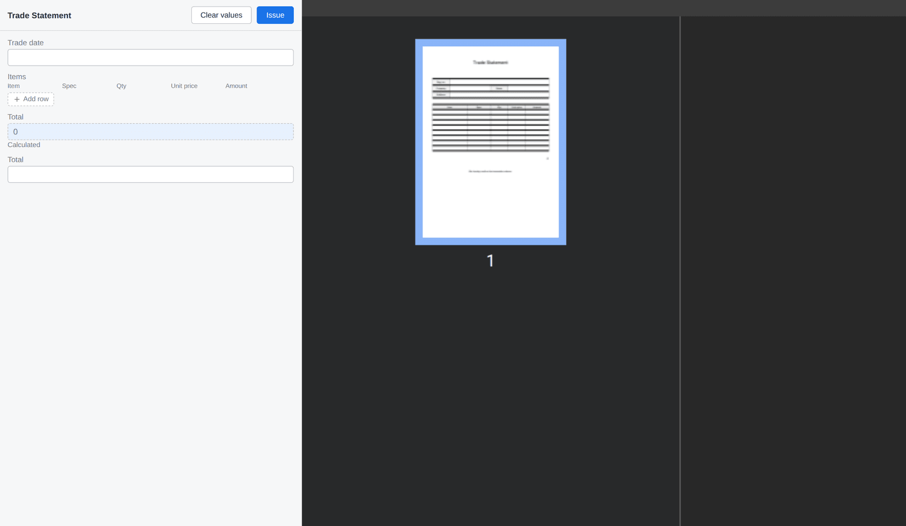

# Form Designer Guide

[한국어](designer.md) · [日本語](designer.ja.md)

This guide walks through building a form (template) with `<slip-designer>`, with screenshots.
For wiring the component into your app (install, props, events) see the **[Usage Guide](README.en.md)**;
for the `.slip` file format see the **[SPEC](../SPEC.md)**.

The screens below show the bundled demo (`pnpm demo`) with the "Trade Statement" preset open.

## Contents

1. [Layout](#1-layout)
2. [Adding and editing elements](#2-adding-and-editing-elements)
3. [Parameters — the values a voucher fills in](#3-parameters--the-values-a-voucher-fills-in)
4. [Grid — tables and repeating lists](#4-grid--tables-and-repeating-lists)
5. [Formulas](#5-formulas)
6. [Preview](#6-preview)
7. [Filling in a voucher](#7-filling-in-a-voucher)
8. [Saving and loading](#8-saving-and-loading)

---

## 1. Layout

The designer has four areas.

| Area | Where | What it does |
|---|---|---|
| **Toolbar** | Top | Add elements, copy/paste/undo, page navigation, preview, presets, save to my forms |
| **Sidebar** | Left | Page list, element list, parameter list |
| **Canvas** | Center | The editing surface where you place, move, and resize elements on the paper. mm rulers on top and left |
| **Settings panel** | Right | Edits the details of the selected target (paper, element, or parameter) |

With nothing selected, the panel shows **Form settings** (title, paper size, orientation, margins).

## 2. Adding and editing elements

Add elements with the tools on the left of the toolbar. There are nine element types.

| Tool | Element |
|---|---|
| Text | Fixed text (titles, notes) |
| Grid | Tables and repeating lists ([section 4](#4-grid--tables-and-repeating-lists)) |
| Image | A fixed image, or a per-voucher image (signature, stamp) |
| Line | A segment edited by length, angle, and width |
| Shape | Rectangle, ellipse, regular polygon |
| Field | A slot filled in at voucher time ([section 3](#3-parameters--the-values-a-voucher-fills-in)) |
| Barcode | QR, Code128, and 10 more (12 types) |

Selecting an element on the canvas or in the sidebar **Elements** list switches the right panel to
its editor. Below, the title (a text element) is selected — position (anchor, X, Y, width, height)
and text style are edited in one place.

- **Anchor**: which corner of the element the position (X, Y) is measured from.
- **Type**: toggle a slot between text (fixed) and input field (filled at voucher time) right here.
- Drag an element to move it, or use the corner handles to resize; snap to the mesh (toolbar `Grid`)
  if you turn it on.

## 3. Parameters — the values a voucher fills in

A **parameter** is a value a person fills in when writing a voucher. Define parameters in the form, and
fields, images, barcodes, and grid cells draw from them. The sidebar **Parameters** list is the single
source of truth for values, so you can design the values first, before adding any element.

A single parameter has these parts.

| Part | Meaning |
|---|---|
| **Physical name (key)** | The name used in files, formulas, and integrations (English recommended) |
| **Display name (label)** | The name shown on screen |
| **Parameter type** | The kind of value — text, number, date, boolean, image, or list. Decides the input in the form and which formulas apply |
| **Sub-fields** | For a **list** type, the values one item holds (item name, spec, quantity, unit price, amount above). Created and edited in the definition, independent of any grid |

At the bottom, **Used by** shows the elements that actually use the value, with their page.

## 4. Grid — tables and repeating lists

A grid handles both a fixed table (like the supplier box, with set cells) and a list that grows with the
data (the item table) as one element.

- **Rows/Columns**: add or remove. Column widths and row heights are absolute mm, so changing one cell
  doesn't shift the others.
- **Repeat section**: when on, the chosen row range is cloned for each item of a **list parameter**.
  Set the start/end rows, rows per page, a display cap, and whether to redraw the header across pages.
- **Cell editing**: click the table once more to pick an individual cell and edit its value
  (direct text, parameter, or formula) and style right away.

## 5. Formulas

Fields, barcodes, and grid cells can compute their value with a **formula**. Switch the value source to
`Formula` to get a formula box and an edit button (∑); the button opens the formula editor.

- Type the formula at the top and the **preview result** updates immediately.
- Click a **parameter** chip to insert that value; its type (date, list, number) is shown too.
- The **functions** list below documents all 32 built-in functions (SUM, AVG, IF, ROUND, …) with usage.

For detailed formula usage see the **[Formula Function Reference](formula.en.md)**.

## 6. Preview

The toolbar **Preview** renders the current form to PDF. On-screen preview and the actual PDF share the
same conversion, so what you see matches the output.

Sample values are drawn if present, otherwise the value name (`{key}`). Press **Edit** to return.

## 7. Filling in a voucher

Once the form is ready, switch to voucher entry to fill in values (`<slip-form>`). Enter values on the
left and the preview on the right updates live; formula values (like the total) compute automatically.

Pressing **Issue** locks the content and records integrity data (hash, signature) so you can later verify
the content hasn't changed.

## 8. Saving and loading

- **Files**: use download/open (in the toolbar, or the demo's top bar) to exchange `.slip` files.
- **My forms**: attach a `storage` adapter and use `Save to my forms` / `My forms` to keep and reuse
  forms in the browser or on a server. For adapter implementation see
  **[Usage Guide §5](README.en.md#5-storage-adapters)**.

The component does not save edits by itself — the host app must handle the `slip-change` event and save
([Usage Guide §4](README.en.md#4-events)).
