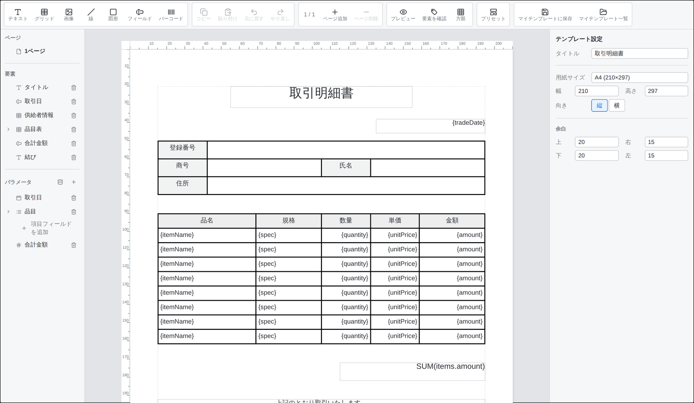
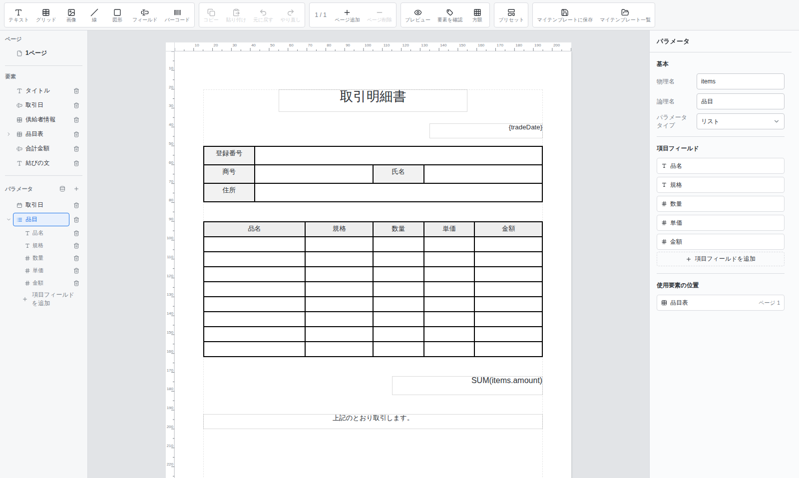
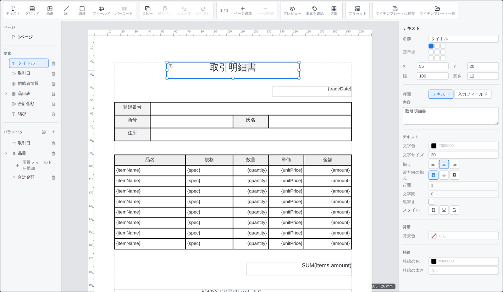
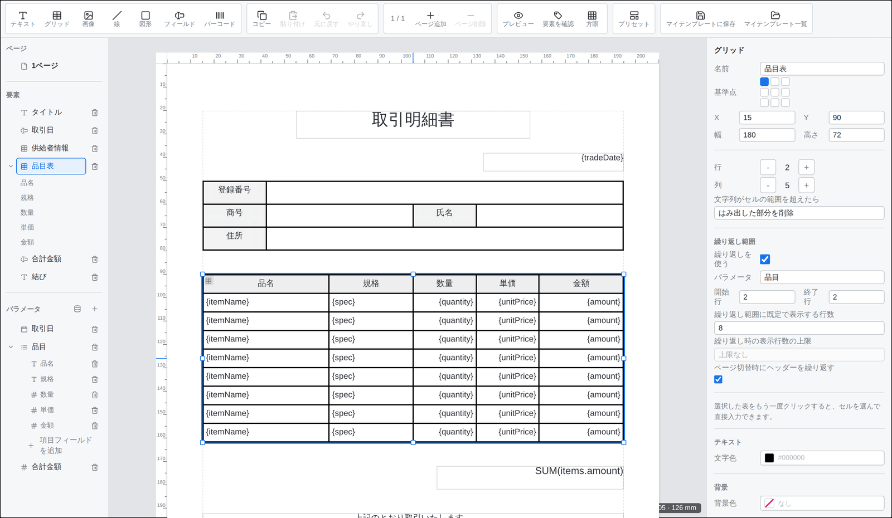
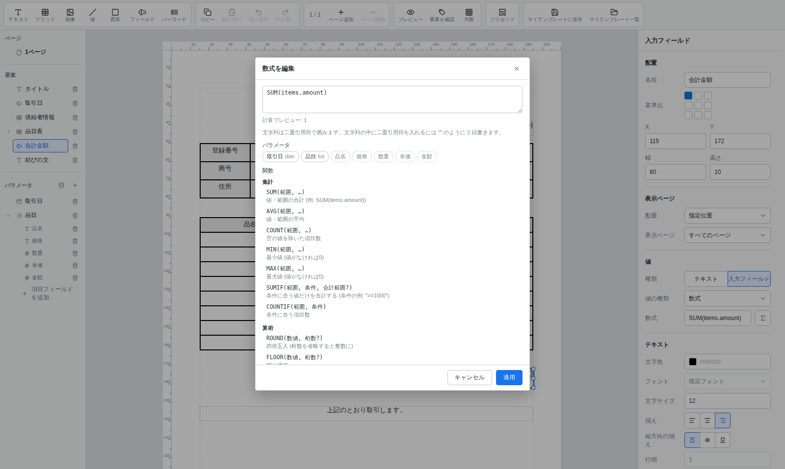
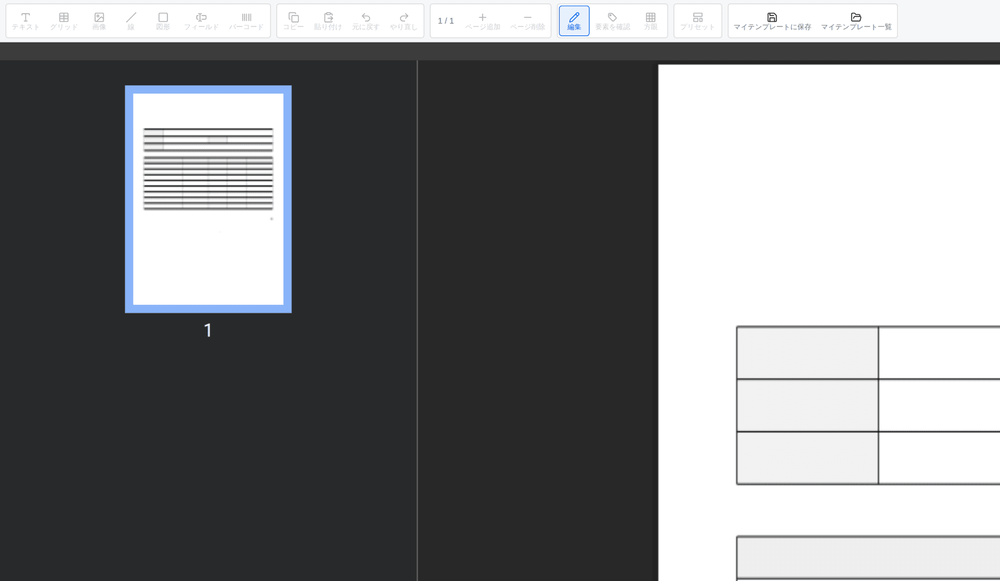

# テンプレートデザイナー利用ガイド

[한국어](designer.ko.md) · [English](designer.md)

このドキュメントは、SlipKit テンプレートデザイナーを使って文書テンプレートを作る方法を説明します。

開発者が `<slip-designer>` をアプリケーションに接続する方法は [スタートガイド](getting-started.ja.md) を、編集したテンプレートを保存して伝票作成画面と接続する方法は [アプリケーション統合ガイド](integration.ja.md) を参照してください。

このドキュメントの画面は、同梱デモで <kbd>プリセット</kbd> の <kbd>取引明細書</kbd> を読み込んだ状態を基準にしています。

## テンプレート作成の順序

初めてテンプレートを作る場合は、次の順序で作業することを推奨します。

- [ ] 空テンプレートまたはプリセットを選ぶ
- [ ] タイトル・用紙・余白を設定する
- [ ] 伝票に入力するパラメータを定義する
- [ ] テキスト・フィールド・画像などの要素を配置する
- [ ] 繰り返す項目があればグリッドを設定する
- [ ] 必要な計算数式を書く
- [ ] サンプルデータを入力する
- [ ] PDF プレビューを確認する
- [ ] 完成したテンプレートを保存する

> [!TIP]
> 画面の要素から配置するより、伝票に入るパラメータを先に定義すると、フィールド・繰り返し表・数式を接続しやすくなります。

## 1. 開始するテンプレートを選ぶ

テンプレート作成は、次の 2 つの方法で始められます。

### 空テンプレートから始める

空テンプレートは要素を自由に配置できますが、タイトル・用紙・パラメータ・表をすべて自分で構成する必要があります。

初めて使う場合は、空テンプレートよりプリセットを修正しながら機能を覚える方が簡単です。

### プリセットから始める

ツールバーの <kbd>プリセット</kbd> から、同梱の既定テンプレートを選べます。

- 取引明細書
- 請求書

プリセットには、用紙・テキスト・入力フィールド・品目表・合計数式があらかじめ設定されています。

> [!WARNING]
> プリセットを選ぶと、現在編集中のテンプレート全体が選んだプリセットに置き換わります。
> 必要な作業が残っていれば先に保存してください。プリセットを誤って適用した直後は、<kbd>元に戻す</kbd> で前の状態に戻せます。

## 2. 画面構成を理解する

デザイナーは 4 つの領域で構成されます。

| 領域 | 位置 | 役割 |
|---|---|---|
| ツールバー | 上 | 要素の追加、コピー・貼り付け、元に戻す、ページ追加、プレビュー、プリセット |
| サイドバー | 左 | ページ・要素・パラメータの一覧 |
| キャンバス | 中央 | 用紙の上で要素を配置しサイズを調整する編集空間 |
| 設定パネル | 右 | 現在選択したテンプレート・ページ・要素・パラメータの設定 |

キャンバスとサイドバーで選択した対象に応じて、右の設定パネルの内容が変わります。

| 選択した対象 | 設定パネル |
|---|---|
| 何も選択していない | テンプレート設定 |
| サイドバーのページ | ページ設定 |
| キャンバスまたはサイドバーの要素 | その要素の設定 |
| サイドバーのパラメータ | パラメータ設定 |
| グリッドのセル | 選択したセルの設定 |

> [!TIP]
> 設定したい項目が見えない場合は、まず現在何を選択しているか確認してください。空のキャンバス領域を選ぶとテンプレート設定に戻ります。

## 3. テンプレートとページを設定する

### テンプレート設定

要素もページも選択していない状態では、右にテンプレート設定が表示されます。

次の項目を先に決めます。

| 項目 | 説明 |
|---|---|
| タイトル | テンプレートと保存一覧で使う名前 |
| 用紙サイズ | A4 などの既定用紙、または直接入力したサイズ |
| 向き | 縦または横 |
| 余白 | 上・右・下・左の余白 |

用紙サイズと要素の位置・サイズは、ミリメートル単位で管理されます。

> [!NOTE]
> 余白は文書の作業基準を示します。要素を配置するときは、余白の外に出ていないかプレビューで確認してください。

### ページの管理

サイドバーの <kbd>ページ</kbd> 一覧からページを選択します。ツールバーでは、ページを追加または削除できます。

ページを選択すると、次の項目を設定できます。

- ページ名
- 外部連携に使う物理名
- ページ番号の表示可否
- ページ番号の位置
- ページの順序

ページ名を指定すると、サイドバーで単なるページ番号の代わりにその名前が表示されます。

> [!CAUTION]
> ページを削除すると、そのページに配置した要素も一緒に消えます。削除前にページと要素を確認してください。

## 4. パラメータを定義する

パラメータは、伝票ごとに異なる値を表します。

たとえば取引明細書には、次のようなパラメータが必要になることがあります。

| 物理名 | 論理名 | タイプ |
|---|---|---|
| `tradeDate` | 取引日 | 日付 |
| `customerName` | 取引先名 | 文字 |
| `items` | 品目 | リスト |
| `totalAmount` | 合計金額 | 数値 |
| `stamp` | 印鑑 | 画像 |

### パラメータの登録

サイドバーの <kbd>パラメータ</kbd> 領域で <kbd>パラメータを登録</kbd> を押します。

登録したパラメータを選択したあと、右の設定パネルで次の項目を入力します。

| 項目 | 用途 |
|---|---|
| 物理名 | ファイル、数式、外部システム連携に使う名前 |
| 論理名 | 作成フォームとデザイナー画面に表示する名前 |
| パラメータタイプ | 入力方法と、数式での値の種類 |

サポートするパラメータタイプは次のとおりです。

| タイプ | 使用例 |
|---|---|
| 文字 | 取引先名、住所、備考 |
| 数値 | 数量、単価、金額 |
| 日付 | 取引日、請求日 |
| 真偽 | 選択の有無、課税の有無 |
| 画像 | 署名、印鑑、商品画像 |
| リスト | 品目、作業内訳、請求項目 |

> [!TIP]
> 物理名は画面に表示する文章ではなく、データ連携に使う識別子です。
> `取引 日付` より `tradeDate` のように、空白なしで意味の分かる名前を推奨します。

物理名を変更すると、そのパラメータを参照する要素とサンプル値も一緒に変更されます。すでに使われている物理名と重複する名前や空の名前は使えません。

### リストパラメータと項目フィールド

品目のように複数の行が繰り返されるデータは、タイプを <kbd>リスト</kbd> に設定します。

リストパラメータには、項目 1 つが持つ項目フィールドを登録します。

たとえば `items` には、次の項目フィールドを置けます。

| 物理名 | 論理名 | タイプ |
|---|---|---|
| `itemName` | 品名 | 文字 |
| `spec` | 規格 | 文字 |
| `quantity` | 数量 | 数値 |
| `unitPrice` | 単価 | 数値 |
| `amount` | 金額 | 数値 |

項目フィールドは、まずパラメータ定義部で作り、そのあとグリッドの繰り返しセルに接続します。

> [!IMPORTANT]
> リストの項目フィールドと一般のパラメータは役割が異なります。
> `items` は品目全体のリストで、`items` 内の `quantity` は品目 1 行の数量です。

## 5. 要素を配置する

ツールバーで要素を追加したあと、キャンバスに配置します。

デザイナーがサポートする要素は次のとおりです。

| 要素 | 用途 |
|---|---|
| テキスト | タイトルや案内文のように、すべての伝票で固定される文字 |
| フィールド | パラメータや数式の結果を表示する場所 |
| グリッド | 固定された表、または繰り返されるリスト |
| 画像 | ロゴなどの固定画像、または伝票ごとに変わる画像 |
| バーコード | QR、Code 128 などのバーコード |
| 線 | 区切り線 |
| 四角形 | 枠線と背景領域 |
| 楕円 | 円形・楕円形の表示 |
| 多角形 | 三角形・五角形・六角形などの図形 |

要素を選択すると、右の設定パネルで位置、サイズ、内容、スタイルを編集できます。

### 要素の移動とサイズ調整

- 要素をドラッグして移動します。
- 要素のサイズ調整ハンドルをドラッグしてサイズを変更します。
- 設定パネルの X・Y・幅・高さに値を入力して正確に配置します。
- <kbd>基準点</kbd> で、X・Y 座標を計算する基準の位置を決めます。
- ツールバーの <kbd>方眼</kbd> をオンにすると、指定した間隔に合わせて配置できます。

### 要素の選択と編集

- キャンバスで要素を選択できます。
- サイドバーの <kbd>要素</kbd> 一覧からも選択できます。
- <kbd>要素を確認</kbd> をオンにすると、キャンバスで要素の種類を区別しやすくなります。
- <kbd>コピー</kbd> と <kbd>貼り付け</kbd> で要素を複製できます。
- <kbd>元に戻す</kbd> と <kbd>やり直し</kbd> で編集を復元できます。

<strong>複数の要素を一緒に移動する</strong>

サイドバーの要素一覧で、<kbd>Ctrl</kbd> または macOS の <kbd>⌘</kbd> を押しながら複数の要素を選択します。

選択した要素は一緒に移動したり、グループにまとめたりできます。グループにまとめると、グループ内の要素 1 つを選択しても全体が一緒に選択されます。

### フォントを選ぶ

- テキスト要素とフィールド要素では、<kbd>フォント</kbd> から使用するフォントを選びます。
- グリッドには共通フォントを指定でき、各セルは共通フォントを継承するか、別のフォントを選べます。
- <kbd>既定値</kbd> を選ぶと個別のフォント指定を解除します。グリッドセルはグリッドの共通フォントを再び継承します。
- 保存されたフォントを使用できない場合も名前は保持し、現在表示に使っている代替フォントを案内します。
- 太字と斜体には、登録された `-Bold`、`-Italic`、`-BoldItalic` の派生フォントを使います。必要な派生フォントがない場合は、設定パネルで実際に表示される字体を確認できます。

キャンバス、セルのインライン編集、PDF は同じフォントと派生フォントの選択規則を使います。ただし、ブラウザーと PDF レンダラーでは文字の測定方法が異なるため、改行位置に差が出ることがあります。

### 固定値と変動値の区別

文書で常に同じ内容は、テキスト要素として配置します。

伝票ごとに異なる値は、フィールド要素にパラメータを接続します。

たとえば次のように区別します。

| 内容 | 要素 |
|---|---|
| `取引日` というタイトル | テキスト |
| 実際の取引日の値 | `tradeDate` を接続したフィールド |
| 会社ロゴ | 固定画像 |
| 伝票ごとに異なる印鑑 | `stamp` を接続した変動画像 |

> [!NOTE]
> 画像ファイルはテンプレートに含まれるため、画像が多かったり大きかったりすると `.slip` ファイルのサイズも大きくなります。

## 6. グリッドを作る

グリッドは、固定された表と、データに応じて行が増える繰り返しリストの両方を表現します。

### 固定された表を作る

供給者情報のように行と列の数が決まっている表は、繰り返し機能を使いません。

1. ツールバーから <kbd>グリッド</kbd> を追加します。
2. 行と列の数を決めます。
3. 各行の高さと列の幅を調整します。
4. 必要なセルを結合します。
5. セルに直接入力、パラメータ、または数式を設定します。
6. 背景色・文字・枠線のスタイルを調整します。

### セルを選択する

グリッドを最初にクリックすると、グリッド全体が選択されます。選択されたグリッドをもう一度クリックすると、個別のセルを選択できます。

セルを選択すると、右の設定パネルでセルタイプを決めます。

| セルタイプ | 用途 |
|---|---|
| 直接入力 | 列見出しや固定文言 |
| パラメータ | 伝票で入力された値 |
| 数式 | 他の値から計算した結果 |

セルに名前を付けると、値の種類に関係なくサイドバーの要素一覧からそのセルを選択できます。名前がないセルは行と列の座標で表示されます。

### 繰り返しリストを作る

品目表のようにデータに応じて内容が増える表では、グリッドの <kbd>繰り返し</kbd> を使います。1 件のデータを 1 行だけでなく複数行で構成することもできます。

1. リストパラメータと項目フィールドを先に定義します。
2. 1 件のデータを表示する行を作ります。
3. グリッド設定の <kbd>繰り返し</kbd> で <kbd>使用</kbd> をオンにします。
4. 繰り返すリストパラメータを選びます。
5. <kbd>行範囲</kbd> で項目ごとに繰り返す行を <kbd>データ繰り返し領域</kbd> に指定します。
6. データ繰り返し領域の各セルに、リストの項目フィールドを接続します。
7. ページ方式を選びます。
8. <kbd>出力結果を表示</kbd> で実際の繰り返し結果を確認します。

ページ方式は次のように動作します。

| 方式 | 動作 |
|---|---|
| 自動拡張 | <kbd>最小表示項目数</kbd> まで空の項目を確保し、実データが多い場合はフロー領域内で拡張します。領域に収まらない場合は続きの出力ページを作成します。 |
| 固定ページ | 各出力ページに <kbd>1ページの項目数</kbd> 分の領域を確保します。データが不足する部分は空の項目として表示します。 |

たとえば `items` リストの繰り返し行には、次のように接続します。

| 列 | 接続する項目フィールド |
|---|---|
| 品名 | `itemName` |
| 規格 | `spec` |
| 数量 | `quantity` |
| 単価 | `unitPrice` |
| 金額 | `amount` |

> [!IMPORTANT]
> データ繰り返し領域のセルには、リスト全体の `items` ではなく、`items` 内の項目フィールドを接続します。

### ヘッダーと集計行を構成する

<kbd>行範囲</kbd> のかんたん設定では、次の行を追加できます。

| コマンド | 初期設定の結果 |
|---|---|
| ヘッダー | すべての出力ページ上部に列名を繰り返し表示 |
| グループ小計 | 各グループの末尾に選択した数値フィールドの合計を表示 |
| ページ小計 | 最終ページを除く各出力ページの下部にページ合計を表示 |
| 最終合計 | すべてのデータの後に全体合計を一度表示 |

行範囲の <kbd>表示方法</kbd> は、行の内容の種類ではなく、その行をどの範囲でいつ出力するかを定めます。

| 表示方法 | 出力タイミング | 主な用途 |
|---|---|---|
| 全データの前 | 最初の出力ページに1回 | タイトル、最初のページの案内 |
| ページごとのデータ前 | 表示対象の各ページ | 繰り返す列見出し |
| グループごとのデータ前 | 各グループの最初の項目前 | グループ名 |
| データ繰り返し領域 | データ1件ごと | 項目の内容 |
| グループごとのデータ後 | 各グループの最後の項目後 | グループ小計 |
| 全データの後 | 最後の項目後に1回 | 最終合計 |
| ページごとのデータ後 | 表示対象の各ページ | ページ小計、フッター |

グループ小計を使う場合は、先に <kbd>詳細設定</kbd> でグループ基準のフィールドを選びます。かんたん設定で追加した行も、行範囲一覧で範囲、表示方法、表示ページを変更できます。

キャンバス上でグリッドの左側に表示される行番号を選択すると、その行の表示方法を変更できます。複数行を 1 つの範囲にまとめるには、<kbd>Shift</kbd> を押しながら別の行番号を選択します。同じ操作は右側の行範囲一覧からも行えます。

ページ計画に問題がある場合は、キャンバス上部にエラーと <kbd>問題箇所を表示</kbd> ボタンが表示されます。ボタンを押すと、問題のあるグリッドと行範囲が選択されます。

## 7. 数式を書く

フィールド、バーコード、グリッドのセルは、パラメータの代わりに数式の結果を表示できます。

数式を使う要素やセルを選択したあと、値の種類を <kbd>数式</kbd> に変更します。数式編集ボタンを押すと編集ウィンドウが開きます。

数式編集ウィンドウでは、次の機能を使えます。

- パラメータ一覧から値を挿入
- サポート関数の一覧を確認
- 数式の文法エラーを確認
- サンプル値を使った結果の事前計算

たとえば品目ごとの金額をすべて合計するには、次の数式を使えます。

`SUM(items.amount)`

数量と単価から 1 行の金額を計算する必要があれば、繰り返しセルでその項目フィールドを使った数式を構成します。

> [!IMPORTANT]
> 数値計算に使うパラメータと項目フィールドは、タイプを <kbd>数値</kbd> に設定してください。
> 文字タイプは数値に自動変換されず、必要な場合は `TO_NUMBER` を明示的に使う必要があります。

サポート関数と記述ルールは、[数式関数リファレンス](formula.ja.md) を確認してください。

## 8. 条件付き書式を設定する

テキスト、フィールド、グリッドセルは、値に応じて文字色、背景色、罫線色、または文字の強調を変更できます。

1. 条件付き書式を適用する要素またはセルを選択します。
2. 右側の設定パネルにある <kbd>条件付き書式</kbd> で <kbd>ルールを追加</kbd> を選びます。
3. `amount < 0` のように `TRUE` または `FALSE` を返す条件式を入力します。
4. 条件が真のときに適用する色または強調を 1 つ以上指定します。
5. ルールが複数ある場合は、上下ボタンで適用順を調整します。同じプロパティを変更するルールが重なると、下のルールが優先されます。

強調ボタンは、次の 3 状態を順番に切り替えます。

| 状態 | 動作 |
|---|---|
| 基本のまま | 要素またはセルの基本の強調を維持 |
| 適用 | 条件が真のときに太字、斜体、下線、または取り消し線を適用 |
| 解除 | 条件が真のときに基本の強調を解除 |

データ繰り返し領域のセルでは、現在の項目のフィールドを条件式から直接参照できます。たとえば金額セルに `amount < 0` を指定すると、各行の `amount` の値でルールを評価します。

> [!NOTE]
> 必要な値がない、または計算できないため条件式を評価できない場合、そのルールは適用されません。サンプルデータを入力し、通常値と境界値をキャンバスと PDF プレビューの両方で確認してください。

> [!IMPORTANT]
> 自動結合されたセルは、結合グループの最初の項目で評価した条件付き書式を使用します。斜体は、ホストが選択したフォントの Italic バリアントを提供している場合にのみ PDF に反映されます。

## 9. サンプルデータを入力する

サンプルデータは、実際の伝票を発行せずにパラメータと数式の表示結果を確認するための値です。

サイドバーの <kbd>パラメータ</kbd> 領域で <kbd>サンプルデータ</kbd> を開きます。

サンプルデータでは、次の内容を確認できます。

- フィールドに値が表示されるか
- 数値と日付の形式が正しいか
- 繰り返しリストが想定した行数で表示されるか
- 数式の結果が正しいか
- 条件付き書式が想定した値で適用されるか
- 画像とバーコードが正常にレンダリングされるか
- 複数ページに分かれる結果が正しいか

サンプル値を入れていないパラメータは、プレビューで値の名前や空の値として表示されることがあります。

> [!NOTE]
> サンプルデータは、テンプレート作成とプレビューに使う値です。テンプレートから伝票を作るときに、実際の入力値として自動でコピーされることはありません。

## 10. PDF プレビューを確認する

ツールバーの <kbd>プレビュー</kbd> を押すと、現在のテンプレートを PDF にレンダリングした結果が表示されます。

次の項目を確認します。

- 要素が用紙と余白の中に配置されているか
- 文字が切れたり重なったりしていないか
- 表の枠線とセル結合が正しいか
- 繰り返しリストが次のページへ正しく続くか
- ページ番号が指定した位置に表示されるか
- 数式とバーコードが正常にレンダリングされるか
- 条件付き書式の色と強調が想定どおりに適用されるか
- 画像が想定したサイズと比率で表示されるか

> [!IMPORTANT]
> 最終的な出力の形は、編集キャンバスではなく PDF プレビューを基準に確認してください。
> 編集キャンバスと PDF は、フォントをレンダリングする環境によって改行位置が少し異なる場合があります。

プレビューで問題が見つかったら、<kbd>編集</kbd> に戻って修正します。

## 11. テンプレートを保存する

テンプレートを保存する方法は、ホストアプリケーションの構成によって異なります。

### マイテンプレートに保存

開発者がデザイナーの `storage` プロパティを接続している場合、次のボタンが表示されます。

- <kbd>マイテンプレートに保存</kbd>
- <kbd>マイテンプレート一覧</kbd>

この機能でテンプレートに名前を付けて保存し、一覧から再度読み込んだり削除したりできます。

### 自動保存

デザイナーは、編集するたびに `slip-change` イベントで変更されたテンプレートを渡します。ホストアプリケーションがこのイベントを受け取って初めて、自動保存を実装できます。

> [!IMPORTANT]
> <kbd>マイテンプレートに保存</kbd> 機能と自動保存は別々の機能です。
> ストレージアダプタが接続されていても、現在の編集内容を自動で保存し続けることはありません。

### ファイルを開く・ダウンロードする

同梱デモ上部の次の機能は、`<slip-designer>` ではなくデモアプリケーションが提供します。

- <kbd>ファイルにダウンロード</kbd>
- <kbd>ファイルを開く</kbd>
- リロード後の作業の復元
- <kbd>テンプレート作成</kbd> と <kbd>伝票作成</kbd> の画面切り替え

実際のアプリケーションでこれらの機能を実装する方法は、[アプリケーション統合ガイド](integration.ja.md) を参照してください。

## よくある問題

<strong>伝票作成画面に入力項目が表示されません</strong>

フィールドやグリッドのセルにパラメータが接続されているか確認してください。

固定テキストと数式の結果は、ユーザーが入力する値ではないため、作成フォームの入力項目にはなりません。

<strong>繰り返し表にデータが表示されません</strong>

次の項目を順に確認してください。

- パラメータタイプがリストか
- リストに項目フィールドが定義されているか
- グリッドで繰り返しの使用がオンになっているか
- データ繰り返し領域が正しいか
- データ繰り返し領域のセルに項目フィールドが接続されているか
- サンプルデータがオブジェクトの配列の形か

<strong>数式が計算されません</strong>

パラメータのタイプと、数式が要求するタイプが同じか確認してください。数値関数に文字の値を渡すと計算エラーが発生することがあります。

数式編集ウィンドウの文法エラーと事前計算の結果を先に確認してください。

<strong>条件付き書式が適用されません</strong>

条件式が `TRUE` または `FALSE` を返すか、参照するパラメータや繰り返し項目のフィールドにサンプル値があるか確認してください。繰り返しセルでは、リストパラメータ名ではなく現在の項目のフィールド名を使用します。

ルールが複数ある場合は、下のルールが同じ色や強調を上書きしていないかも確認してください。

<strong>プレビューに実際の値が表示されません</strong>

テンプレート作成中は実際の伝票の値がないため、サンプルデータを入力する必要があります。

サイドバーの <kbd>パラメータ</kbd> 領域で <kbd>サンプルデータ</kbd> を開いて値を入力してください。

<strong>編集した内容がリロード後に消えます</strong>

デザイナーは編集内容を自動で永続保存しません。ホストアプリケーションが `slip-change` イベントを受け取って、ブラウザやサーバーに保存する必要があります。

同梱デモでは、アプリケーションが IndexedDB の自動保存を別途実装しています。

## 完了確認

- [ ] テンプレートのタイトルと用紙設定を確認しました。
- [ ] 必要なパラメータとタイプを定義しました。
- [ ] リストパラメータの項目フィールドを定義しました。
- [ ] 固定値と変動値を正しい要素で区別しました。
- [ ] 繰り返し表のデータ繰り返し領域と項目フィールドを接続しました。
- [ ] 数式編集ウィンドウで計算結果を確認しました。
- [ ] 条件付き書式をサンプル値と PDF プレビューで確認しました。
- [ ] サンプルデータでテンプレートを検証しました。
- [ ] PDF プレビューで出力結果を確認しました。
- [ ] テンプレートがホストアプリケーションに保存されるか確認しました。

## 関連ドキュメント

- [スタートガイド](getting-started.ja.md)
- [アプリケーション統合ガイド](integration.ja.md)
- [数式関数リファレンス](formula.ja.md)
