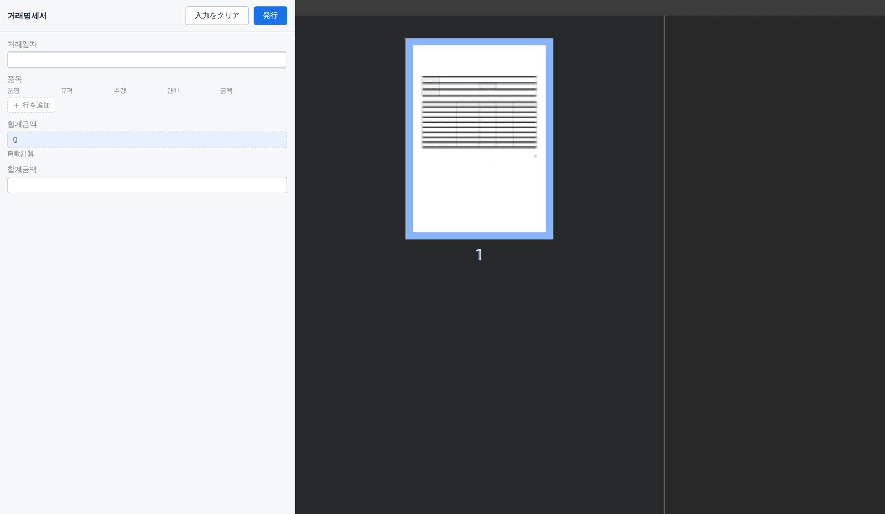

# フォームデザイナー利用ガイド

[한국어](designer.md) · [English](designer.en.md)

`<slip-designer>` でテンプレートを作る方法を画面とともに説明します。コンポーネントをアプリに組み込む
方法（インストール・プロパティ・イベント）は **[利用ガイド](README.ja.md)** を、`.slip` ファイル
フォーマットは **[SPEC](../SPEC.md)** を参照してください。

以下の画面は同梱デモ（`pnpm demo`）で「取引明細書」プリセットを開いたものです。

## 目次

1. [画面構成](#1-画面構成)
2. [要素の追加・編集](#2-要素の追加編集)
3. [パラメータ — 伝票に入力する値](#3-パラメータ--伝票に入力する値)
4. [グリッド — 表と繰り返しリスト](#4-グリッド--表と繰り返しリスト)
5. [数式](#5-数式)
6. [プレビュー](#6-プレビュー)
7. [伝票の作成](#7-伝票の作成)
8. [保存・読み込み](#8-保存読み込み)

---

## 1. 画面構成

デザイナーは四つの領域に分かれます。

| 領域 | 位置 | 役割 |
|---|---|---|
| **ツールバー** | 上 | 要素の追加、コピー・貼り付け・元に戻す、ページ切り替え、プレビュー、プリセット、マイテンプレート保存 |
| **サイドバー** | 左 | ページ一覧、要素一覧、パラメータ一覧 |
| **キャンバス** | 中央 | 用紙の上に要素を置き、動かし、サイズを変える編集領域。上と左に mm 定規 |
| **設定パネル** | 右 | 選択した対象（用紙・要素・パラメータ）の詳細を編集する場所 |

何も選択していないと、パネルは **フォーム設定**（タイトル・用紙サイズ・向き・余白）を表示します。

## 2. 要素の追加・編集

ツールバー左側のツールで要素を追加します。要素は 9 種類です。

| ツール | 要素 |
|---|---|
| テキスト | 固定の文字（タイトル・案内文など） |
| グリッド | 表と繰り返しリスト（[4章](#4-グリッド--表と繰り返しリスト)） |
| 画像 | 固定画像、または伝票ごとに変わる画像（署名・印鑑） |
| 線 | 長さ・角度・太さで扱う線分 |
| 図形 | 四角形・楕円・正多角形 |
| フィールド | 伝票作成時に値が入る入力欄（[3章](#3-パラメータ--伝票に入力する値)） |
| バーコード | QR・Code128 など 12 種 |

キャンバスまたはサイドバーの **要素** 一覧で要素を選ぶと、右のパネルがその要素の編集に変わります。
下はタイトル（テキスト）を選んだ状態です — 位置（基準点・X・Y・幅・高さ）と文字スタイルを一箇所で
編集します。

- **基準点**: 位置（X・Y）を要素のどの角を基準に取るかを選びます。
- **種類**: テキスト（固定文）と入力フィールド（伝票で入力する値）をその場で切り替えます。
- キャンバスで要素をドラッグして動かしたり、角のハンドルでサイズを変えたりでき、方眼（ツールバー
  `方眼`）に吸着させることもできます。

## 3. パラメータ — 伝票に入力する値

**パラメータ**は伝票を書くときに人が入力する値です。テンプレートでパラメータを定義しておくと、
フィールド・画像・バーコード・グリッドのセルがその値を使います。サイドバーの **パラメータ** 一覧が
値の唯一の源なので、要素を作らずに値を先に設計できます。

パラメータ一つは次の要素からなります。

| 項目 | 意味 |
|---|---|
| **物理名（key）** | ファイル・数式・連携に使う名前（英字推奨） |
| **論理名（label）** | 画面に表示される名前 |
| **パラメータタイプ** | 値の種類 — 文字・数値・日付・真偽・画像・リスト。作成フォームの入力方式と使える数式を決めます |
| **項目フィールド** | タイプが**リスト**のとき、1 項目が持つ値（上図の品名・規格・数量・単価・金額）。グリッドとは無関係に定義部で作成・編集します |

パラメータパネル下の **使用要素の位置** は、その値を実際に使う要素をページとともに示します。

## 4. グリッド — 表と繰り返しリスト

グリッドは、固定された表（供給者情報のようにセルが決まった表）と、データの数だけ増える繰り返しリスト
（品目表）を一つの要素として扱います。

- **行・列**: 数を増減します。列幅・行高は mm 絶対値なので、1 つのセルを変えても他のセルは動きません。
- **繰り返し範囲**: 有効にすると、指定した行範囲が**リストパラメータ**の項目数だけ複製されます。
  開始・終了行、1 ページあたりの行数、表示上限、ページをまたぐときにヘッダーを再描画するかを決めます。
- **セル編集**: 表をもう一度クリックすると、個別のセルを選んで値（直接入力・パラメータ・数式）と
  スタイルをその場で編集できます。

## 5. 数式

フィールド・バーコード・グリッドのセルは、値を**数式**で計算できます。値のソースを `数式` に切り替えると
数式入力欄と編集ボタン（∑）が現れ、ボタンで数式編集ウィンドウが開きます。

- 上部に数式を書くと、**計算プレビュー**の結果がすぐ表示されます。
- **パラメータ**チップを押すとその値を数式に挿入します。タイプ（日付・リスト・数値）も表示されます。
- 下の**関数**一覧で、32 種の組み込み関数（SUM・AVG・IF・ROUND など）を用途とともに確認します。

数式関数の詳しい使い方は **[数式関数リファレンス](formula.ja.md)** を参照してください。

## 6. プレビュー

ツールバーの **プレビュー** を押すと、現在のテンプレートを PDF にレンダリングした結果を見られます。
画面プレビューと実際の PDF は同じ変換結果を使うため、画面と出力がずれません。

サンプル値があればその値で、なければ値の名前（`{key}`）で描画します。再び **編集** を押すと編集に戻ります。

## 7. 伝票の作成

テンプレートができたら、伝票作成に切り替えて値を入力します（`<slip-form>`）。左で値を入力すると
右のプレビューがリアルタイムで変わり、数式の値（合計金額など）は自動で計算されます。

**発行** を押すと内容が確定してロックされます — 発行後は編集できません。

## 8. 保存・読み込み

- **ファイル**: ツールバー（デモでは上部）のダウンロード・開くで `.slip` ファイルをやり取りします。
- **マイテンプレート**: `storage` アダプターを付けると `マイテンプレートに保存`・`マイテンプレート一覧`
  でブラウザやサーバーにテンプレートを保管・再利用できます。アダプターの実装は
  **[利用ガイド §5](README.ja.md#5-ストレージアダプター)** を参照してください。

コンポーネントは編集内容を自分では保存しません — ホストアプリが `slip-change` イベントを受け取って
保存する必要があります（[利用ガイド §4](README.ja.md#4-イベント)）。
