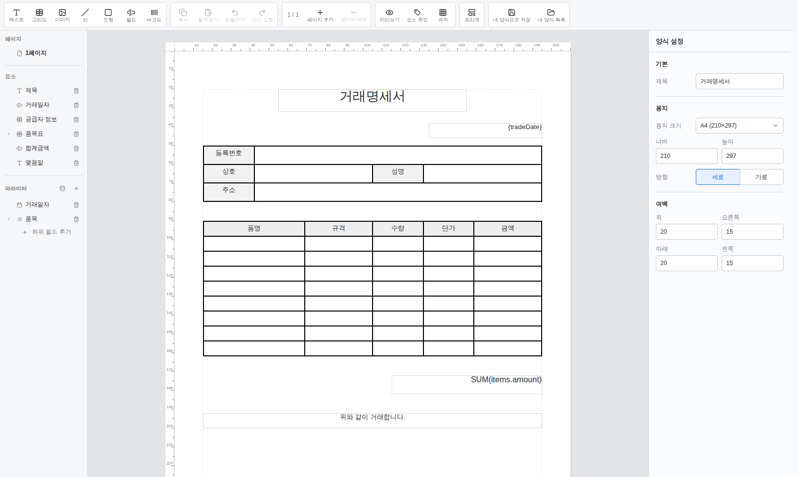
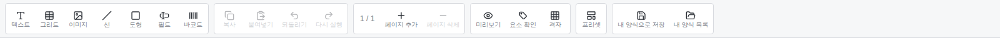
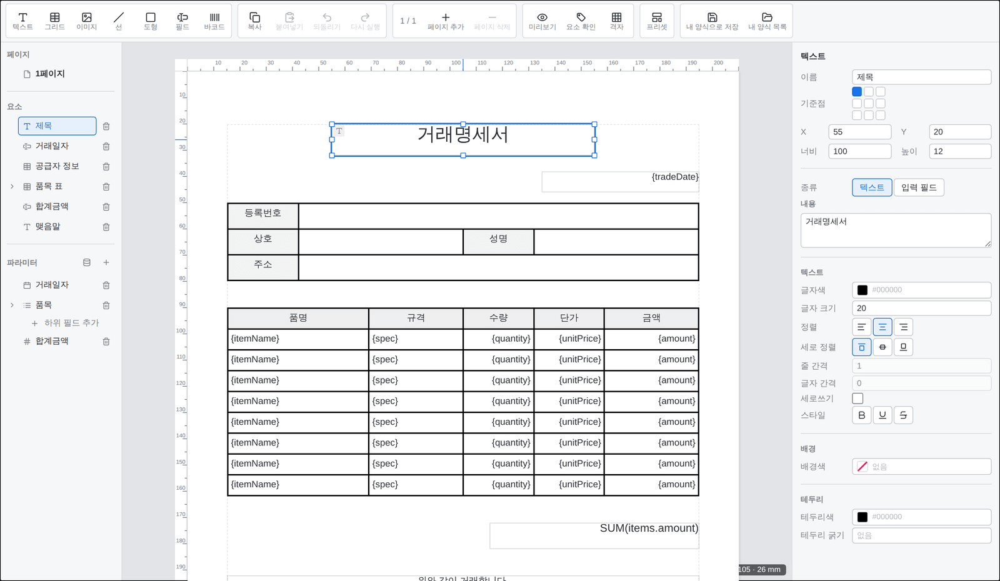
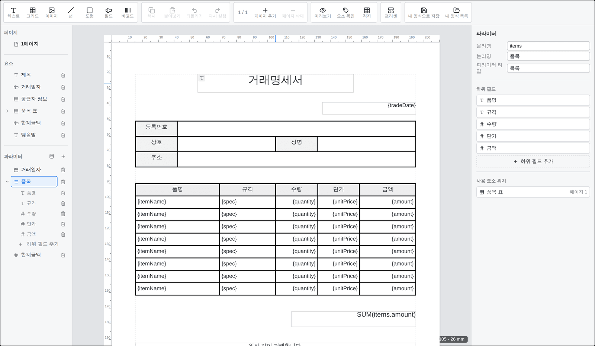
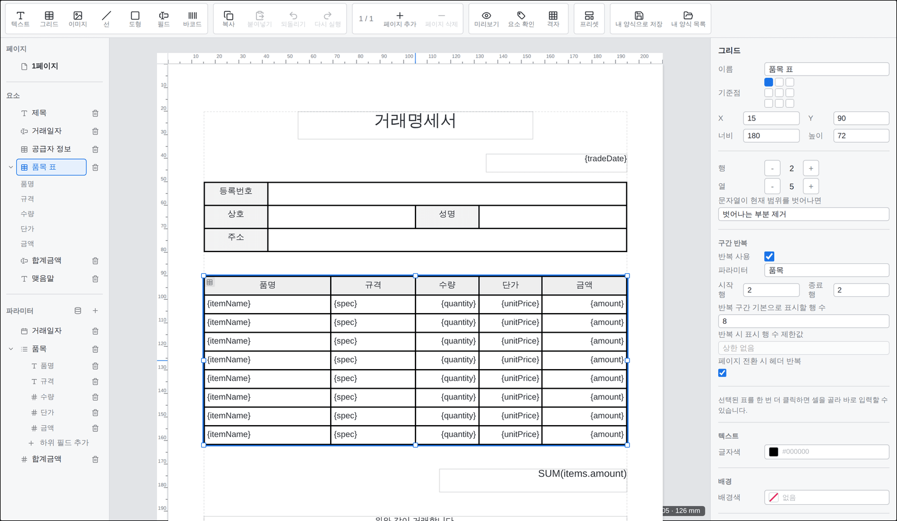
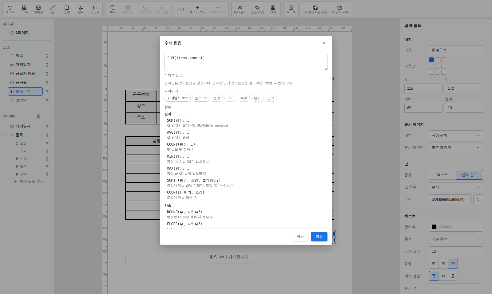
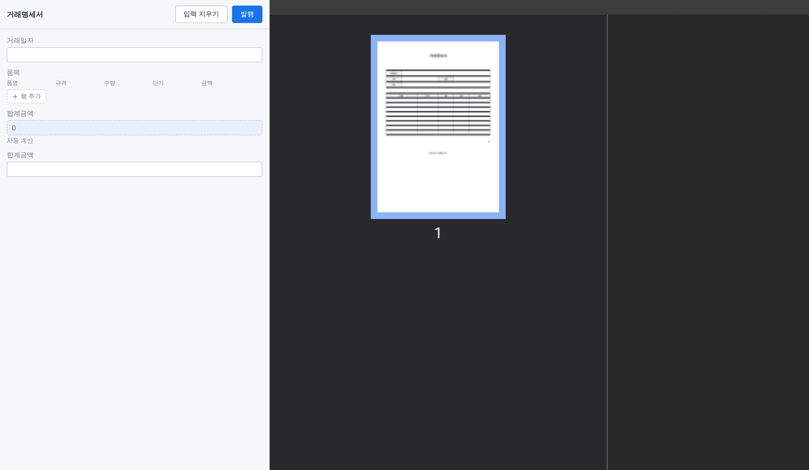

# 양식 디자이너 사용 가이드

[English](designer.en.md) · [日本語](designer.ja.md)

`<slip-designer>`로 양식(template)을 만드는 방법을 화면과 함께 설명합니다. 컴포넌트를 앱에 붙이는
방법(설치·속성·이벤트)은 **[사용 가이드](README.md)** 를, `.slip` 파일 포맷은 **[SPEC](../SPEC.md)** 을 보세요.

여기 나오는 화면은 동봉 데모(`pnpm demo`)에서 동봉 프리셋 "거래명세서"를 연 모습입니다.

## 목차

1. [화면 구성](#1-화면-구성)
2. [요소 추가·편집](#2-요소-추가편집)
3. [파라미터 — 전표에 채울 값](#3-파라미터--전표에-채울-값)
4. [그리드 — 표와 반복 목록](#4-그리드--표와-반복-목록)
5. [수식](#5-수식)
6. [미리보기](#6-미리보기)
7. [전표 쓰기](#7-전표-쓰기)
8. [저장·불러오기](#8-저장불러오기)

---

## 1. 화면 구성

디자이너는 네 영역으로 나뉩니다.

| 영역 | 자리 | 하는 일 |
|---|---|---|
| **툴바** | 위 | 요소 추가, 복사·붙여넣기·되돌리기, 페이지 넘기기, 미리보기, 프리셋, 내 양식 저장 |
| **사이드바** | 왼쪽 | 페이지 목록, 요소 목록, 파라미터 목록 |
| **캔버스** | 가운데 | 용지 위에 요소를 놓고 옮기고 크기를 바꾸는 편집 공간. 위·왼쪽에 mm 눈금자 |
| **설정 패널** | 오른쪽 | 선택한 대상(용지·요소·파라미터)의 세부 값을 고치는 곳 |

아무것도 선택하지 않으면 설정 패널은 **양식 설정**(제목·용지 크기·방향·여백)을 보여줍니다.

## 2. 요소 추가·편집

툴바 왼쪽의 도구로 요소를 추가합니다. 요소는 9종입니다.

| 도구 | 요소 |
|---|---|
| 텍스트 | 고정된 글 (제목·안내 문구 등) |
| 그리드 | 표와 반복 목록 ([4장](#4-그리드--표와-반복-목록)) |
| 이미지 | 고정 이미지 또는 전표마다 바뀌는 변동 이미지(서명·도장) |
| 선 | 길이·각도·굵기로 다루는 선분 |
| 도형 | 사각형·타원·정다각형 |
| 필드 | 전표에서 값이 채워지는 입력 자리 ([3장](#3-파라미터--전표에-채울-값)) |
| 바코드 | QR·Code128 등 12종 |

요소를 캔버스나 사이드바 **요소** 목록에서 고르면 오른쪽 설정 패널이 그 요소의 편집으로 바뀝니다.
아래는 제목(텍스트)을 고른 모습입니다 — 자리(기준점·X·Y·너비·높이)와 글자 스타일을 한자리에서 고칩니다.

- **기준점**: 위치(X·Y)를 요소의 어느 모서리 기준으로 잡을지 고릅니다.
- **종류**: 텍스트(고정 글)와 입력 필드(전표에서 채우는 값)를 그 자리에서 서로 바꿉니다.
- 캔버스에서 요소를 끌어 옮기거나 모서리 손잡이로 크기를 바꿀 수 있고, 격자(툴바 `격자`)에
  맞춰 떨어지게 할 수 있습니다.

## 3. 파라미터 — 전표에 채울 값

**파라미터**는 전표를 쓸 때 사람이 채우는 값입니다. 양식에서 파라미터를 정의해 두면, 필드·이미지·바코드·
그리드 셀이 그 값을 가져다 씁니다. 사이드바 **파라미터** 목록이 값의 단일 원천이라, 요소를 만들지
않고도 값을 먼저 설계할 수 있습니다.

파라미터 하나는 이렇게 이뤄집니다.

| 항목 | 뜻 |
|---|---|
| **물리명(key)** | 파일·수식·연동에 쓰는 이름 (영문 권장) |
| **논리명(label)** | 화면에 보이는 이름 |
| **파라미터 타입** | 값의 종류 — 글자·숫자·날짜·참/거짓·이미지·목록. 작성폼의 입력 방식과 쓸 수 있는 수식을 정합니다 |
| **하위 필드** | 타입이 **목록**일 때, 항목 하나가 가진 값들(위 그림의 품명·규격·수량·단가·금액). 그리드와 무관하게 정의부에서 만들고 고칩니다 |

파라미터 패널 아래 **사용 요소 위치**는 그 값을 실제로 쓰는 요소를 페이지와 함께 보여줍니다.

## 4. 그리드 — 표와 반복 목록

그리드는 고정된 표(공급자 정보처럼 칸이 정해진 표)와 데이터만큼 늘어나는 반복 목록(품목 표)을
하나로 다루는 요소입니다.

- **행·열**: 개수를 늘리고 줄입니다. 열 너비·행 높이는 mm 절대값이라 한 칸을 바꿔도 다른 칸이
  덩달아 변하지 않습니다.
- **구간 반복**: 켜면 지정한 행 범위가 **목록 파라미터**의 항목 수만큼 복제됩니다. 시작·종료 행,
  한 페이지에 담을 행 수, 표시 상한, 페이지가 넘어갈 때 헤더를 다시 그릴지를 정합니다.
- **셀 편집**: 표를 한 번 더 클릭하면 개별 셀을 골라 값(직접 입력·파라미터·수식)과 스타일을
  바로 고칠 수 있습니다.

## 5. 수식

필드·바코드·그리드 셀은 값을 **수식**으로 계산할 수 있습니다. 값 소스를 `수식`으로 바꾸면
수식 입력칸과 편집 단추(∑)가 나오고, 단추를 누르면 수식 편집 창이 열립니다.

- 위쪽에 수식을 적으면 **미리 계산** 결과가 바로 보입니다.
- **파라미터** 칩을 누르면 그 값을 수식에 넣습니다. 타입(날짜·목록·숫자)이 함께 표시됩니다.
- 아래 **함수** 목록에서 32종의 내장 함수(SUM·AVG·IF·ROUND 등)를 쓰임과 함께 확인합니다.

수식 함수의 자세한 사용법은 **[수식 함수 참조](formula.md)** 를 보세요.

## 6. 미리보기

툴바 **미리보기**를 누르면 지금 양식을 PDF로 렌더한 결과를 봅니다. 화면 미리보기와 실제 PDF는
같은 변환 결과를 쓰므로 화면과 출력이 어긋나지 않습니다.

샘플 값이 있으면 그 값으로, 없으면 값 이름(`{키}`)으로 그립니다. 다시 **편집**을 누르면 편집으로 돌아옵니다.

## 7. 전표 쓰기

양식이 완성되면 **전표 쓰기**로 넘어가 값을 채웁니다(`<slip-form>`). 왼쪽에서 값을 입력하면
오른쪽 미리보기가 실시간으로 바뀌고, 수식 값(예: 합계금액)은 자동으로 계산됩니다.

**발행**을 누르면 내용이 확정되어 잠깁니다 — 발행 뒤에는 더 고칠 수 없습니다.

## 8. 저장·불러오기

- **파일**: 툴바(데모에서는 상단)의 내려받기·열기로 `.slip` 파일을 주고받습니다.
- **내 양식**: `storage` 어댑터를 붙이면 `내 양식으로 저장`·`내 양식 목록`으로 브라우저나 서버에
  양식을 보관·재사용합니다. 어댑터 구현은 **[사용 가이드 §5](README.md#5-저장소-어댑터)** 를 보세요.

편집 내용은 컴포넌트가 스스로 저장하지 않습니다 — 호스트 앱이 `slip-change` 이벤트를 받아 저장해야
합니다([사용 가이드 §4](README.md#4-이벤트)).
