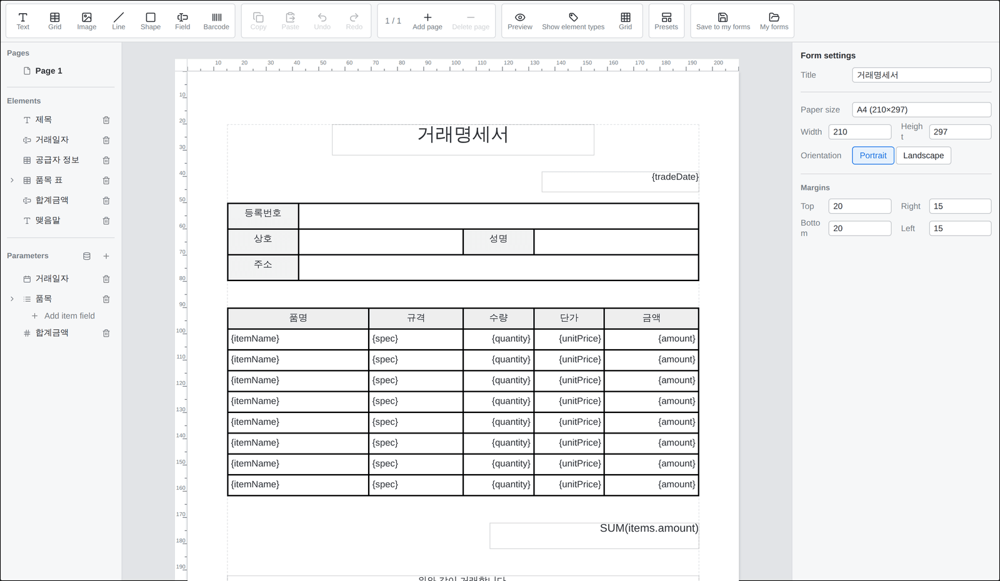
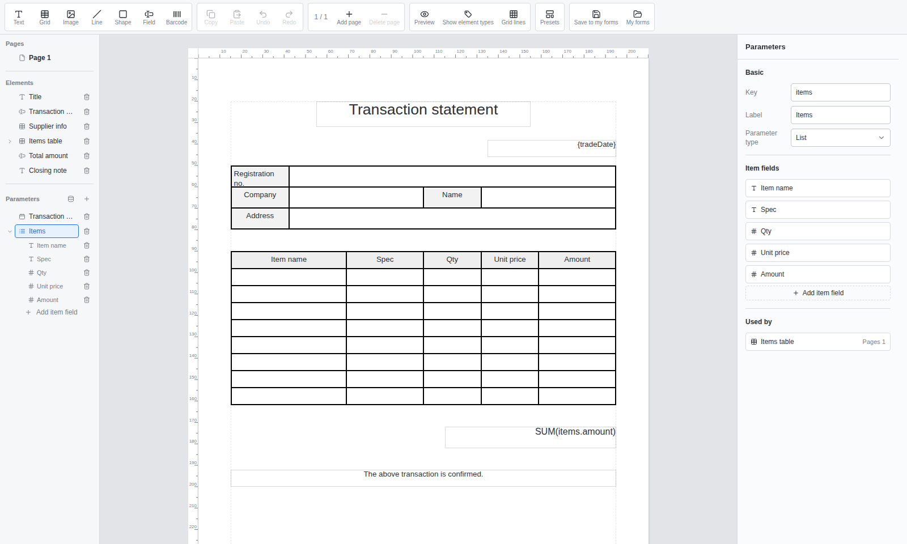
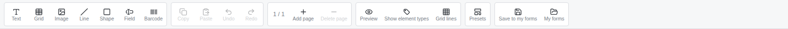
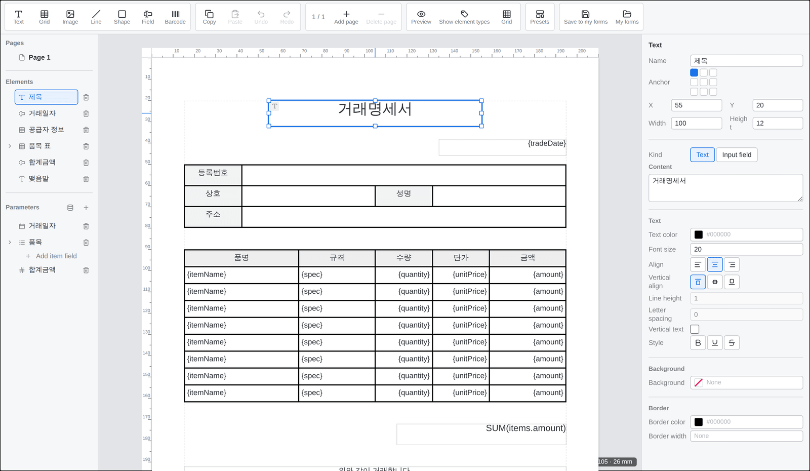
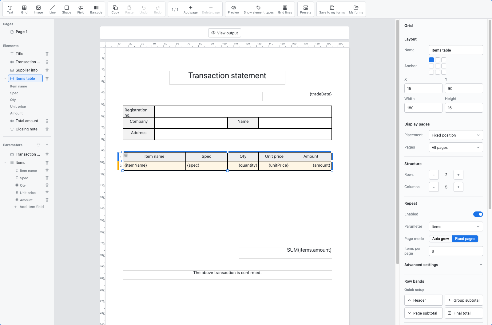
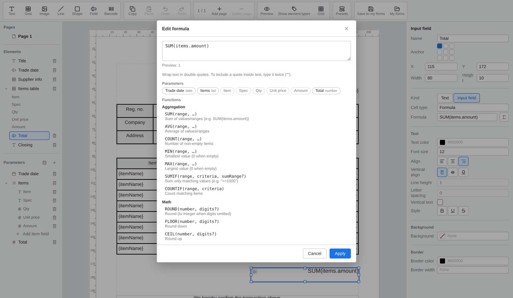
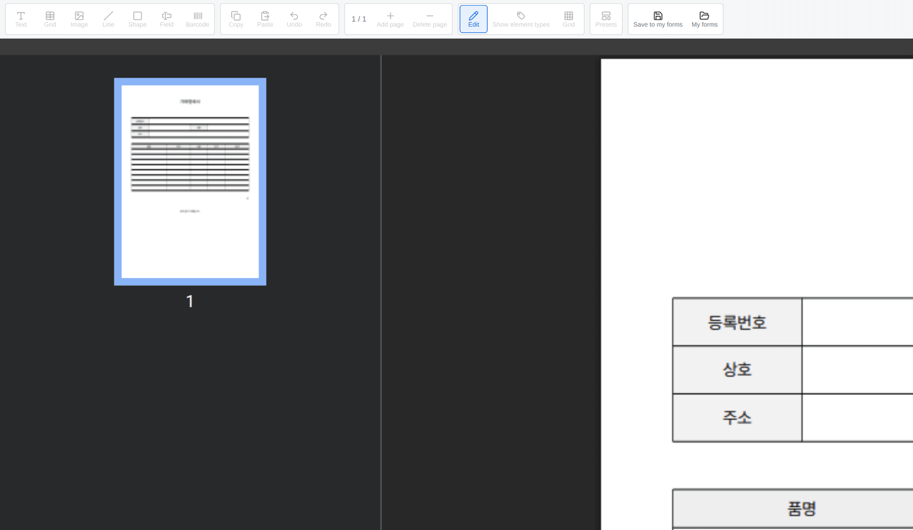

# Form Designer Guide

[한국어](designer.ko.md) · [日本語](designer.ja.md)

This document explains how to build document templates with the SlipKit form designer.

For how a developer connects `<slip-designer>` to an application, see [Getting started](getting-started.md); for how to save the edited template and connect it to the voucher-entry screen, see the [Application Integration Guide](integration.md).

The screens in this document are based on loading <kbd>Transaction statement</kbd> from <kbd>Presets</kbd> in the bundled demo.

## Supported screen size

The form designer is a desktop-only interface. Use it in a browser viewport of at least 1440×810 and allocate at least 1280×640 to the `<slip-designer>` element. The toolbar, sidebars, and canvas keep the same three-column layout and do not switch to a mobile or tablet layout.

If the host application cannot allocate 1280×640, place the designer in a container with `overflow: auto`. The designer does not show a warning or block editing below the supported size.

## Order of building a template

If you're building a template for the first time, we recommend working in this order.

- [ ] Choose a blank template or a preset
- [ ] Set the title, paper, and margins
- [ ] Define the parameters to fill in on a voucher
- [ ] Place elements such as text, fields, and images
- [ ] Set up a grid if there are repeating items
- [ ] Write any calculation formulas you need
- [ ] Enter sample data
- [ ] Check the PDF preview
- [ ] Save the finished template

> [!TIP]
> Rather than placing screen elements first, defining the parameters that go into a voucher first makes it easier to connect fields, repeating tables, and formulas.

## 1. Choosing a starting template

You can start building a template in two ways.

### Starting from a blank template

A blank template lets you place elements freely, but you have to set up the title, paper, parameters, and tables all by yourself.

For first-time use, it's easier to learn the features by modifying a preset than by starting from a blank template.

### Starting from a preset

You can choose a bundled default template from <kbd>Presets</kbd> in the toolbar.

- Transaction statement
- Invoice

A preset comes with paper, text, input fields, an items table, and a total formula preconfigured.

> [!WARNING]
> Choosing a preset replaces the entire template you are currently editing with the selected preset.
> If you have unfinished work, save it first. Right after applying a preset by mistake, you can return to the previous state with <kbd>Undo</kbd>.

## 2. Understanding the layout

The designer consists of four areas.

| Area | Position | Role |
|---|---|---|
| Toolbar | Top | Add elements, copy/paste, undo, add page, preview, presets |
| Sidebar | Left | Lists of pages, elements, and parameters |
| Canvas | Center | The editing space where you place and resize elements on the paper |
| Settings panel | Right | Settings for the currently selected template, page, element, or parameter |

The content of the right settings panel changes depending on what you select in the canvas and the sidebar.

| What you selected | Settings panel |
|---|---|
| Nothing selected | Template settings |
| A page in the sidebar | Page settings |
| An element in the canvas or sidebar | That element's settings |
| A parameter in the sidebar | Parameter settings |
| A cell in a grid | The selected cell's settings |

> [!TIP]
> If the item you want to configure isn't visible, first check what you currently have selected. Selecting an empty canvas area returns you to the template settings.

## 3. Configuring the template and pages

### Template settings

When no element or page is selected, the template settings appear on the right.

Decide the following items first.

| Item | Description |
|---|---|
| Title | The name used for the template and in the save list |
| Paper size | A default paper such as A4, or a custom size you enter |
| Orientation | Portrait or landscape |
| Margins | Top, right, bottom, and left margins |

Paper size and the position and size of elements are managed in millimeters.

> [!NOTE]
> Margins indicate the working boundary of the document. When placing elements, check in the preview that they don't go outside the margins.

### Managing pages

Select a page from the <kbd>Pages</kbd> list in the sidebar. In the toolbar you can add or delete pages.

When you select a page, you can configure the following.

- Page name
- Physical name used for external integration
- Whether to show the page number
- Page number position
- Page order

If you set a page name, the sidebar shows that name instead of a plain page number.

> [!CAUTION]
> Deleting a page also removes the elements placed on it. Check the page and its elements before deleting.

## 4. Defining parameters

Parameters represent values that differ from voucher to voucher.

For example, a transaction statement might need the following parameters.

| Physical name | Logical name | Type |
|---|---|---|
| `tradeDate` | Trade date | Date |
| `customerName` | Customer name | Text |
| `items` | Items | List |
| `totalAmount` | Total amount | Number |
| `stamp` | Seal | Image |

### Registering a parameter

In the <kbd>Parameters</kbd> area of the sidebar, press <kbd>Add parameter</kbd>.

Select the registered parameter, then enter the following in the right settings panel.

| Item | Purpose |
|---|---|
| Physical name | The name used for files, formulas, and external-system integration |
| Logical name | The name shown in the entry form and the designer screen |
| Parameter type | The input method and the value kind in formulas |

The supported parameter types are as follows.

| Type | Example use |
|---|---|
| Text | Customer name, address, notes |
| Number | Quantity, unit price, amount |
| Date | Trade date, billing date |
| Boolean | Selected or not, taxable or not |
| Image | Signature, stamp, product image |
| List | Items, work history, billing items |

> [!TIP]
> The physical name is not a phrase shown on screen but an identifier used for data integration.
> Prefer a name without spaces that conveys its meaning, like `tradeDate`, over `trade date`.

Changing a physical name also updates the elements and sample values that reference that parameter. A name that duplicates an existing physical name, or an empty name, cannot be used.

### List parameters and sub-fields

For data that repeats over several rows, like items, set the type to <kbd>List</kbd>.

For a list parameter, register the sub-fields that a single item holds.

For example, `items` can have the following sub-fields.

| Physical name | Logical name | Type |
|---|---|---|
| `itemName` | Item name | Text |
| `spec` | Spec | Text |
| `quantity` | Quantity | Number |
| `unitPrice` | Unit price | Number |
| `amount` | Amount | Number |

Sub-fields are first created in the parameter definition, then connected to the grid's repeat cells.

> [!IMPORTANT]
> A list's sub-fields and a regular parameter have different roles.
> `items` is the whole list of items, and `quantity` inside `items` is the quantity of a single item row.

## 5. Placing elements

Add an element from the toolbar, then place it on the canvas.

The designer supports the following elements.

| Element | Purpose |
|---|---|
| Text | Text fixed on every voucher, like a title or guidance |
| Field | A place that shows a parameter or a formula result |
| Grid | A fixed table or a repeating list |
| Image | A fixed image such as a logo, or an image that changes per voucher |
| Barcode | A barcode such as QR or Code 128 |
| Line | A divider line |
| Rectangle | A border or a background area |
| Ellipse | A circular or oval mark |
| Polygon | A shape such as a triangle, pentagon, or hexagon |

When you select an element, you can edit its position, size, content, and style in the right settings panel.

### Moving and resizing elements

- Drag an element to move it.
- Drag an element's resize handle to change its size.
- Enter values in X, Y, width, and height in the settings panel for precise placement.
- Use <kbd>Anchor</kbd> to set the reference position for calculating the X/Y coordinates.
- Turn on <kbd>Grid</kbd> in the toolbar to align elements to a set interval.

### Selecting and editing elements

- You can select an element on the canvas.
- You can also select it from the <kbd>Elements</kbd> list in the sidebar.
- Turn on <kbd>Show element types</kbd> to make it easier to distinguish element types on the canvas.
- Duplicate elements with <kbd>Copy</kbd> and <kbd>Paste</kbd>.
- Restore edits with <kbd>Undo</kbd> and <kbd>Redo</kbd>.

<strong>Moving multiple elements together</strong>

In the sidebar's element list, hold <kbd>Ctrl</kbd> (or <kbd>⌘</kbd> on macOS) and select multiple elements.

The selected elements can be moved together or bundled into a group. Once grouped, selecting one element in the group selects the whole group.

### Choosing fonts

- Text and field elements have a <kbd>Font</kbd> setting.
- A grid has a common font, and each cell can either inherit it or choose another font.
- Choose <kbd>Default</kbd> to remove an explicit font assignment. A grid cell then inherits the grid's common font.
- If a saved font is unavailable, the designer preserves its name and shows the fallback font currently in use.
- Bold and italic use registered `-Bold`, `-Italic`, and `-BoldItalic` variants. If a required variant is unavailable, the settings panel explains which form is displayed.

The canvas, inline cell editor, and PDF use the same font and variant selection rules. Line breaks may still differ because the browser and PDF renderer measure text differently.

### Distinguishing fixed and variable values

Content that is always the same in the document is placed as a text element.

Values that differ from voucher to voucher are connected to a field element via a parameter.

For example, distinguish them like this.

| Content | Element |
|---|---|
| The title text `Trade date` | Text |
| The actual trade date value | A field connected to `tradeDate` |
| The company logo | A fixed image |
| A seal that differs per voucher | A variable image connected to `stamp` |

> [!NOTE]
> Image files are included in the template, so if there are many or large images, the `.slip` file size also grows.

## 6. Building a grid

A grid represents both a fixed table and a repeating list whose rows grow with the data.

### Building a fixed table

A table with a fixed number of rows and columns, like supplier information, does not use the repeat feature.

1. Add a <kbd>Grid</kbd> from the toolbar.
2. Decide the number of rows and columns.
3. Adjust each row's height and each column's width.
4. Merge the cells you need.
5. Set direct input, a parameter, or a formula on a cell.
6. Adjust the background color, text, and border styles.

### Setting grid borders

Select the grid to set its <kbd>Default cell border</kbd> and <kbd>Grid border</kbd> independently.
The default cell border applies to cells that do not have their own border setting. The grid border
draws one frame around the whole grid and is off by default.

Select a cell to change its <kbd>Cell border</kbd>. A cell setting overrides the corresponding default
cell-border value. Removing the grid border does not remove the borders between cells.

### Selecting cells

Clicking a grid first selects the whole grid. Clicking the selected grid again lets you select an individual cell.

When you select a cell, decide the cell type in the right settings panel.

| Cell type | Purpose |
|---|---|
| Direct input | A column title or fixed text |
| Parameter | A value entered on the voucher |
| Formula | A result calculated from other values |

Give a cell a name to make it selectable from the sidebar's element list regardless of its value type. An unnamed cell is shown by its row and column coordinates.

To edit the styles of several cells together, select one cell and use these modifier keys.

| Action | Result |
|---|---|
| Select another cell while holding <kbd>Shift</kbd> | Select the rectangular range from the anchor cell to that cell |
| Select a cell while holding <kbd>Ctrl</kbd>, or <kbd>⌘</kbd> on macOS | Add that cell to the selection or remove it from the selection |
| Select a cell while holding <kbd>Ctrl</kbd>/<kbd>⌘</kbd> and <kbd>Shift</kbd> | Add the rectangular range from the anchor cell to the existing selection |

A regular click, or a cell newly added with Ctrl/⌘, makes that cell the anchor. The anchor has a darker outline
than the other selected cells. A multi-cell selection can edit only text, background, and cell-border styles;
cell names, value types, merges, and conditional formatting remain unchanged. Controls whose values differ show
<kbd>Mixed</kbd>. Each reset button removes the corresponding cell-level settings from every selected cell so
that they inherit the grid defaults again.

### Building a repeating list

A table that grows with its data, such as an items table, uses the grid's <kbd>Repeat</kbd> setting. One item may occupy one row or a range of several rows.

1. Define the list parameter and its sub-fields first.
2. Create the rows that display one data item.
3. Under <kbd>Repeat</kbd> in the grid settings, turn on <kbd>Enabled</kbd>.
4. Choose the list parameter to repeat.
5. In <kbd>Row bands</kbd>, assign the item rows to <kbd>Data repeat area</kbd>.
6. Connect each cell in the data repeat area to a sub-field of the list.
7. Choose a page mode.
8. Select <kbd>View output</kbd> to inspect the repeated result.

The page modes work as follows.

| Mode | Behavior |
|---|---|
| Auto grow | Reserves blank items up to <kbd>Minimum items shown</kbd>, then grows within the flow area when more data exists. It creates continuation output pages when the area is full. |
| Fixed pages | Reserves exactly <kbd>Items per page</kbd> slots on each output page. Unused slots are shown as blank items. |

If actual data exists but the first item or fixed-page group cannot fit at all in the space left on
the first page, the grid starts at the top of the flow area on the next page instead of leaving an
empty grid fragment. An item or fixed group that cannot fit even on a full continuation page is a
layout error.

For example, connect the repeat rows of the `items` list like this.

| Column | Sub-field to connect |
|---|---|
| Item name | `itemName` |
| Spec | `spec` |
| Quantity | `quantity` |
| Unit price | `unitPrice` |
| Amount | `amount` |

> [!IMPORTANT]
> In cells in the data repeat area, connect a sub-field inside `items`, not the whole `items` list.

### Adding headers and totals

Use the quick setup commands in <kbd>Row bands</kbd> to add the following rows.

| Command | Default result |
|---|---|
| Header | Repeats column names at the top of every output page |
| Group subtotal | Shows the selected numeric field's total at the end of each group |
| Page subtotal | Shows the page total at the bottom of every output page except the last |
| Final total | Shows the overall total once after all data |

The <kbd>Display behavior</kbd> of a row band defines when and at what scope the rows are output. It does not define what kind of content the rows contain.

| Display behavior | When it is output | Typical content |
|---|---|---|
| Before all data | Once on the first output page | Title or introductory note |
| Before data on each page | On every selected output page | Repeating column headings |
| Before each group | Before the first item in each group | Group heading |
| Data repeat area | Once per data item | Item content |
| After each group | After the last item in each group | Group subtotal |
| After all data | Once after the final item | Final total |
| After data on each page | On every selected output page | Page subtotal or footer |

To add a group subtotal, first choose group-by fields under <kbd>Advanced settings</kbd>. Rows added by quick setup remain editable in the row-band list, including their range, display behavior, and displayed pages.

Select a row number shown to the left of the grid on the canvas to change that row's display behavior. Hold <kbd>Shift</kbd> while selecting another row number to make a multi-row band. The same operations are available in the row-band list on the right.

When page planning fails, the canvas shows the error and a <kbd>Show problem</kbd> button. The button selects the affected grid and row band.

## 7. Writing formulas

Fields, barcodes, and grid cells can show a formula result instead of a parameter.

Select the element or cell that will use a formula, then change its value kind to <kbd>Formula</kbd>. Press the formula edit button to open the editor.

In the formula editor you can use the following features.

- Insert a value from the parameter list
- Check the list of supported functions
- Check formula syntax errors
- Pre-compute the result using sample values

For example, to sum every item's amount, you can use the following formula.

`SUM($(items).$(amount))`

If you need to calculate a single row's amount from quantity and unit price, build a formula in the repeat cell using those sub-fields.

> [!IMPORTANT]
> Set the type of parameters and sub-fields used in numeric calculations to <kbd>Number</kbd>.
> Text types are not automatically converted to numbers; use `TO_NUMBER` explicitly when needed.

For supported functions and writing rules, see the [Formula Function Reference](formula.md).

## 8. Setting conditional formats

Text elements, fields, and grid cells can change their text color, background color, border color, or text emphasis based on values.

1. Select the element or cell that will use the conditional format.
2. In <kbd>Conditional format</kbd> on the right settings panel, select <kbd>Add rule</kbd>.
3. Enter a condition that returns `TRUE` or `FALSE`, such as `amount < 0`.
4. Choose at least one color or emphasis to apply when the condition is true.
5. When there are multiple rules, use the up and down buttons to set their order. If matching rules change the same property, the lower rule wins.

Each emphasis button cycles through three states.

| State | Behavior |
|---|---|
| Keep base | Keep the element or cell's base emphasis |
| Apply | Apply bold, italic, underline, or strikethrough when the condition is true |
| Clear | Turn off the base emphasis when the condition is true |

In the data repeat area, a cell condition can directly reference fields of the current item. For example, `amount < 0` on an amount cell is evaluated with each row's `amount` value.

> [!NOTE]
> If a condition cannot be evaluated because a required value is missing or invalid, that rule does not apply. Enter sample data and check both normal and boundary values on the canvas and in the PDF preview.

> [!IMPORTANT]
> An automatically merged cell uses the conditional format evaluated from the first item in the merged group. Italic appears in the PDF only when the host provides an Italic variant of the selected font.

## 9. Entering sample data

Sample data are values for checking how parameters and formulas display without actually issuing a voucher.

Open <kbd>Sample data</kbd> in the <kbd>Parameters</kbd> area of the sidebar.

With sample data you can check the following.

- Whether values appear in fields
- Whether number and date formats are correct
- Whether the repeating list shows the expected number of rows
- Whether formula results are correct
- Whether conditional formats apply to the expected values
- Whether images and barcodes render correctly
- Whether results that split across multiple pages are correct

A parameter with no sample value may show its value name or a blank value in the preview.

The dialog preserves existing sample-data keys and values when you switch between Form and JSON or
apply without making a change. This includes keys not declared as parameters, keys such as
`__proto__`, `constructor`, and `toString`, and malformed existing list values. A default editing
value is added only for a declared parameter that has no sample value.

> [!NOTE]
> Sample data are values used for building the template and previewing. They are not automatically copied as actual input values when a voucher is created from the template.

## 10. Checking the PDF preview

Pressing <kbd>Preview</kbd> in the toolbar shows the result of rendering the current template to PDF.

Check the following.

- Whether elements are placed within the paper and margins
- Whether text is not clipped or overlapping
- Whether table borders and cell merges are correct
- Whether the repeating list continues correctly onto the next page
- Whether the page number appears at the specified position
- Whether formulas and barcodes render correctly
- Whether conditional-format colors and emphasis are applied as expected
- Whether images appear at the expected size and ratio

> [!IMPORTANT]
> Check the final output form against the PDF preview, not the editing canvas.
> The editing canvas and the PDF may have slightly different line-break positions depending on the font-rendering environment.

If you find a problem in the preview, return to <kbd>Edit</kbd> and fix it.

## 11. Saving the template

How you save a template depends on the host application's setup.

### Save to My templates

If the developer has connected the designer's `storage` property, the following buttons appear.

- <kbd>Save to My templates</kbd>
- <kbd>My templates</kbd>

With this feature you can save a template under a name, and reload or delete it from the list.

### Auto-save

The designer emits the changed template via the `slip-change` event on every edit. The host application must receive this event to implement auto-save.

> [!IMPORTANT]
> The <kbd>Save to My templates</kbd> feature and auto-save are different features.
> Even with a storage adapter connected, it does not automatically keep saving the current edits.

### Opening and downloading files

The following features at the top of the bundled demo are provided by the demo application, not by `<slip-designer>`.

- <kbd>Download as file</kbd>
- <kbd>Open file</kbd>
- Restoring work after a refresh
- Switching between the <kbd>Design</kbd> and <kbd>Fill</kbd> screens

For how to implement these features in a real application, see the [Application Integration Guide](integration.md).

## Common problems

<strong>No input items appear on the voucher-entry screen</strong>

Check whether a parameter is connected to the field or grid cell.

Fixed text and formula results are not values the user enters, so they don't become input items in the entry form.

<strong>Data doesn't appear in the repeating table</strong>

Check the following in order.

- Whether the parameter type is List
- Whether the list has sub-fields defined
- Whether repeat is enabled in the grid
- Whether the data repeat area is correct
- Whether cells in the data repeat area are connected to sub-fields
- Whether the sample data is an array of objects

<strong>A formula doesn't compute</strong>

Check whether the parameter's type matches the type the formula requires. Passing a text value to a numeric function can cause a calculation error.

Check the formula editor's syntax errors and pre-computed result first.

<strong>A conditional format does not apply</strong>

Check that the condition returns `TRUE` or `FALSE` and that sample values exist for the referenced parameters or repeat-item fields. In a repeat cell, use the current item's field name rather than the list parameter name.

When there are multiple rules, also check whether a lower rule overwrites the same color or emphasis.

<strong>Actual values don't appear in the preview</strong>

While building a template there are no actual voucher values, so you must enter sample data.

Open <kbd>Sample data</kbd> in the <kbd>Parameters</kbd> area of the sidebar and enter values.

<strong>Edits disappear after a refresh</strong>

The designer does not automatically persist edits. The host application must receive the `slip-change` event and save to the browser or a server.

In the bundled demo, the application implements IndexedDB auto-save separately.

## Completion check

- [ ] I checked the template title and paper settings.
- [ ] I defined the needed parameters and their types.
- [ ] I defined the sub-fields of the list parameter.
- [ ] I distinguished fixed and variable values with the correct elements.
- [ ] I connected the data repeat area and sub-fields of the repeating table.
- [ ] I checked the calculation result in the formula editor.
- [ ] I checked conditional formats with sample values and the PDF preview.
- [ ] I validated the template with sample data.
- [ ] I checked the output result in the PDF preview.
- [ ] I confirmed the template is saved to the host application.

## Related documents

- [Getting started](getting-started.md)
- [Application Integration Guide](integration.md)
- [Formula Function Reference](formula.md)
