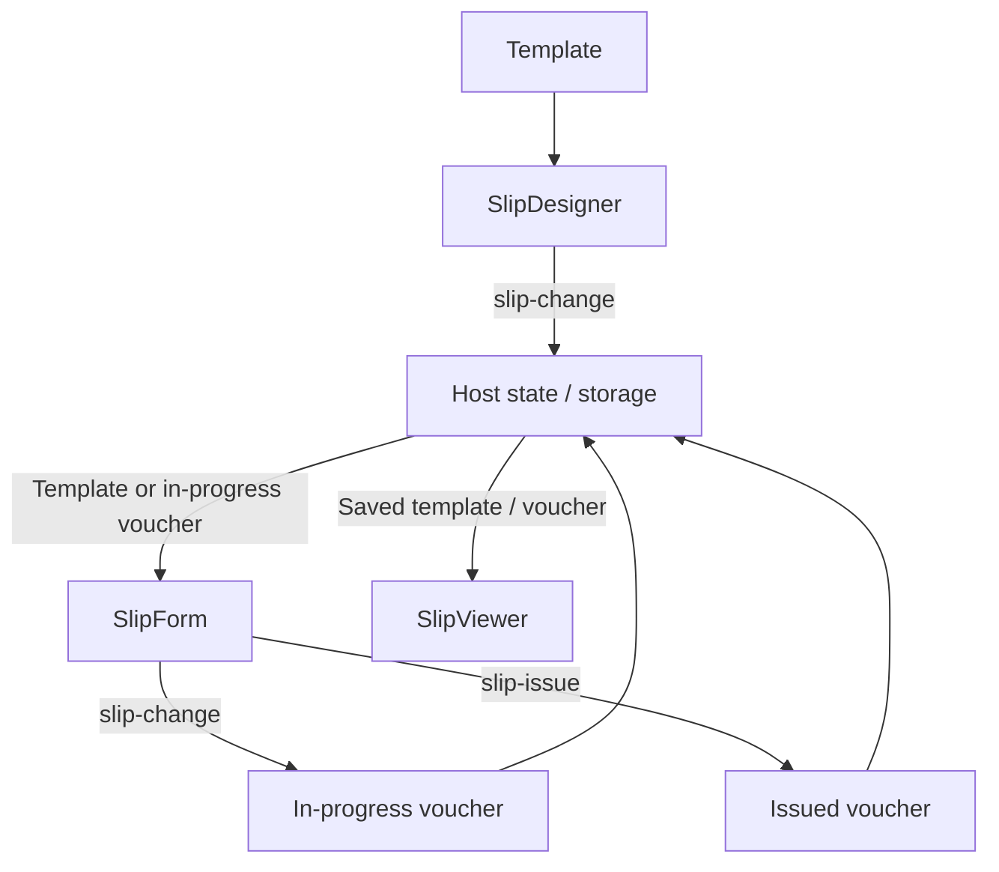

# Application Integration Guide

This document explains how to connect SlipKit's designer, entry form, and viewer, and how to manage in your application the templates and vouchers received from each component.

If you haven't run the form designer yet, start with [Getting started](getting-started.en.md).

By the end of this document you will be able to:

- Distinguish template and voucher states
- Connect the designer, entry form, and viewer
- Save edits to the browser or a server
- Continue editing an in-progress voucher
- Display an issued voucher read-only

> [!IMPORTANT]
> SlipKit components provide the screens and editing features.
> User authentication, permission management, screen transitions, auto-save, and server integration are the responsibility of the host application.

## Overall data flow

In a typical application, templates and vouchers move in the following order.



Components do not pass data to each other directly. The host application saves the file received from one component and passes it to the next component's `src`.

## Files you need to manage

A SlipKit application mainly manages the following three states.

| State | File kind | Description |
|---|---|---|
| Template | `kind: 'template'` | Defines the document's composition, parameters, formulas, and more. |
| In-progress voucher | `kind: 'voucher'`, `issued: false` | A voucher the user is still filling in. |
| Issued voucher | `kind: 'voucher'`, `issued: true` | A voucher whose values are finalized and can't be edited in the entry form. |

A voucher stores the template as it was at creation time in `templateSnapshot`. Even if the original template changes later, an existing voucher uses its own template snapshot.

> [!WARNING]
> `issued: true` is a state that blocks input in the entry form. It is not a digital signature or integrity guarantee proving the voucher has not been cryptographically tampered with.
> Access control and change protection for stored vouchers must be handled by the host application and server.

## Component input and output

| Component | File received via `src` | Result emitted |
|---|---|---|
| `<slip-designer>` | A template | The edited template via `slip-change` |
| `<slip-form>` | A template or a voucher | An in-progress voucher via `slip-change`, an issued voucher via `slip-issue` |
| `<slip-viewer>` | A template or a voucher | None |

Pass `src` a JSON string produced by `serializeSlipFile`, not a `SlipFile` object.

```ts
import { serializeSlipFile } from '@omdc-slipkit/core';

designer.src = serializeSlipFile(template);
form.src = serializeSlipFile(template);
viewer.src = serializeSlipFile(voucher);
```

## Connecting events

### Event names per environment

| Action | Web Component | React | Vue |
|---|---|---|---|
| Template change | `slip-change` | `onSlipChange` | `@slip-change` |
| Voucher input change | `slip-change` | `onSlipChange` | `@slip-change` |
| Voucher issue | `slip-issue` | `onSlipIssue` | `@slip-issue` |

In Web Components, the result is in the `CustomEvent`'s `detail.file`.

```ts
designer.addEventListener('slip-change', (event) => {
  const file = (
    event as CustomEvent<{ file: SlipFile }>
  ).detail.file;
});
```

The React and Vue wrappers unwrap the `CustomEvent` and pass the `SlipFile` object directly.

<details>
<summary><strong>React</strong></summary>

```tsx
<SlipDesigner
  src={designerSrc}
  onSlipChange={(file) => {
    if (file.kind === 'template') {
      setTemplate(file);
    }
  }}
/>

<SlipForm
  src={formSrc}
  onSlipChange={(file) => {
    if (file.kind === 'voucher') {
      setDraftVoucher(file);
    }
  }}
  onSlipIssue={(file) => {
    if (file.kind === 'voucher') {
      setIssuedVoucher(file);
    }
  }}
/>
```

</details>

<details>
<summary><strong>Vue</strong></summary>

```vue
<SlipDesigner
  :src="designerSrc"
  @slip-change="onTemplateChange"
/>

<SlipForm
  :src="formSrc"
  @slip-change="onVoucherChange"
  @slip-issue="onVoucherIssue"
/>
```

The Vue event handler functions receive the `SlipFile` object directly.

</details>

## Connecting the three components

The following example connects template design, voucher entry, and issued-voucher viewing using Web Components.

Prepare each component in the HTML.

```html
<section id="designer-screen">
  <slip-designer id="designer"></slip-designer>
  <button id="start-voucher">Fill voucher</button>
</section>

<section id="form-screen" hidden>
  <slip-form id="form"></slip-form>
</section>

<section id="viewer-screen" hidden>
  <slip-viewer id="viewer"></slip-viewer>
</section>
```

Manage the template and voucher states in the application.

```ts
import '@omdc-slipkit/elements';

import {
  serializeSlipFile,
  type SlipFile,
  type SlipTemplateFile,
  type SlipVoucherFile,
} from '@omdc-slipkit/core';
import type {
  SlipDesigner,
  SlipForm,
  SlipViewer,
} from '@omdc-slipkit/elements';

import { createBlankTemplate } from './slip-template';

const designer =
  document.querySelector<SlipDesigner>('#designer');
const form =
  document.querySelector<SlipForm>('#form');
const viewer =
  document.querySelector<SlipViewer>('#viewer');

const designerScreen =
  document.querySelector<HTMLElement>('#designer-screen');
const formScreen =
  document.querySelector<HTMLElement>('#form-screen');
const viewerScreen =
  document.querySelector<HTMLElement>('#viewer-screen');
const startButton =
  document.querySelector<HTMLButtonElement>('#start-voucher');

if (
  !designer ||
  !form ||
  !viewer ||
  !designerScreen ||
  !formScreen ||
  !viewerScreen ||
  !startButton
) {
  throw new Error('Could not find the SlipKit screen elements.');
}

let template: SlipTemplateFile = createBlankTemplate();
let draftVoucher: SlipVoucherFile | null = null;
let issuedVoucher: SlipVoucherFile | null = null;

designer.src = serializeSlipFile(template);

designer.addEventListener('slip-change', (event) => {
  const file = (
    event as CustomEvent<{ file: SlipFile }>
  ).detail.file;

  if (file.kind !== 'template') {
    return;
  }

  template = file;
});

form.addEventListener('slip-change', (event) => {
  const file = (
    event as CustomEvent<{ file: SlipFile }>
  ).detail.file;

  if (file.kind !== 'voucher') {
    return;
  }

  draftVoucher = file;
});

form.addEventListener('slip-issue', (event) => {
  const file = (
    event as CustomEvent<{ file: SlipFile }>
  ).detail.file;

  if (file.kind !== 'voucher') {
    return;
  }

  issuedVoucher = file;
  draftVoucher = null;

  viewer.src = serializeSlipFile(file);

  formScreen.hidden = true;
  viewerScreen.hidden = false;
});

startButton.addEventListener('click', () => {
  const source =
    draftVoucher && canContinueVoucher(draftVoucher, template)
      ? draftVoucher
      : template;

  form.src = serializeSlipFile(source);

  designerScreen.hidden = true;
  viewerScreen.hidden = true;
  formScreen.hidden = false;
});

function canContinueVoucher(
  voucher: SlipVoucherFile,
  currentTemplate: SlipTemplateFile,
): boolean {
  if (voucher.issued) {
    return false;
  }

  return (
    JSON.stringify(voucher.templateSnapshot) ===
    JSON.stringify(currentTemplate.template)
  );
}
```

### When to update the entry form's `src`

Set the entry form's `src` at these times.

- When starting a new voucher
- When reopening a saved in-progress voucher
- When the user switches to a different voucher

> [!CAUTION]
> Do not re-serialize the voucher received on every `slip-change` and set it back as the same entry form's `src`.
> When `src` changes, the entry form re-parses the file and rebuilds its internal input state.
> While the user is typing, keep the voucher received via events only in host state, and leave the entry form's `src` unchanged.

In React and Vue as well, we recommend managing the entry form's input `formSrc` and the event-received `draftVoucher` as separate states.

## Continuing an in-progress voucher

An in-progress voucher holds the template snapshot from its creation time.

If you continue an old in-progress voucher after the current template has changed, the template the user is looking at and the template stored in the voucher may differ.

Before continuing, check the following conditions.

- Whether `issued` is `false`
- Whether `templateSnapshot` matches the current template

The `canContinueVoucher` example above checks both conditions.

If the conditions don't match, you must choose one of the following.

1. Start a new voucher with the current template.
2. Continue editing using the existing voucher's template snapshot.
3. Let the user choose which template to use.

> [!NOTE]
> Do not automatically replace an existing voucher's `templateSnapshot` with the current template.
> If the template differs, the existing input values' parameters may not match the new template's parameters.

## Saving changes

### Application state and storage format

We recommend managing `SlipFile` objects inside the application and converting to JSON strings at the boundary where you save to a server or file.

```ts
import {
  parseSlipFile,
  serializeSlipFile,
  type SlipFile,
} from '@omdc-slipkit/core';

const json = serializeSlipFile(file);
const restored = parseSlipFile(json);
```

`parseSlipFile` performs JSON parsing and `.slip` schema validation together.

### Saving to a server

The following example saves the whole `.slip` file to a server and loads it back.

```ts
import {
  parseSlipFile,
  serializeSlipFile,
  type SlipFile,
} from '@omdc-slipkit/core';

export async function saveSlip(
  id: string,
  file: SlipFile,
): Promise<void> {
  const response = await fetch(
    `/api/slips/${encodeURIComponent(id)}`,
    {
      method: 'PUT',
      headers: {
        'Content-Type': 'application/json',
      },
      body: serializeSlipFile(file),
    },
  );

  if (!response.ok) {
    throw new Error(
      `Save failed: ${response.status}`,
    );
  }
}

export async function loadSlip(
  id: string,
): Promise<SlipFile> {
  const response = await fetch(
    `/api/slips/${encodeURIComponent(id)}`,
  );

  if (!response.ok) {
    throw new Error(
      `Load failed: ${response.status}`,
    );
  }

  return parseSlipFile(await response.text());
}
```

> [!IMPORTANT]
> When saving a voucher, don't store only its `values` — store the whole `SlipVoucherFile`.
> The voucher's template snapshot and issued state must also be preserved so it can be viewed the same way later.

### Reducing auto-save requests

`slip-change` can be delivered every time an edit or input occurs. Instead of sending a server request each time, you can delay saving until input pauses for a moment.

```ts
import type { SlipFile } from '@omdc-slipkit/core';

function createSaveScheduler(
  id: string,
  delay = 800,
): (file: SlipFile) => void {
  let timer: ReturnType<typeof setTimeout> | null = null;

  return (file) => {
    if (timer !== null) {
      clearTimeout(timer);
    }

    timer = setTimeout(() => {
      timer = null;

      void saveSlip(id, file).catch((error) => {
        console.error('Auto-save failed.', error);
      });
    }, delay);
  };
}

const saveTemplateLater =
  createSaveScheduler('current-template');
const saveDraftLater =
  createSaveScheduler('current-draft');
```

Then call the scheduled save in later events.

```ts
designer.addEventListener('slip-change', (event) => {
  const file = (
    event as CustomEvent<{ file: SlipFile }>
  ).detail.file;

  if (file.kind !== 'template') {
    return;
  }

  template = file;
  saveTemplateLater(file);
});

form.addEventListener('slip-change', (event) => {
  const file = (
    event as CustomEvent<{ file: SlipFile }>
  ).detail.file;

  if (file.kind !== 'voucher') {
    return;
  }

  draftVoucher = file;
  saveDraftLater(file);
});
```

It's better to save the issue event immediately without delay.

```ts
form.addEventListener('slip-issue', (event) => {
  const file = (
    event as CustomEvent<{ file: SlipFile }>
  ).detail.file;

  if (file.kind !== 'voucher') {
    return;
  }

  void saveSlip(`voucher-${crypto.randomUUID()}`, file)
    .catch((error) => {
      console.error('Failed to save the issued voucher.', error);
    });
});
```

## The designer's storage adapter

When you pass a `StorageAdapter` to `<slip-designer>`'s `storage` property, the following features appear in the designer.

- Save to My templates
- List of saved templates
- Load a saved template
- Delete a saved template

To use the browser's IndexedDB, connect it like this.

```ts
import { IndexedDbStorage } from '@omdc-slipkit/elements';

const templateStorage = new IndexedDbStorage({
  dbName: 'my-app-templates',
});

designer.storage = templateStorage;
```

> [!IMPORTANT]
> The `storage` property is the storage used for the designer's "My templates" feature.
> It is not a feature that automatically saves on every edit or saves in-progress vouchers.
> Auto-save must be implemented separately by receiving `slip-change` events.

Because `storage` is an object, it cannot be passed as an HTML attribute string.

```html
<!-- Incorrect usage -->
<slip-designer storage="templateStorage"></slip-designer>
```

Pass it as a JavaScript property or as your framework's object prop.

```ts
designer.storage = templateStorage;
```

### Server storage adapter

To connect a server API to the designer's "My templates" feature, implement a `StorageAdapter`.

<details>
<summary><strong>Server StorageAdapter example</strong></summary>

```ts
import {
  parseSlipFile,
  serializeSlipFile,
  type SlipFile,
  type SlipListPage,
  type StorageAdapter,
} from '@omdc-slipkit/core';

async function requireSuccess(
  response: Response,
): Promise<Response> {
  if (!response.ok) {
    throw new Error(
      `Storage request failed: ${response.status}`,
    );
  }

  return response;
}

export const serverStorage: StorageAdapter = {
  async save(id, file): Promise<void> {
    await requireSuccess(
      await fetch(
        `/api/slips/${encodeURIComponent(id)}`,
        {
          method: 'PUT',
          headers: {
            'Content-Type': 'application/json',
          },
          body: serializeSlipFile(file),
        },
      ),
    );
  },

  async load(id): Promise<SlipFile> {
    const response = await requireSuccess(
      await fetch(
        `/api/slips/${encodeURIComponent(id)}`,
      ),
    );

    return parseSlipFile(await response.text());
  },

  async delete(id): Promise<void> {
    await requireSuccess(
      await fetch(
        `/api/slips/${encodeURIComponent(id)}`,
        {
          method: 'DELETE',
        },
      ),
    );
  },

  async list(filter, cursor): Promise<SlipListPage> {
    const params = new URLSearchParams();

    if (filter?.kind) {
      params.set('kind', filter.kind);
    }

    if (filter?.query) {
      params.set('query', filter.query);
    }

    if (cursor) {
      params.set('cursor', cursor);
    }

    const response = await requireSuccess(
      await fetch(`/api/slips?${params.toString()}`),
    );

    return await response.json() as SlipListPage;
  },
};
```

The list API must return the following shape.

```json
{
  "items": [
    {
      "id": "template-001",
      "kind": "template",
      "title": "Transaction statement",
      "updatedAt": "2026-08-25T09:00:00.000Z"
    }
  ],
  "nextCursor": "Value to use when there is a next page"
}
```

The server must not trust the JSON received in a save request; it should validate it with `parseSlipFile` or `validateSlipFile`.

</details>

## Opening and downloading local files

`LocalFileStorage` provides the browser's file picker and download features.

```ts
import { LocalFileStorage } from '@omdc-slipkit/elements';

const localFiles = new LocalFileStorage();

await localFiles.save('transaction-statement.slip', template);

const opened = await localFiles.load('');

if (opened.kind === 'template') {
  template = opened;
  designer.src = serializeSlipFile(opened);
}
```

> [!NOTE]
> `LocalFileStorage` does not support listing or deleting files.
> So rather than passing it to the designer's `storage`, it's more suitable to use it directly in your application's <kbd>Open file</kbd> and <kbd>Download</kbd> features.

A `.slip` file received from outside must always be parsed and validated before use. `LocalFileStorage.load` performs this validation internally.

## Viewing an issued voucher

An issued voucher can be passed to `<slip-viewer>` to display it read-only.

```ts
viewer.src = serializeSlipFile(issuedVoucher);
```

React:

```tsx
<SlipViewer src={serializeSlipFile(issuedVoucher)} />
```

Vue:

```vue
<SlipViewer :src="serializeSlipFile(issuedVoucher)" />
```

`<slip-viewer>` can display both templates and vouchers, and it does not emit events that change the file.

## Error handling

It's good to handle the following failures distinctly in your application.

| Failure | Example handling |
|---|---|
| Invalid `.slip` file | Show a message that the file is not valid |
| Server save failure | Show that the edits weren't saved and retry |
| Saved file not found | Start with a new template or a new voucher |
| File selection canceled | Keep the current screen without an error alert |
| Issue failure | Keep the input screen and show the issue error |
| PDF rendering failure | Keep the original `.slip` file and retry |

> [!CAUTION]
> Do not show an auto-save as successful when it actually failed.
> Because the screen state and the server state may differ, it's better to show the user the last successful save time or the save-failed state.

## Implementations to avoid

- Updating the same entry form's `src` on every `slip-change`
- Mistaking the `storage` property for an auto-save feature
- Saving only an in-progress voucher's `values`
- Continuing a voucher whose snapshot differs from the current template without checking
- Interpreting `issued: true` as a digital signature or tamper protection
- Using `.slip` JSON received from a server without validating it
- Ignoring a save failure and showing a success state
- Automatically editing an issued voucher to match changes to the original template

## Integration checklist

- [ ] Receive the template from the designer's `slip-change`.
- [ ] Receive the in-progress voucher from the entry form's `slip-change`.
- [ ] Receive the issued voucher from the entry form's `slip-issue`.
- [ ] Manage templates and vouchers in separate states or storage keys.
- [ ] Delay auto-save requests appropriately.
- [ ] Save the issue event immediately.
- [ ] Check the template snapshot before continuing an in-progress voucher.
- [ ] Validate `.slip` files exchanged with the outside.
- [ ] Show save failures and rendering failures to the user.
- [ ] Display issued vouchers read-only in the viewer.

## Related documents

- [Getting started](getting-started.en.md)
- [Form Designer Guide](designer.en.md)
- [Core API Guide](core.en.md)
- [Formula Function Reference](formula.en.md)
