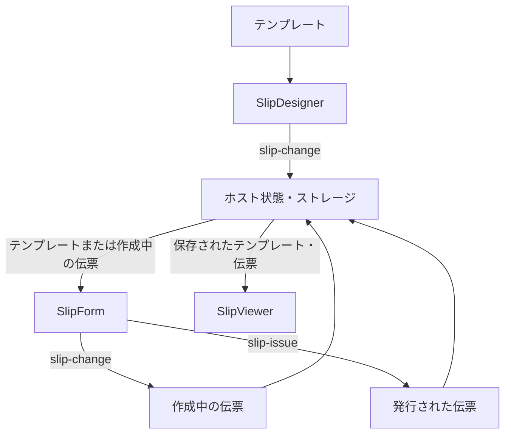

# アプリケーション統合ガイド

このドキュメントは、SlipKit のデザイナー・作成フォーム・ビューアを接続し、各コンポーネントから受け取ったテンプレートと伝票をアプリケーションで管理する方法を説明します。

まだテンプレートデザイナーを実行していない場合は、[スタートガイド](getting-started.ja.md) を進めてください。

このドキュメントを終えると、次のことができるようになります。

- テンプレートと伝票の状態を区別する
- デザイナー・作成フォーム・ビューアを接続する
- 編集結果をブラウザまたはサーバーに保存する
- 作成中の伝票を続けて作成する
- 発行された伝票を読み取り専用で表示する

> [!IMPORTANT]
> SlipKit コンポーネントは画面と編集機能を提供します。
> ユーザー認証、権限管理、画面遷移、自動保存、サーバー連携はホストアプリケーションが担当します。

## 全体のデータフロー

一般的なアプリケーションでは、テンプレートと伝票が次の順序で移動します。



コンポーネント同士でデータを直接渡しません。ホストアプリケーションが、あるコンポーネントから受け取ったファイルを保存し、次のコンポーネントの `src` に渡します。

## 管理すべきファイル

SlipKit アプリケーションは、主に次の 3 つの状態を管理します。

| 状態 | ファイルの種類 | 説明 |
|---|---|---|
| テンプレート | `kind: 'template'` | 文書の構成、パラメータ、数式などを定義します。 |
| 作成中の伝票 | `kind: 'voucher'`、`issued: false` | ユーザーが値を入力している伝票です。 |
| 発行された伝票 | `kind: 'voucher'`、`issued: true` | 値が確定し、作成フォームで編集できない伝票です。 |

伝票には、作成時点のテンプレートが `templateSnapshot` として保存されます。その後、元のテンプレートが変更されても、既存の伝票は自身のテンプレートスナップショットを使用します。

> [!WARNING]
> `issued: true` は作成フォームで入力を止める状態です。伝票が暗号学的に改ざんされていないことを証明する電子署名や完全性保証ではありません。
> 保存された伝票のアクセス権限と変更防止は、ホストアプリケーションとサーバーで処理する必要があります。

## コンポーネントの入力と出力

| コンポーネント | `src` で受け取るファイル | 出力する結果 |
|---|---|---|
| `<slip-designer>` | テンプレート | `slip-change` で編集されたテンプレート |
| `<slip-form>` | テンプレートまたは伝票 | `slip-change` で作成中の伝票、`slip-issue` で発行された伝票 |
| `<slip-viewer>` | テンプレートまたは伝票 | なし |

`src` には `SlipFile` オブジェクトではなく、`serializeSlipFile` で変換した JSON 文字列を渡します。

```ts
import { serializeSlipFile } from '@omdc-slipkit/core';

designer.src = serializeSlipFile(template);
form.src = serializeSlipFile(template);
viewer.src = serializeSlipFile(voucher);
```

## イベントの接続

### 環境ごとのイベント名

| 動作 | Web Component | React | Vue |
|---|---|---|---|
| テンプレート変更 | `slip-change` | `onSlipChange` | `@slip-change` |
| 伝票の入力変更 | `slip-change` | `onSlipChange` | `@slip-change` |
| 伝票の発行 | `slip-issue` | `onSlipIssue` | `@slip-issue` |

Web Component では、`CustomEvent` の `detail.file` に結果が入っています。

```ts
designer.addEventListener('slip-change', (event) => {
  const file = (
    event as CustomEvent<{ file: SlipFile }>
  ).detail.file;
});
```

React と Vue のラッパーは `CustomEvent` を外し、`SlipFile` オブジェクトを直接渡します。

<details>
<summary><strong>React</strong></summary>

```tsx
<SlipDesigner
  src={designerSrc}
  onSlipChange={(file) => {
    if (file.kind === 'template') {
      setTemplate(file);
    }
  }}
/>

<SlipForm
  src={formSrc}
  onSlipChange={(file) => {
    if (file.kind === 'voucher') {
      setDraftVoucher(file);
    }
  }}
  onSlipIssue={(file) => {
    if (file.kind === 'voucher') {
      setIssuedVoucher(file);
    }
  }}
/>
```

</details>

<details>
<summary><strong>Vue</strong></summary>

```vue
<SlipDesigner
  :src="designerSrc"
  @slip-change="onTemplateChange"
/>

<SlipForm
  :src="formSrc"
  @slip-change="onVoucherChange"
  @slip-issue="onVoucherIssue"
/>
```

Vue のイベント処理関数には、`SlipFile` オブジェクトが直接渡されます。

</details>

## 3 つのコンポーネントを接続する

次の例は、Web Component を使ってテンプレート設計、伝票作成、発行伝票の閲覧を接続します。

HTML に各コンポーネントを用意します。

```html
<section id="designer-screen">
  <slip-designer id="designer"></slip-designer>
  <button id="start-voucher">伝票作成</button>
</section>

<section id="form-screen" hidden>
  <slip-form id="form"></slip-form>
</section>

<section id="viewer-screen" hidden>
  <slip-viewer id="viewer"></slip-viewer>
</section>
```

アプリケーションでテンプレートと伝票の状態を管理します。

```ts
import '@omdc-slipkit/elements';

import {
  serializeSlipFile,
  type SlipFile,
  type SlipTemplateFile,
  type SlipVoucherFile,
} from '@omdc-slipkit/core';
import type {
  SlipDesigner,
  SlipForm,
  SlipViewer,
} from '@omdc-slipkit/elements';

import { createBlankTemplate } from './slip-template';

const designer =
  document.querySelector<SlipDesigner>('#designer');
const form =
  document.querySelector<SlipForm>('#form');
const viewer =
  document.querySelector<SlipViewer>('#viewer');

const designerScreen =
  document.querySelector<HTMLElement>('#designer-screen');
const formScreen =
  document.querySelector<HTMLElement>('#form-screen');
const viewerScreen =
  document.querySelector<HTMLElement>('#viewer-screen');
const startButton =
  document.querySelector<HTMLButtonElement>('#start-voucher');

if (
  !designer ||
  !form ||
  !viewer ||
  !designerScreen ||
  !formScreen ||
  !viewerScreen ||
  !startButton
) {
  throw new Error('SlipKit の画面要素が見つかりません。');
}

let template: SlipTemplateFile = createBlankTemplate();
let draftVoucher: SlipVoucherFile | null = null;
let issuedVoucher: SlipVoucherFile | null = null;

designer.src = serializeSlipFile(template);

designer.addEventListener('slip-change', (event) => {
  const file = (
    event as CustomEvent<{ file: SlipFile }>
  ).detail.file;

  if (file.kind !== 'template') {
    return;
  }

  template = file;
});

form.addEventListener('slip-change', (event) => {
  const file = (
    event as CustomEvent<{ file: SlipFile }>
  ).detail.file;

  if (file.kind !== 'voucher') {
    return;
  }

  draftVoucher = file;
});

form.addEventListener('slip-issue', (event) => {
  const file = (
    event as CustomEvent<{ file: SlipFile }>
  ).detail.file;

  if (file.kind !== 'voucher') {
    return;
  }

  issuedVoucher = file;
  draftVoucher = null;

  viewer.src = serializeSlipFile(file);

  formScreen.hidden = true;
  viewerScreen.hidden = false;
});

startButton.addEventListener('click', () => {
  const source =
    draftVoucher && canContinueVoucher(draftVoucher, template)
      ? draftVoucher
      : template;

  form.src = serializeSlipFile(source);

  designerScreen.hidden = true;
  viewerScreen.hidden = true;
  formScreen.hidden = false;
});

function canContinueVoucher(
  voucher: SlipVoucherFile,
  currentTemplate: SlipTemplateFile,
): boolean {
  if (voucher.issued) {
    return false;
  }

  return (
    JSON.stringify(voucher.templateSnapshot) ===
    JSON.stringify(currentTemplate.template)
  );
}
```

### 作成フォームの `src` を更新するタイミング

作成フォームの `src` は次のタイミングで設定します。

- 新しい伝票の作成を開始するとき
- 保存された作成中の伝票を再度開くとき
- ユーザーが別の伝票に切り替えるとき

> [!CAUTION]
> `slip-change` が発生するたびに、受け取った伝票を再度シリアライズして同じ作成フォームの `src` に入れないでください。
> `src` が変更されると、作成フォームはファイルを再パースし、内部の入力状態を再構成します。
> 入力中は、イベントで受け取った伝票をホスト状態にのみ保持し、作成フォームの `src` はそのまま維持するのが安全です。

React と Vue でも、作成フォームの入力用 `formSrc` とイベントで受け取った `draftVoucher` を別々の状態として管理することを推奨します。

## 作成中の伝票を続けて書く

作成中の伝票は、作成時点のテンプレートスナップショットを持っています。

現在のテンプレートが変更されたあとに古い作成中の伝票をそのまま続けて書くと、ユーザーが見ているテンプレートと伝票に保存されたテンプレートが異なる場合があります。

続けて書く前に、次の条件を確認します。

- `issued` が `false` かどうか
- `templateSnapshot` が現在のテンプレートと同じかどうか

前述の `canContinueVoucher` の例は、両方の条件を確認します。

条件が合わない場合は、次のいずれかを選択する必要があります。

1. 現在のテンプレートで新しい伝票を開始します。
2. 既存の伝票のテンプレートスナップショットを使って作成を続けます。
3. どのテンプレートを使うかをユーザーに選ばせます。

> [!NOTE]
> 既存の伝票の `templateSnapshot` を現在のテンプレートに自動で置き換えないでください。
> テンプレートが異なると、既存の入力値のパラメータと新しいテンプレートのパラメータが合わない場合があります。

## 変更内容を保存する

### アプリケーション状態と保存形式

アプリケーション内部では `SlipFile` オブジェクトとして管理し、サーバーやファイルに保存する境界で JSON 文字列に変換する方式を推奨します。

```ts
import {
  parseSlipFile,
  serializeSlipFile,
  type SlipFile,
} from '@omdc-slipkit/core';

const json = serializeSlipFile(file);
const restored = parseSlipFile(json);
```

`parseSlipFile` は JSON パースと `.slip` スキーマ検証を同時に行います。

### サーバーに保存する

次の例は、`.slip` ファイル全体をサーバーに保存し、再度読み込みます。

```ts
import {
  parseSlipFile,
  serializeSlipFile,
  type SlipFile,
} from '@omdc-slipkit/core';

export async function saveSlip(
  id: string,
  file: SlipFile,
): Promise<void> {
  const response = await fetch(
    `/api/slips/${encodeURIComponent(id)}`,
    {
      method: 'PUT',
      headers: {
        'Content-Type': 'application/json',
      },
      body: serializeSlipFile(file),
    },
  );

  if (!response.ok) {
    throw new Error(
      `保存に失敗しました: ${response.status}`,
    );
  }
}

export async function loadSlip(
  id: string,
): Promise<SlipFile> {
  const response = await fetch(
    `/api/slips/${encodeURIComponent(id)}`,
  );

  if (!response.ok) {
    throw new Error(
      `読み込みに失敗しました: ${response.status}`,
    );
  }

  return parseSlipFile(await response.text());
}
```

> [!IMPORTANT]
> 伝票を保存するときは `values` だけを別に保存せず、`SlipVoucherFile` 全体を保存してください。
> 伝票のテンプレートスナップショットと発行状態も一緒に保持されて初めて、あとで同じ見た目で閲覧できます。

### 自動保存リクエストを減らす

`slip-change` は編集や入力が発生するたびに渡されることがあります。毎回サーバーリクエストを送らず、入力が少し止まったあとに保存するよう遅延できます。

```ts
import type { SlipFile } from '@omdc-slipkit/core';

function createSaveScheduler(
  id: string,
  delay = 800,
): (file: SlipFile) => void {
  let timer: ReturnType<typeof setTimeout> | null = null;

  return (file) => {
    if (timer !== null) {
      clearTimeout(timer);
    }

    timer = setTimeout(() => {
      timer = null;

      void saveSlip(id, file).catch((error) => {
        console.error('自動保存に失敗しました。', error);
      });
    }, delay);
  };
}

const saveTemplateLater =
  createSaveScheduler('current-template');
const saveDraftLater =
  createSaveScheduler('current-draft');
```

その後、イベントで予約保存を呼び出します。

```ts
designer.addEventListener('slip-change', (event) => {
  const file = (
    event as CustomEvent<{ file: SlipFile }>
  ).detail.file;

  if (file.kind !== 'template') {
    return;
  }

  template = file;
  saveTemplateLater(file);
});

form.addEventListener('slip-change', (event) => {
  const file = (
    event as CustomEvent<{ file: SlipFile }>
  ).detail.file;

  if (file.kind !== 'voucher') {
    return;
  }

  draftVoucher = file;
  saveDraftLater(file);
});
```

発行イベントは遅延せず、すぐに保存するのがよいです。

```ts
form.addEventListener('slip-issue', (event) => {
  const file = (
    event as CustomEvent<{ file: SlipFile }>
  ).detail.file;

  if (file.kind !== 'voucher') {
    return;
  }

  void saveSlip(`voucher-${crypto.randomUUID()}`, file)
    .catch((error) => {
      console.error('発行伝票の保存に失敗しました。', error);
    });
});
```

## デザイナーのストレージアダプタ

`<slip-designer>` の `storage` プロパティに `StorageAdapter` を渡すと、デザイナーに次の機能が現れます。

- マイテンプレートに保存
- 保存したテンプレートの一覧
- 保存したテンプレートの読み込み
- 保存したテンプレートの削除

ブラウザの IndexedDB を使うには、次のように接続します。

```ts
import { IndexedDbStorage } from '@omdc-slipkit/elements';

const templateStorage = new IndexedDbStorage({
  dbName: 'my-app-templates',
});

designer.storage = templateStorage;
```

> [!IMPORTANT]
> `storage` プロパティは、デザイナーの「マイテンプレート」機能に使うストレージです。
> 編集するたびに自動で保存したり、作成中の伝票を保存したりする機能ではありません。
> 自動保存は別途 `slip-change` イベントを受け取って実装する必要があります。

`storage` はオブジェクトなので、HTML 属性の文字列として渡せません。

```html
<!-- 誤った使い方 -->
<slip-designer storage="templateStorage"></slip-designer>
```

JavaScript プロパティ、またはフレームワークのオブジェクト prop として渡します。

```ts
designer.storage = templateStorage;
```

### サーバーストレージアダプタ

サーバー API をデザイナーの「マイテンプレート」機能と接続するには、`StorageAdapter` を実装します。

<details>
<summary><strong>サーバー StorageAdapter の例</strong></summary>

```ts
import {
  parseSlipFile,
  serializeSlipFile,
  type SlipFile,
  type SlipListPage,
  type StorageAdapter,
} from '@omdc-slipkit/core';

async function requireSuccess(
  response: Response,
): Promise<Response> {
  if (!response.ok) {
    throw new Error(
      `ストレージリクエストに失敗しました: ${response.status}`,
    );
  }

  return response;
}

export const serverStorage: StorageAdapter = {
  async save(id, file): Promise<void> {
    await requireSuccess(
      await fetch(
        `/api/slips/${encodeURIComponent(id)}`,
        {
          method: 'PUT',
          headers: {
            'Content-Type': 'application/json',
          },
          body: serializeSlipFile(file),
        },
      ),
    );
  },

  async load(id): Promise<SlipFile> {
    const response = await requireSuccess(
      await fetch(
        `/api/slips/${encodeURIComponent(id)}`,
      ),
    );

    return parseSlipFile(await response.text());
  },

  async delete(id): Promise<void> {
    await requireSuccess(
      await fetch(
        `/api/slips/${encodeURIComponent(id)}`,
        {
          method: 'DELETE',
        },
      ),
    );
  },

  async list(filter, cursor): Promise<SlipListPage> {
    const params = new URLSearchParams();

    if (filter?.kind) {
      params.set('kind', filter.kind);
    }

    if (filter?.query) {
      params.set('query', filter.query);
    }

    if (cursor) {
      params.set('cursor', cursor);
    }

    const response = await requireSuccess(
      await fetch(`/api/slips?${params.toString()}`),
    );

    return await response.json() as SlipListPage;
  },
};
```

一覧 API は次の形を返す必要があります。

```json
{
  "items": [
    {
      "id": "template-001",
      "kind": "template",
      "title": "取引明細書",
      "updatedAt": "2026-08-25T09:00:00.000Z"
    }
  ],
  "nextCursor": "次のページがある場合に使う値"
}
```

サーバーは、保存リクエストで受け取った JSON を信頼せず、`parseSlipFile` または `validateSlipFile` で検証する必要があります。

</details>

## ローカルファイルを開く・ダウンロードする

`LocalFileStorage` は、ブラウザのファイル選択ダイアログとダウンロード機能を提供します。

```ts
import { LocalFileStorage } from '@omdc-slipkit/elements';

const localFiles = new LocalFileStorage();

await localFiles.save('取引明細書.slip', template);

const opened = await localFiles.load('');

if (opened.kind === 'template') {
  template = opened;
  designer.src = serializeSlipFile(opened);
}
```

> [!NOTE]
> `LocalFileStorage` は、ファイル一覧の取得と削除をサポートしていません。
> したがって、デザイナーの `storage` に渡すより、アプリケーションの <kbd>ファイルを開く</kbd> と <kbd>ダウンロード</kbd> 機能で直接使うのが適しています。

外部から受け取った `.slip` ファイルは、使う前に必ずパースと検証を行う必要があります。`LocalFileStorage.load` は内部でこの検証を行います。

## 発行された伝票を閲覧する

発行された伝票は `<slip-viewer>` に渡して読み取り専用で表示できます。

```ts
viewer.src = serializeSlipFile(issuedVoucher);
```

React:

```tsx
<SlipViewer src={serializeSlipFile(issuedVoucher)} />
```

Vue:

```vue
<SlipViewer :src="serializeSlipFile(issuedVoucher)" />
```

`<slip-viewer>` はテンプレートと伝票の両方を表示でき、ファイルを変更するイベントは発生させません。

## エラー処理

アプリケーションでは、次の失敗を区別して処理するのがよいです。

| 失敗 | 処理例 |
|---|---|
| 不正な `.slip` ファイル | ファイルが有効でない旨の案内を表示 |
| サーバー保存の失敗 | 編集内容が保存されなかったことを表示して再試行 |
| 保存されたファイルがない | 新しいテンプレートまたは新しい伝票で開始 |
| ファイル選択のキャンセル | エラー通知なしで既存の画面を維持 |
| 発行の失敗 | 入力画面を維持して発行エラーを表示 |
| PDF レンダリングの失敗 | 元の `.slip` ファイルを維持して再試行 |

> [!CAUTION]
> 自動保存が失敗したのに成功したように表示しないでください。
> 画面の状態とサーバーの状態が異なる場合があるため、最後に保存が成功した時刻や保存失敗の状態をユーザーに見せるのがよいです。

## 避けるべき実装

- `slip-change` が発生するたびに同じ作成フォームの `src` を更新する
- `storage` プロパティを自動保存機能と誤解する
- 作成中の伝票の `values` だけを保存する
- 現在のテンプレートと異なるスナップショットを持つ伝票を、確認せずに続けて書く
- `issued: true` を電子署名や改ざん防止として解釈する
- サーバーから受け取った `.slip` JSON を検証せずに使う
- 保存の失敗を無視して成功状態を表示する
- 発行伝票を、元のテンプレートの変更に合わせて自動修正する

## 統合チェックリスト

- [ ] デザイナーの `slip-change` からテンプレートを受け取ります。
- [ ] 作成フォームの `slip-change` から作成中の伝票を受け取ります。
- [ ] 作成フォームの `slip-issue` から発行された伝票を受け取ります。
- [ ] テンプレートと伝票を別々の状態または保存キーで管理します。
- [ ] 自動保存リクエストを適切に遅延します。
- [ ] 発行イベントはすぐに保存します。
- [ ] 作成中の伝票を続けて書く前に、テンプレートスナップショットを確認します。
- [ ] 外部とやり取りする `.slip` ファイルを検証します。
- [ ] 保存失敗とレンダリング失敗をユーザーに表示します。
- [ ] 発行された伝票をビューアで読み取り専用で表示します。

## 関連ドキュメント

- [スタートガイド](getting-started.ja.md)
- [テンプレートデザイナー利用ガイド](designer.ja.md)
- [Core API ガイド](core.ja.md)
- [数式関数リファレンス](formula.ja.md)
