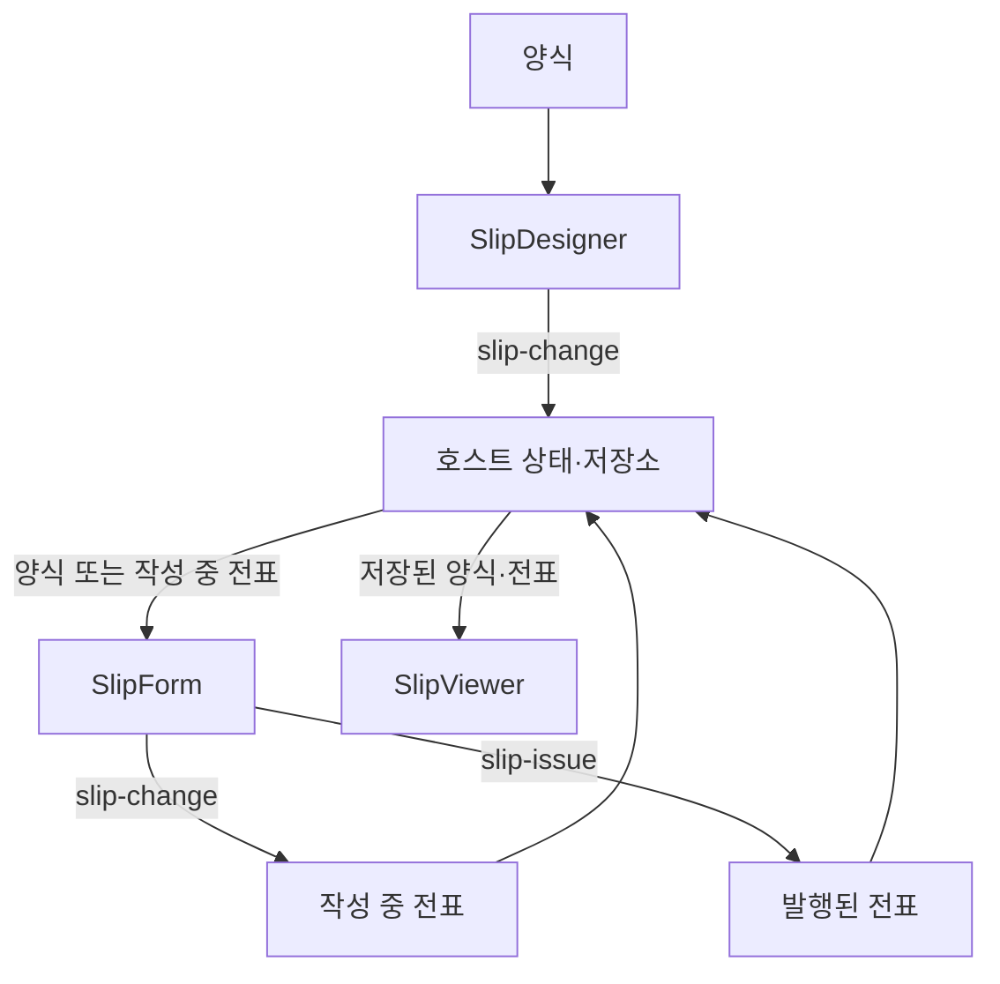

# 애플리케이션 통합 가이드

[English](integration.md) · [日本語](integration.ja.md)

이 문서는 SlipKit의 디자이너·작성폼·뷰어를 연결하고, 각 컴포넌트에서 받은 양식과 전표를 애플리케이션에서 관리하는 방법을 설명합니다.

먼저 양식 디자이너를 실행하지 않았다면 [시작하기](getting-started.ko.md)를 진행하세요.

이 문서를 완료하면 다음 작업을 할 수 있습니다.

- 양식과 전표 상태 구분하기
- 디자이너·작성폼·뷰어 연결하기
- 편집 결과를 브라우저 또는 서버에 저장하기
- 작성 중 전표를 이어서 작성하기
- 발행된 전표를 읽기 전용으로 표시하기

> [!IMPORTANT]
> SlipKit 컴포넌트는 화면과 편집 기능을 제공합니다.
> 사용자 인증, 권한 관리, 화면 전환, 자동 저장 및 서버 연계는 호스트 애플리케이션에서 담당합니다.

## 전체 데이터 흐름

일반적인 애플리케이션에서는 양식과 전표가 다음 순서로 이동합니다.



컴포넌트끼리 데이터를 직접 전달하지 않습니다. 호스트 애플리케이션이 한 컴포넌트에서 받은 파일을 저장하고 다음 컴포넌트의 `src`로 전달합니다.

## 관리해야 하는 파일

SlipKit 애플리케이션은 주로 다음 세 가지 상태를 관리합니다.

| 상태 | 파일 종류 | 설명 |
|---|---|---|
| 양식 | `kind: 'template'` | 문서의 구성, 파라미터, 수식 등을 정의합니다. |
| 작성 중 전표 | `kind: 'voucher'`, `issued: false` | 사용자가 값을 입력하고 있는 전표입니다. |
| 발행된 전표 | `kind: 'voucher'`, `issued: true` | 값이 확정되어 작성폼에서 수정할 수 없는 전표입니다. |

전표에는 생성 당시의 양식이 `templateSnapshot`으로 저장됩니다. 이후 원본 양식이 변경되어도 기존 전표는 자신의 양식 스냅샷을 사용합니다.

> [!WARNING]
> `issued: true`는 작성폼에서 입력을 막는 상태입니다. 전표가 암호학적으로 위변조되지 않았음을 증명하는 전자서명이나 무결성 보증은 아닙니다.
> 저장된 전표의 접근 권한과 변경 방지는 호스트 애플리케이션과 서버에서 처리해야 합니다.

## 컴포넌트의 입력과 출력

| 컴포넌트 | `src`로 받는 파일 | 전달하는 결과 |
|---|---|---|
| `<slip-designer>` | 양식 | `slip-change`로 편집된 양식 |
| `<slip-form>` | 양식 또는 전표 | `slip-change`로 작성 중 전표, `slip-issue`로 발행된 전표 |
| `<slip-viewer>` | 양식 또는 전표 | 없음 |

`src`에는 `SlipFile` 객체가 아니라 `serializeSlipFile`로 변환한 JSON 문자열을 전달합니다.

```ts
import { serializeSlipFile } from '@omdc-slipkit/core';

designer.src = serializeSlipFile(template);
form.src = serializeSlipFile(template);
viewer.src = serializeSlipFile(voucher);
```

## 이벤트 연결

### 환경별 이벤트 이름

| 동작 | Web Component | React | Vue |
|---|---|---|---|
| 양식 변경 | `slip-change` | `onSlipChange` | `@slip-change` |
| 전표 입력 변경 | `slip-change` | `onSlipChange` | `@slip-change` |
| 전표 발행 | `slip-issue` | `onSlipIssue` | `@slip-issue` |

Web Component에서는 `CustomEvent`의 `detail.file`에 결과가 들어 있습니다.

```ts
designer.addEventListener('slip-change', (event) => {
  const file = (
    event as CustomEvent<{ file: SlipFile }>
  ).detail.file;
});
```

React와 Vue 래퍼는 `CustomEvent`를 벗기고 `SlipFile` 객체를 직접 전달합니다.

<details>
<summary><strong>React</strong></summary>

```tsx
<SlipDesigner
  src={designerSrc}
  onSlipChange={(file) => {
    if (file.kind === 'template') {
      setTemplate(file);
    }
  }}
/>

<SlipForm
  src={formSrc}
  onSlipChange={(file) => {
    if (file.kind === 'voucher') {
      setDraftVoucher(file);
    }
  }}
  onSlipIssue={(file) => {
    if (file.kind === 'voucher') {
      setIssuedVoucher(file);
    }
  }}
/>
```

</details>

<details>
<summary><strong>Vue</strong></summary>

```vue
<SlipDesigner
  :src="designerSrc"
  @slip-change="onTemplateChange"
/>

<SlipForm
  :src="formSrc"
  @slip-change="onVoucherChange"
  @slip-issue="onVoucherIssue"
/>
```

Vue 이벤트 처리 함수에는 `SlipFile` 객체가 직접 전달됩니다.

</details>

> [!IMPORTANT]
> `designerSrc`와 `formSrc`는 각 컴포넌트에서 편집을 시작할 때 전달하는 입력입니다.
> `slip-change`로 받은 결과를 현재 편집 중인 컴포넌트의 `src`에 곧바로 다시 전달하지 마세요.
>
> 이벤트로 받은 최신 양식과 전표는 별도의 애플리케이션 상태 또는 저장 대상으로 관리합니다. 다른 파일을 열거나 새로운 편집 세션을 시작할 때만 해당 컴포넌트의 `src`를 갱신하세요.

디자이너의 입력과 편집 결과를 분리하는 기본 예제는 [시작하기](getting-started.ko.md#3-디자이너-연결)를 확인하세요.

## 세 컴포넌트 연결하기

다음 예제는 Web Component를 이용해 양식 설계, 전표 작성, 발행 전표 조회를 연결합니다.

HTML에 각 컴포넌트를 준비합니다.

```html
<section id="designer-screen">
  <slip-designer id="designer"></slip-designer>
  <button id="start-voucher">전표 작성</button>
</section>

<section id="form-screen" hidden>
  <slip-form id="form"></slip-form>
</section>

<section id="viewer-screen" hidden>
  <slip-viewer id="viewer"></slip-viewer>
</section>
```

애플리케이션에서 양식과 전표 상태를 관리합니다.

```ts
import '@omdc-slipkit/elements';

import {
  serializeSlipFile,
  type SlipFile,
  type SlipTemplateFile,
  type SlipVoucherFile,
} from '@omdc-slipkit/core';
import type {
  SlipDesigner,
  SlipForm,
  SlipViewer,
} from '@omdc-slipkit/elements';

import { createBlankTemplate } from './slip-template';

const designer =
  document.querySelector<SlipDesigner>('#designer');
const form =
  document.querySelector<SlipForm>('#form');
const viewer =
  document.querySelector<SlipViewer>('#viewer');

const designerScreen =
  document.querySelector<HTMLElement>('#designer-screen');
const formScreen =
  document.querySelector<HTMLElement>('#form-screen');
const viewerScreen =
  document.querySelector<HTMLElement>('#viewer-screen');
const startButton =
  document.querySelector<HTMLButtonElement>('#start-voucher');

if (
  !designer ||
  !form ||
  !viewer ||
  !designerScreen ||
  !formScreen ||
  !viewerScreen ||
  !startButton
) {
  throw new Error('SlipKit 화면 요소를 찾을 수 없습니다.');
}

let template: SlipTemplateFile = createBlankTemplate();
let draftVoucher: SlipVoucherFile | null = null;
let issuedVoucher: SlipVoucherFile | null = null;

designer.src = serializeSlipFile(template);

designer.addEventListener('slip-change', (event) => {
  const file = (
    event as CustomEvent<{ file: SlipFile }>
  ).detail.file;

  if (file.kind !== 'template') {
    return;
  }

  template = file;
});

form.addEventListener('slip-change', (event) => {
  const file = (
    event as CustomEvent<{ file: SlipFile }>
  ).detail.file;

  if (file.kind !== 'voucher') {
    return;
  }

  draftVoucher = file;
});

form.addEventListener('slip-issue', (event) => {
  const file = (
    event as CustomEvent<{ file: SlipFile }>
  ).detail.file;

  if (file.kind !== 'voucher') {
    return;
  }

  issuedVoucher = file;
  draftVoucher = null;

  viewer.src = serializeSlipFile(file);

  formScreen.hidden = true;
  viewerScreen.hidden = false;
});

startButton.addEventListener('click', () => {
  const source =
    draftVoucher && canResumeVoucher(draftVoucher)
      ? draftVoucher
      : template;

  form.src = serializeSlipFile(source);

  designerScreen.hidden = true;
  viewerScreen.hidden = true;
  formScreen.hidden = false;
});

function canResumeVoucher(
  voucher: SlipVoucherFile,
): boolean {
  return !voucher.issued;
}
```

이 예제에서는 작성 중인 전표가 있으면 전표에 저장된 `templateSnapshot`을 이용해 이어서 작성하고, 발행된 전표라면 현재 양식으로 새 전표를 시작합니다.

### 작성폼의 `src`를 갱신하는 시점

작성폼의 `src`는 다음 시점에 설정합니다.

- 새 전표 작성을 시작할 때
- 저장된 작성 중 전표를 다시 열 때
- 사용자가 다른 전표로 전환할 때

> [!CAUTION]
> `slip-change`가 발생할 때마다 받은 전표를 다시 직렬화하여 같은 작성폼의 `src`로 넣지 마세요.
> `src`가 변경되면 작성폼은 파일을 다시 파싱하고 내부 입력 상태를 다시 구성합니다.
> 입력 중에는 이벤트로 받은 전표를 호스트 상태에만 보관하고, 작성폼의 `src`는 그대로 유지하는 것이 안전합니다.

React와 Vue에서도 작성폼 입력용 `formSrc`와 이벤트로 받은 `draftVoucher`를 별도 상태로 관리하는 것을 권장합니다.

발행 뒤 같은 양식으로 새 전표를 시작하려면 Web Component의 `reset()` 메서드를 호출합니다. React와 Vue 래퍼는 이 메서드를 노출하지 않으므로 컴포넌트의 `key`를 바꿔 다시 마운트합니다. 같은 `src` 문자열을 다시 지정하는 것만으로는 발행된 작성폼의 잠금이 풀리지 않습니다.

`.slip` 검증기는 `values`, `sampleValues`, 목록 행과 미정의 업무 데이터 키를 불러오기·편집·저장 과정에서 보존합니다. 여기에는 `__proto__`, `constructor`, `toString`이라는 이름의 자체 프로퍼티도 포함됩니다. 구조 객체에서는 이 이름을 포함한 미정의 프로퍼티를 거부합니다. 작성폼은 잘못된 업무 값을 조용히 고치지 않고 보존하며, 사용자가 명시적으로 비우거나 수정할 때까지 발행을 차단합니다. 업무 규칙 검증은 호스트 애플리케이션의 책임입니다.

## 작성 중 전표 이어서 쓰기

작성 중 전표는 생성 당시의 양식을 `templateSnapshot`으로 가지고 있습니다.

원본 양식이 이후 변경되더라도 작성 중 전표를 다시 열면 전표에 저장된 양식 스냅샷이 사용됩니다. 따라서 기술적으로는 현재 양식과 관계없이 `issued: false`인 전표를 이어서 작성할 수 있습니다.

다만 호스트 애플리케이션은 서비스 정책에 따라 다음 중 하나를 선택해야 합니다.

1. 작성 중 전표가 가진 기존 양식으로 계속 작성합니다.
2. 현재 양식과 같은 버전에서 생성된 전표만 이어서 작성합니다.
3. 양식이 변경되었다면 사용자에게 기존 전표를 계속 작성할지 새 전표를 만들지 선택하게 합니다.

앞의 `canResumeVoucher` 예제는 첫 번째 정책을 사용합니다.

```ts
function canResumeVoucher(
  voucher: SlipVoucherFile,
): boolean {
  return !voucher.issued;
}
```

### 현재 양식 버전과 일치할 때만 이어 쓰기

현재 양식과 같은 버전에서 생성된 전표만 이어 쓰려면 호스트 애플리케이션에서 양식 ID와 버전을 별도로 관리하는 방법을 권장합니다.

`.slip` 파일 자체에는 호스트 애플리케이션의 양식 ID나 개정 번호가 필수 필드로 정의되어 있지 않습니다. 따라서 다음과 같은 저장 레코드를 애플리케이션이나 서버에서 관리합니다.

```ts
interface TemplateRecord {
  id: string;
  revision: number;
  file: SlipTemplateFile;
}

interface VoucherRecord {
  id: string;
  templateId: string;
  templateRevision: number;
  file: SlipVoucherFile;
}
```

전표를 처음 만들 때 사용한 양식의 ID와 버전을 전표 저장 레코드에 함께 기록합니다.

```ts
function canResumeWithCurrentTemplate(
  voucher: VoucherRecord,
  currentTemplate: TemplateRecord,
): boolean {
  return (
    !voucher.file.issued &&
    voucher.templateId === currentTemplate.id &&
    voucher.templateRevision === currentTemplate.revision
  );
}
```

이 메타데이터는 `.slip` 파일의 `templateSnapshot`을 대신하지 않습니다.

- `templateSnapshot`은 전표를 당시 모습으로 렌더링하기 위해 사용합니다.
- `templateId`와 `templateRevision`은 호스트 애플리케이션에서 양식의 관계와 버전을 판단하기 위해 사용합니다.

> [!CAUTION]
> `JSON.stringify(voucher.templateSnapshot) === JSON.stringify(currentTemplate.template)`을 운영 환경의 양식 버전 판별 기준으로 사용하지 마세요.
>
> 객체 프로퍼티 순서가 다르면 내용이 같아도 다른 문자열이 될 수 있으며, 샘플 데이터처럼 전표 작성 구조와 직접 관계없는 변경에도 다른 양식으로 판단할 수 있습니다. 양식이 커질수록 비교 비용도 증가합니다.

양식 ID와 버전을 관리할 수 없다면 정규화된 양식 데이터로 해시를 생성하여 저장할 수 있습니다. 이 경우에도 단순 `JSON.stringify` 결과가 아니라 프로퍼티 순서를 고정한 정규 형식을 사용해야 합니다.

> [!IMPORTANT]
> 기존 전표의 `templateSnapshot`을 현재 양식으로 자동 교체하지 마세요.
> 양식이 달라지면 기존 입력값의 파라미터와 새 양식의 파라미터가 맞지 않을 수 있습니다.
>
> 현재 양식으로 작성해야 한다면 기존 전표를 변형하는 대신 새 전표를 만들거나, 별도로 정의한 데이터 마이그레이션 절차를 사용하세요.

## 변경 내용 저장하기

### 애플리케이션 상태와 저장 형식

애플리케이션 내부에서는 `SlipFile` 객체로 관리하고, 서버나 파일에 저장하는 경계에서 JSON 문자열로 변환하는 방식을 권장합니다.

```ts
import {
  parseSlipFile,
  serializeSlipFile,
  type SlipFile,
} from '@omdc-slipkit/core';

const json = serializeSlipFile(file);
const restored = parseSlipFile(json);
```

`parseSlipFile`은 JSON 파싱과 `.slip` 스키마 검증을 함께 수행합니다.

### 서버에 저장하기

다음 예제는 `.slip` 파일 전체를 서버에 저장하고 다시 불러옵니다.

```ts
import {
  parseSlipFile,
  serializeSlipFile,
  type SlipFile,
} from '@omdc-slipkit/core';

export async function saveSlip(
  id: string,
  file: SlipFile,
): Promise<void> {
  const response = await fetch(
    `/api/slips/${encodeURIComponent(id)}`,
    {
      method: 'PUT',
      headers: {
        'Content-Type': 'application/json',
      },
      body: serializeSlipFile(file),
    },
  );

  if (!response.ok) {
    throw new Error(
      `저장에 실패했습니다: ${response.status}`,
    );
  }
}

export async function loadSlip(
  id: string,
): Promise<SlipFile> {
  const response = await fetch(
    `/api/slips/${encodeURIComponent(id)}`,
  );

  if (!response.ok) {
    throw new Error(
      `불러오기에 실패했습니다: ${response.status}`,
    );
  }

  return parseSlipFile(await response.text());
}
```

> [!IMPORTANT]
> 전표를 저장할 때 `values`만 따로 저장하지 말고 `SlipVoucherFile` 전체를 저장하세요.
> 전표의 양식 스냅샷과 발행 상태도 함께 보관되어야 나중에 같은 모습으로 조회할 수 있습니다.

### 자동 저장 요청 줄이기

`slip-change`는 편집이나 입력이 발생할 때마다 전달될 수 있습니다. 매번 서버 요청을 보내지 않고 입력이 잠시 멈춘 뒤 저장하도록 지연할 수 있습니다.

```ts
import type { SlipFile } from '@omdc-slipkit/core';

function createSaveScheduler(
  id: string,
  delay = 800,
): (file: SlipFile) => void {
  let timer: ReturnType<typeof setTimeout> | null = null;

  return (file) => {
    if (timer !== null) {
      clearTimeout(timer);
    }

    timer = setTimeout(() => {
      timer = null;

      void saveSlip(id, file).catch((error) => {
        console.error('자동 저장에 실패했습니다.', error);
      });
    }, delay);
  };
}

const saveTemplateLater =
  createSaveScheduler('current-template');
const saveDraftLater =
  createSaveScheduler('current-draft');
```

이후 이벤트에서 예약 저장을 호출합니다.

```ts
designer.addEventListener('slip-change', (event) => {
  const file = (
    event as CustomEvent<{ file: SlipFile }>
  ).detail.file;

  if (file.kind !== 'template') {
    return;
  }

  template = file;
  saveTemplateLater(file);
});

form.addEventListener('slip-change', (event) => {
  const file = (
    event as CustomEvent<{ file: SlipFile }>
  ).detail.file;

  if (file.kind !== 'voucher') {
    return;
  }

  draftVoucher = file;
  saveDraftLater(file);
});
```

발행 이벤트는 지연하지 않고 즉시 저장하는 편이 좋습니다.

```ts
form.addEventListener('slip-issue', (event) => {
  const file = (
    event as CustomEvent<{ file: SlipFile }>
  ).detail.file;

  if (file.kind !== 'voucher') {
    return;
  }

  void saveSlip(`voucher-${crypto.randomUUID()}`, file)
    .catch((error) => {
      console.error('발행 전표 저장에 실패했습니다.', error);
    });
});
```

## 디자이너의 저장소 어댑터

`<slip-designer>`의 `storage` 프로퍼티에 `StorageAdapter`를 전달하면 디자이너에 다음 기능이 나타납니다.

- 내 양식으로 저장
- 저장한 양식 목록
- 저장한 양식 불러오기
- 저장한 양식 삭제

브라우저 IndexedDB를 사용하려면 다음과 같이 연결합니다.

```ts
import { createSlipKit } from '@omdc-slipkit/core';
import { IndexedDbStorage } from '@omdc-slipkit/elements';

const slipkit = createSlipKit({
  locale: 'ko-KR',
  encryption: {
    key: import.meta.env.VITE_SLIPKIT_KEY,
  },
});

const templateStorage = new IndexedDbStorage(slipkit, {
  dbName: 'my-app-templates',
  encryptOnSave: true,
});

designer.slipkit = slipkit;
designer.storage = templateStorage;
```

이 예제처럼 `getFonts`를 생략하면 디자이너 미리보기는 `SlipKit.locale`에 맞는 동봉 폰트를 사용합니다.

> [!IMPORTANT]
> `storage` 프로퍼티는 디자이너의 “내 양식” 기능에 사용하는 저장소입니다.
> 편집할 때마다 자동으로 저장하거나 작성 중 전표를 저장해 주는 기능은 아닙니다.
> 자동 저장은 별도로 `slip-change` 이벤트를 받아 구현해야 합니다.

`storage`는 객체이므로 HTML 속성 문자열로 전달할 수 없습니다.

```html
<!-- 잘못된 사용 -->
<slip-designer storage="templateStorage"></slip-designer>
```

JavaScript 프로퍼티 또는 프레임워크의 객체 prop으로 전달합니다.

```ts
designer.storage = templateStorage;
```

### 서버 저장소 어댑터

서버 API를 디자이너의 “내 양식” 기능과 연결하려면 `StorageAdapter`를 구현합니다.

<details>
<summary><strong>서버 StorageAdapter 예제</strong></summary>

```ts
import {
  parseSlipFile,
  serializeSlipFile,
  type SlipFile,
  type SlipListPage,
  type StorageAdapter,
} from '@omdc-slipkit/core';

async function requireSuccess(
  response: Response,
): Promise<Response> {
  if (!response.ok) {
    throw new Error(
      `저장소 요청에 실패했습니다: ${response.status}`,
    );
  }

  return response;
}

export const serverStorage: StorageAdapter = {
  async save(id, file): Promise<void> {
    await requireSuccess(
      await fetch(
        `/api/slips/${encodeURIComponent(id)}`,
        {
          method: 'PUT',
          headers: {
            'Content-Type': 'application/json',
          },
          body: serializeSlipFile(file),
        },
      ),
    );
  },

  async load(id): Promise<SlipFile> {
    const response = await requireSuccess(
      await fetch(
        `/api/slips/${encodeURIComponent(id)}`,
      ),
    );

    return parseSlipFile(await response.text());
  },

  async delete(id): Promise<void> {
    await requireSuccess(
      await fetch(
        `/api/slips/${encodeURIComponent(id)}`,
        {
          method: 'DELETE',
        },
      ),
    );
  },

  async list(filter, cursor): Promise<SlipListPage> {
    const params = new URLSearchParams();

    if (filter?.kind) {
      params.set('kind', filter.kind);
    }

    if (filter?.query) {
      params.set('query', filter.query);
    }

    if (cursor) {
      params.set('cursor', cursor);
    }

    const response = await requireSuccess(
      await fetch(`/api/slips?${params.toString()}`),
    );

    return await response.json() as SlipListPage;
  },
};
```

목록 API는 다음 형태를 반환해야 합니다.

```json
{
  "items": [
    {
      "id": "template-001",
      "kind": "template",
      "title": "거래명세서",
      "updatedAt": "2026-08-25T09:00:00.000Z"
    }
  ],
  "nextCursor": "다음 페이지가 있을 때 사용할 값"
}
```

서버는 저장 요청으로 받은 JSON을 신뢰하지 말고 `parseSlipFile` 또는 `validateSlipFile`로 검증해야 합니다.

</details>

## 로컬 파일 열기와 내려받기

`SlipFileExchange`는 브라우저의 파일 선택 창과 다운로드 기능을 제공합니다. 컴포넌트와 IndexedDB 저장소에 전달한 `SlipKit` 인스턴스를 그대로 사용합니다.

```ts
import { SlipFileExchange } from '@omdc-slipkit/elements';

const files = new SlipFileExchange(slipkit, {
  encryptOnSave: true,
});

await files.download('거래명세서.slip', template);

const opened = await files.open();

if (opened.kind === 'template') {
  template = opened;
  designer.src = serializeSlipFile(opened);
}
```

`SlipFileExchange`는 `StorageAdapter`를 구현하지 않으므로 디자이너의 `storage`에 전달할 수 없습니다. 애플리케이션의 <kbd>파일 열기</kbd>와 <kbd>내려받기</kbd> 동작에서 직접 사용합니다.

외부에서 받은 `.slip` 파일은 사용하기 전에 파싱과 검증을 거쳐야 합니다. `SlipFileExchange.open`은 이 검증을 수행하고 암호화 봉투는 `SlipKit`에 설정한 키로 복호화합니다.

## 발행된 전표 조회하기

발행된 전표는 `<slip-viewer>`에 전달해 읽기 전용으로 표시할 수 있습니다.

```ts
viewer.src = serializeSlipFile(issuedVoucher);
```

React:

```tsx
<SlipViewer src={serializeSlipFile(issuedVoucher)} />
```

Vue:

```vue
<SlipViewer :src="serializeSlipFile(issuedVoucher)" />
```

`<slip-viewer>`는 양식과 전표를 모두 표시할 수 있으며 파일을 변경하는 이벤트는 발생시키지 않습니다.

## 오류 처리

애플리케이션에서는 다음 실패를 구분해 처리하는 것이 좋습니다.

| 실패 | 처리 예 |
|---|---|
| 잘못된 `.slip` 파일 | 파일이 유효하지 않다는 안내 표시 |
| 서버 저장 실패 | 편집 내용이 저장되지 않았음을 표시하고 재시도 |
| 저장된 파일 없음 | 새 양식 또는 새 전표로 시작 |
| 파일 선택 취소 | 오류 알림 없이 기존 화면 유지 |
| 발행 실패 | 입력 화면을 유지하고 발행 오류 표시 |
| PDF 렌더링 실패 | 원본 `.slip` 파일을 유지하고 다시 시도 |

> [!CAUTION]
> 자동 저장이 실패했는데 성공한 것처럼 표시하지 마세요.
> 화면 상태와 서버 상태가 다를 수 있으므로 마지막 저장 성공 시각이나 저장 실패 상태를 사용자에게 보여주는 것이 좋습니다.

## 피해야 할 구현

- `slip-change`가 발생할 때마다 같은 작성폼의 `src` 갱신
- `storage` 프로퍼티를 자동 저장 기능으로 오해
- 작성 중 전표의 `values`만 저장
- `JSON.stringify` 결과만으로 양식 ID나 버전이 같다고 판단
- `issued: true`를 전자서명이나 위변조 방지로 해석
- 서버에서 받은 `.slip` JSON을 검증하지 않고 사용
- 저장 실패를 무시하고 성공 상태 표시
- 기존 전표의 `templateSnapshot`을 현재 양식으로 자동 교체

## 통합 확인 목록

- [ ] 디자이너의 `slip-change`에서 양식을 받습니다.
- [ ] 작성폼의 `slip-change`에서 작성 중 전표를 받습니다.
- [ ] 작성폼의 `slip-issue`에서 발행된 전표를 받습니다.
- [ ] 양식과 전표를 서로 다른 상태 또는 저장 키로 관리합니다.
- [ ] 자동 저장 요청을 적절히 지연합니다.
- [ ] 발행 이벤트는 즉시 저장합니다.
- [ ] 작성 중 전표를 어떤 양식으로 이어 쓸지 정책을 정했습니다.
- [ ] 양식 버전 일치 여부가 필요하면 호스트에서 양식 ID와 개정 번호를 관리합니다.
- [ ] 기존 전표의 `templateSnapshot`을 현재 양식으로 자동 교체하지 않습니다.
- [ ] 외부와 주고받는 `.slip` 파일을 검증합니다.
- [ ] 저장 실패와 렌더링 실패를 사용자에게 표시합니다.
- [ ] 발행된 전표를 뷰어에서 읽기 전용으로 표시합니다.

## 관련 문서

- [시작하기](getting-started.ko.md)
- [양식 디자이너 사용 가이드](designer.ko.md)
- [Core API 가이드](core.ko.md)
- [수식 함수 참조](formula.ko.md)
