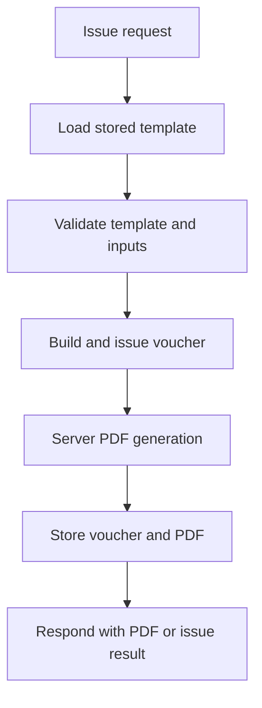

# Server Integration Guide

[한국어](server-integration.md) · [日本語](server-integration.ja.md)

This guide explains how to use SlipKit Core on a Node.js server to validate `.slip` files, issue vouchers, and generate and store PDFs.

It uses NestJS as the representative example, but the validation, rendering, and storage principles are the same for Express, Fastify, batch workers, and other Node.js servers.

> [!NOTE]
> For the Core API itself, see the [Core Usage Guide](core.en.md).
> This document covers how to connect Core to a server application's lifecycle, storage, and HTTP requests.

> [!IMPORTANT]
> SlipKit is currently in pre-release review, and the `@omdc-slipkit/*` packages have not yet been published to the npm registry.
> For now, you can verify everything against the source code and demos included in the repository.

## What the server is responsible for

This guide assumes the server handles the following tasks.

1. Load the template to use from a trusted store.
2. Validate request data and `.slip` files.
3. Build a voucher from the template and input values.
4. Lock the voucher into the issued state and validate it again.
5. Generate the PDF on the server.
6. Store the voucher `.slip` and any required PDFs.



Do not use a flow where a client-generated PDF is uploaded to the server and kept as if it were the original. Only when the server performs validation and rendering itself can the application flow confirm that the stored PDF was produced from that voucher.

> [!WARNING]
> A voucher's `issued: true` is a business state that locks its inputs.
> It is not a digital signature or cryptographic proof of authenticity, so user permissions, change history, and audit records must be managed separately on the server.

## Installation and runtime environment

On the server, use `@omdc-slipkit/core`.

```bash
npm install @omdc-slipkit/core
```

To use the bundled fonts, also install `@omdc-slipkit/elements`.

```bash
npm install @omdc-slipkit/core @omdc-slipkit/elements
```

The supported Node.js version is 22.13 or later.

`@omdc-slipkit/core` is distributed as ESM but can be used in both ESM and CommonJS projects. In TypeScript, use ordinary static imports regardless of your project's output format.

```ts
import {
  createSlipKit,
  parseSlipFile,
  validateSlipFile,
} from '@omdc-slipkit/core';
```

You can also load it by package name when using it directly from a CommonJS file.

```js
const {
  createSlipKit,
  parseSlipFile,
  validateSlipFile,
} = require('@omdc-slipkit/core');
```

> [!IMPORTANT]
> Do not load internal package files such as `dist/index.js` directly.
> Use only the published package name and exports paths so that future changes to the distribution layout do not affect you.

## Registering Core in NestJS

The fonts and locale used to create PDFs usually do not change per request. Call `createSlipKit` once in a NestJS provider and reuse the same instance.

The examples use the following structure.

```text
src/
├── slipkit/
│   ├── slipkit.module.ts
│   ├── slipkit.tokens.ts
│   └── slip-issuance.service.ts
└── vouchers/
    ├── voucher.controller.ts
    └── voucher.repository.ts

fonts/
├── Pretendard-Regular.otf
└── Pretendard-Bold.otf
```

### Creating a provider token

`src/slipkit/slipkit.tokens.ts`:

```ts
export const SLIP_KIT = Symbol('SLIP_KIT');
```

### Registering the SlipKit instance

`src/slipkit/slipkit.module.ts`:

```ts
import {
  Module,
  type Provider,
} from '@nestjs/common';
import { readFile } from 'node:fs/promises';
import { resolve } from 'node:path';

import {
  createSlipKit,
  type SlipFont,
  type SlipKit,
} from '@omdc-slipkit/core';

import { SlipIssuanceService } from './slip-issuance.service';
import { SLIP_KIT } from './slipkit.tokens';

const slipKitProvider: Provider<SlipKit> = {
  provide: SLIP_KIT,
  useFactory: () => {
    const fontDirectory =
      process.env.SLIPKIT_FONT_DIR ?? 'fonts';

    return createSlipKit({
      locale: 'ko-KR',
      getFonts: async (): Promise<readonly SlipFont[]> => {
        const [regular, bold] = await Promise.all([
          readFile(
            resolve(
              fontDirectory,
              'Pretendard-Regular.otf',
            ),
          ),
          readFile(
            resolve(
              fontDirectory,
              'Pretendard-Bold.otf',
            ),
          ),
        ]);

        return [
          {
            name: 'Pretendard',
            data: regular,
            fallback: true,
          },
          {
            name: 'Pretendard-Bold',
            data: bold,
          },
        ];
      },
    });
  },
};

@Module({
  providers: [
    slipKitProvider,
    SlipIssuanceService,
  ],
  exports: [
    SLIP_KIT,
    SlipIssuanceService,
  ],
})
export class SlipKitModule {}
```

A relative `SLIPKIT_FONT_DIR` is resolved against the server process's current working directory. In containers and serverless environments, it is safer to pass the absolute path of the deployed fonts through the environment variable.

When you reuse the same `SlipKit` instance, `getFonts` is resolved once on the first render and the same result is reused for subsequent renders. Font files are not re-read on every request.

> [!CAUTION]
> The `renderSlipToPdf` convenience function creates a new renderer on every call.
> On a server handling multiple requests, use `render` on the `SlipKit` instance registered as a provider.

## Using the bundled fonts

If deploying separate font files to the server is difficult, you can use the bundled fonts from `@omdc-slipkit/elements`.

```ts
import { Module } from '@nestjs/common';

import {
  createSlipKit,
  type SlipKit,
} from '@omdc-slipkit/core';
import {
  PRETENDARD_FONTS,
} from '@omdc-slipkit/elements/fonts/pretendard';

import { SLIP_KIT } from './slipkit.tokens';

@Module({
  providers: [
    {
      provide: SLIP_KIT,
      useFactory: (): SlipKit =>
        createSlipKit({
          locale: 'ko-KR',
          getFonts: () => PRETENDARD_FONTS,
        }),
    },
  ],
  exports: [SLIP_KIT],
})
export class SlipKitModule {}
```

The default Japanese font is loaded from the following path.

```ts
import {
  NOTO_SANS_JP_FONTS,
} from '@omdc-slipkit/elements/fonts/noto-sans-jp';
```

The bundled font modules can be used on a server, but the font data is included in the JavaScript bundle. If deployment size and startup time matter, deploy TTF/OTF files as server assets and read them in `getFonts` instead.

For how font names map to weights, see the [Configuration Guide](configuration.en.md).

## Validating request data

NestJS converts JSON request bodies into JavaScript objects. Validate already-parsed objects with `validateSlipFile`, not `parseSlipFile`.

```ts
import {
  validateSlipFile,
  type SlipFile,
} from '@omdc-slipkit/core';

export function validateRequestFile(
  body: unknown,
): SlipFile {
  return validateSlipFile(body);
}
```

Conversely, use `parseSlipFile` when you have read a JSON string from a database or a file.

```ts
import {
  parseSlipFile,
  type SlipFile,
} from '@omdc-slipkit/core';

export function parseStoredFile(
  json: string,
): SlipFile {
  return parseSlipFile(json);
}
```

Specifying TypeScript types alone does not validate HTTP request data.

```ts
// Bad example — a type assertion performs no runtime validation.
const file = body as SlipFile;
```

> [!IMPORTANT]
> Do not trust values that come from outside the application — HTTP requests, file uploads, message queues, and databases — and check them with `parseSlipFile` or `validateSlipFile`.

### Checking the inputs of an issue request

If a voucher issue API accepts the entire template from the client, the client can tamper with the template snapshot at will. For issue requests, we recommend accepting only the template identifier and the voucher values, and loading the template again from the server's store.

The following function checks the minimal structure of the example request.

```ts
import {
  BadRequestException,
} from '@nestjs/common';

import type {
  JsonValue,
} from '@omdc-slipkit/core';

export interface IssueVoucherRequest {
  templateId: string;
  values: Record<string, JsonValue>;
}

function isRecord(
  value: unknown,
): value is Record<string, unknown> {
  return (
    typeof value === 'object' &&
    value !== null &&
    !Array.isArray(value)
  );
}

export function readIssueVoucherRequest(
  body: unknown,
): IssueVoucherRequest {
  if (!isRecord(body)) {
    throw new BadRequestException(
      'The request body must be an object.',
    );
  }

  if (
    typeof body.templateId !== 'string' ||
    body.templateId.length === 0
  ) {
    throw new BadRequestException(
      'templateId is required.',
    );
  }

  if (!isRecord(body.values)) {
    throw new BadRequestException(
      'values must be an object.',
    );
  }

  return {
    templateId: body.templateId,
    values: body.values as Record<string, JsonValue>,
  };
}
```

This function only checks the outer structure of the API request. The actual voucher rules are checked with `validateSlipFile` after the voucher is built from the template.

## Connecting voucher issuance and PDF generation

`src/slipkit/slip-issuance.service.ts`:

```ts
import {
  BadRequestException,
  Inject,
  Injectable,
} from '@nestjs/common';

import {
  parseSlipFile,
  serializeSlipFile,
  validateSlipFile,
  type JsonValue,
  type SlipKit,
  type SlipVoucherFile,
} from '@omdc-slipkit/core';

import { SLIP_KIT } from './slipkit.tokens';

export interface IssuedVoucherResult {
  voucher: SlipVoucherFile;
  slipJson: string;
  pdf: Uint8Array;
}

@Injectable()
export class SlipIssuanceService {
  constructor(
    @Inject(SLIP_KIT)
    private readonly slip: SlipKit,
  ) {}

  async issue(
    templateJson: string,
    values: Record<string, JsonValue>,
  ): Promise<IssuedVoucherResult> {
    const template = parseSlipFile(templateJson);

    if (template.kind !== 'template') {
      throw new BadRequestException(
        'The stored file is not a template.',
      );
    }

    const draft = this.slip.buildVoucher(
      template,
      values,
    );

    const validated = validateSlipFile({
      ...draft,
      issued: true,
    });

    if (validated.kind !== 'voucher') {
      throw new Error(
        'The result of issuing the voucher has an unexpected kind.',
      );
    }

    const pdf = await this.slip.render(validated);

    return {
      voucher: validated,
      slipJson: serializeSlipFile(validated),
      pdf,
    };
  }
}
```

`buildVoucher` creates a pre-issue voucher with `issued: false`. The example finalizes the values, switches to `issued: true`, and validates the entire voucher again.

Issue-time validation also checks the following.

- The structure of the template snapshot and voucher values
- Structural limits on the document, pages, and elements
- The format of images referenced by the issued voucher
- That no external URL images remain in the issued voucher

If you used external URL images, the server must fetch those images and convert them to `data:` Base64 values before issuing. SlipKit Core does not request external URLs on your behalf.

## Connecting your application's storage

SlipKit does not require a specific database or ORM. On the server, you can store data directly in the database, object storage, or file store your application already uses.

The following interface is the application-side storage example used in this guide. It is not a class provided by SlipKit.

`src/vouchers/voucher.repository.ts`:

```ts
export interface SaveIssuedVoucherInput {
  id: string;
  slipJson: string;
  pdf: Uint8Array;
}

export abstract class VoucherRepository {
  abstract loadTemplateJson(
    id: string,
  ): Promise<string | null>;

  abstract saveIssued(
    input: SaveIssuedVoucherInput,
  ): Promise<void>;
}
```

Implement this interface in the host application to match your database or file storage, and register it as a NestJS provider.

```ts
{
  provide: VoucherRepository,
  useClass: DatabaseVoucherRepository,
}
```

You do not have to implement SlipKit's `StorageAdapter` for server storage. Implement it optionally, only when the designer and the server need to share the same storage abstraction.

## Building the PDF response

The following controller loads the template stored on the server, builds the voucher and PDF, finishes saving, and responds with the PDF.

`src/vouchers/voucher.controller.ts`:

```ts
import {
  Body,
  Controller,
  NotFoundException,
  Post,
  StreamableFile,
} from '@nestjs/common';
import { randomUUID } from 'node:crypto';

import {
  readIssueVoucherRequest,
} from './issue-voucher.request';
import {
  VoucherRepository,
} from './voucher.repository';
import {
  SlipIssuanceService,
} from '../slipkit/slip-issuance.service';

@Controller('vouchers')
export class VoucherController {
  constructor(
    private readonly repository: VoucherRepository,
    private readonly issuance: SlipIssuanceService,
  ) {}

  @Post('issue')
  async issue(
    @Body() body: unknown,
  ): Promise<StreamableFile> {
    const request =
      readIssueVoucherRequest(body);

    const templateJson =
      await this.repository.loadTemplateJson(
        request.templateId,
      );

    if (templateJson === null) {
      throw new NotFoundException(
        'Template not found.',
      );
    }

    const result = await this.issuance.issue(
      templateJson,
      request.values,
    );

    const voucherId = randomUUID();

    await this.repository.saveIssued({
      id: voucherId,
      slipJson: result.slipJson,
      pdf: result.pdf,
    });

    return new StreamableFile(
      Buffer.from(result.pdf),
      {
        type: 'application/pdf',
        disposition:
          `attachment; filename="${voucherId}.pdf"`,
      },
    );
  }
}
```

With `StreamableFile`, you can respond with the PDF in the same way on both the Express and Fastify adapters.

If you do not need to return the PDF immediately, the controller can return only the issue ID and provide the PDF through a separate retrieval API or a job-completion notification.

## Storing vouchers and PDFs

When storing a voucher, save the entire serialized `SlipVoucherFile`, not just its `values`.

A voucher carries the following together.

- The template snapshot at the time of writing
- The values entered into the voucher
- The file format version
- The issued state

The PDF is a derived artifact for viewing and printing. Decide whether to keep it using the following criteria.

| Use case | Recommended approach |
|---|---|
| Print on demand in the latest supported environment | Keep the voucher `.slip` and generate the PDF on request |
| Preserve the PDF file itself as issued | Keep both the `.slip` and the PDF at issue time |
| Bulk issuance or documents that take long to generate | Generate PDFs in a job queue and keep the results |

> [!CAUTION]
> To reproduce the same layout from the same voucher, the renderer version, fonts, and locale settings must also be the same.
> If long-term retention is required, record the PDF from the time of issue together with the SlipKit version and settings used.

### Handling storage failures

When a database and object storage are used together, the two stores sometimes cannot be wrapped in a single transaction.

In that case, use one of the following.

- Save the PDF to a temporary location and move it to its final location once the database write completes
- Split the issue state into `processing` and `completed` and retry failed jobs
- Use a job queue or an outbox to complete storage steps in order
- Use idempotency keys so that repeating the same issue request does not create duplicate results

Do not treat a state where only the voucher was saved without its PDF, or only the PDF without its voucher, as a successful issuance.

## Concurrency and memory management

PDF generation loads font and image data into memory and computes the document layout. Rendering many documents at once can sharply increase memory usage and response times.

We recommend the following principles.

- Reuse a single `SlipKit` instance.
- Do not generate PDFs concurrently with an unbounded `Promise.all`.
- Limit concurrent renders or use a job queue.
- Generate large documents and image-heavy documents in a worker separate from the request-handling process.
- Configure request body and image size limits separately on the HTTP server.
- Record processing time, PDF size, failure rate, and memory usage.

> [!NOTE]
> The SlipKit schema has limits on page and element counts, but it does not limit the byte size of the whole HTTP request for you.
> Requests containing Base64 images can be large, so configure body size limits in the NestJS HTTP adapter and at your proxy as well.

## Error handling

On the server, distinguish responses and logging by where the error originated.

| Error | Typical cause | Recommended handling |
|---|---|---|
| `SlipParseError` | Invalid JSON, unsupported structure, issue-rule violation | Respond 400 for external requests; log as a server data error for stored templates |
| `SlipRenderError` | Invalid render data, font configuration, or PDF generation failure | Distinguish request problems from server configuration problems and handle as 4xx or 5xx |
| `SlipEncryptionError` | Missing key, wrong key, corrupted encryption envelope | Respond with a generalized error and record the detailed cause only in server logs |
| Storage errors | DB, file, or object storage failure | Do not treat as issued; retry or transition to a recovery state |

Do not handle errors caused by client input and errors caused by templates, fonts, or key configuration stored on the server with the same 400 response.

Do not include encryption keys, database connection details, full original vouchers, or internal file paths in error responses.

## Security and operational considerations

SlipKit does not itself provide the following.

- User authentication
- Access permissions for templates and vouchers
- Issuance permissions
- Rate limiting
- Audit logs
- Database transactions
- File retention periods and deletion policies
- Digital signatures or legal proof of authenticity for PDFs

Implement the following separately in your server application.

- Check that the requesting user may use the template
- Check permission to view or download issued vouchers
- Block access to other users' data via template IDs
- Prevent duplicate issue requests
- Encrypt stored data and manage keys
- Record the creator, creation time, and versions used for vouchers and PDFs
- Safely delete data whose retention period has ended

## Implementations to avoid

- Rendering objects sent by the client after only a type assertion
- Using a client-supplied template snapshot as the basis for issuance without verification
- Treating a client-generated PDF as a validated original
- Creating `createSlipKit` anew for every request
- Re-reading font files directly on every render request
- Storing only the `values` of an issued voucher
- Using `issued: true` as a digital signature or tamper-proof marker
- Running PDF generation jobs concurrently without limits
- Treating a state where only one of the database write and PDF save succeeded as a completed issuance
- Using the `@omdc-slipkit/elements` root package as if it were a Node.js server UI

## Server integration checklist

- [ ] Use Node.js 22.13 or later.
- [ ] Import `@omdc-slipkit/core` through its public package paths.
- [ ] Register `createSlipKit` as a singleton provider.
- [ ] Supply the fonts needed for Korean and Japanese output.
- [ ] Validate `.slip` files from external requests and from storage.
- [ ] Read the template used for issuance from a trusted server store.
- [ ] Convert external URL images to embedded data before issuing.
- [ ] Validate the voucher again after switching it to the issued state.
- [ ] Store the entire voucher together with any required PDFs.
- [ ] Be able to recover from issuance failures and partial saves.
- [ ] Limit concurrent PDF generation and request body size.
- [ ] Manage authentication, permissions, audit records, and retention policies on the server.
- [ ] Record the SlipKit version and render settings at the time of issue.

## Related documents

- [Core Usage Guide](core.en.md)
- [Application Integration Guide](integration.en.md)
- [Configuration Guide](configuration.en.md)
- [API Reference](api-reference.en.md)
- [Architecture](../ARCHITECTURE.md)
- [File Format Specification](../SPEC.md)
