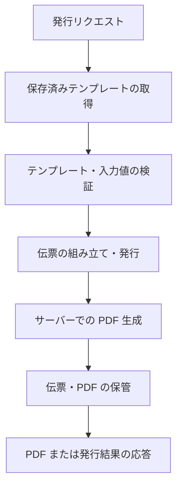

# サーバー統合ガイド

[한국어](server-integration.md) · [English](server-integration.en.md)

SlipKit Core を Node.js サーバーで使い、`.slip` ファイルの検証、伝票の発行、PDF の生成と保管を行う方法を説明します。

このドキュメントでは NestJS を代表例として使いますが、検証・レンダリング・保管の原則は Express、Fastify、バッチワーカーなど他の Node.js サーバーでも同じです。

> [!NOTE]
> Core API 自体の使い方は [Core 利用ガイド](core.ja.md)を参照してください。
> このドキュメントは、Core をサーバーアプリケーションのライフサイクル、ストレージ、HTTP リクエストに接続する方法を扱います。

> [!IMPORTANT]
> SlipKit は現在公開前のレビュー段階であり、`@omdc-slipkit/*` パッケージはまだ npm レジストリに公開されていません。
> 現時点ではリポジトリに含まれるソースコードとデモを基準に確認できます。

## サーバーが担当する範囲

このガイドでは、サーバーが次の作業を担当すると想定します。

1. 使用するテンプレートを信頼できるストレージから読み込みます。
2. リクエストデータと `.slip` ファイルを検証します。
3. テンプレートと入力値から伝票を作ります。
4. 伝票を発行状態にロックし、再度検証します。
5. サーバーで PDF を生成します。
6. 伝票 `.slip` と必要な PDF を保管します。



クライアントが生成した PDF をサーバーにアップロードして原本のように保管するフローは使いません。サーバー自身が検証とレンダリングを行うことで、保管された PDF がその伝票から生成された成果物であることをアプリケーションのフローの中で確認できます。

> [!WARNING]
> 伝票の `issued: true` は入力をロックする業務上の状態です。
> 電子署名や暗号学的な真正性の保証ではないため、ユーザー権限、変更履歴、監査記録はサーバー側で別途管理する必要があります。

## インストールと実行環境

サーバーでは `@omdc-slipkit/core` を使います。

```bash
npm install @omdc-slipkit/core
```

同梱フォントを使う場合は `@omdc-slipkit/elements` もインストールします。

```bash
npm install @omdc-slipkit/core @omdc-slipkit/elements
```

サポートする Node.js のバージョンは 22.13 以上です。

`@omdc-slipkit/core` は ESM として配布されますが、ESM と CommonJS のどちらのプロジェクトでも使えます。TypeScript ではプロジェクトの出力形式に関係なく、通常の静的 import を使います。

```ts
import {
  createSlipKit,
  parseSlipFile,
  validateSlipFile,
} from '@omdc-slipkit/core';
```

CommonJS ファイルから直接使う場合も、パッケージ名で読み込めます。

```js
const {
  createSlipKit,
  parseSlipFile,
  validateSlipFile,
} = require('@omdc-slipkit/core');
```

> [!IMPORTANT]
> `dist/index.js` のようなパッケージ内部のファイルを直接読み込まないでください。
> 公開されたパッケージ名と exports のパスだけを使うことで、今後配布構造が変わっても影響を受けません。

## NestJS への Core の登録

PDF の生成に使うフォントとロケールは、リクエストごとに変わらないことがほとんどです。NestJS の Provider で `createSlipKit` を一度だけ呼び、同じインスタンスを再利用します。

例では次の構成を使います。

```text
src/
├── slipkit/
│   ├── slipkit.module.ts
│   ├── slipkit.tokens.ts
│   └── slip-issuance.service.ts
└── vouchers/
    ├── voucher.controller.ts
    └── voucher.repository.ts

fonts/
├── Pretendard-Regular.otf
└── Pretendard-Bold.otf
```

### Provider トークンの作成

`src/slipkit/slipkit.tokens.ts`:

```ts
export const SLIP_KIT = Symbol('SLIP_KIT');
```

### SlipKit インスタンスの登録

`src/slipkit/slipkit.module.ts`:

```ts
import {
  Module,
  type Provider,
} from '@nestjs/common';
import { readFile } from 'node:fs/promises';
import { resolve } from 'node:path';

import {
  createSlipKit,
  type SlipFont,
  type SlipKit,
} from '@omdc-slipkit/core';

import { SlipIssuanceService } from './slip-issuance.service';
import { SLIP_KIT } from './slipkit.tokens';

const slipKitProvider: Provider<SlipKit> = {
  provide: SLIP_KIT,
  useFactory: () => {
    const fontDirectory =
      process.env.SLIPKIT_FONT_DIR ?? 'fonts';

    return createSlipKit({
      locale: 'ko-KR',
      getFonts: async (): Promise<readonly SlipFont[]> => {
        const [regular, bold] = await Promise.all([
          readFile(
            resolve(
              fontDirectory,
              'Pretendard-Regular.otf',
            ),
          ),
          readFile(
            resolve(
              fontDirectory,
              'Pretendard-Bold.otf',
            ),
          ),
        ]);

        return [
          {
            name: 'Pretendard',
            data: regular,
            fallback: true,
          },
          {
            name: 'Pretendard-Bold',
            data: bold,
          },
        ];
      },
    });
  },
};

@Module({
  providers: [
    slipKitProvider,
    SlipIssuanceService,
  ],
  exports: [
    SLIP_KIT,
    SlipIssuanceService,
  ],
})
export class SlipKitModule {}
```

相対パスで指定した `SLIPKIT_FONT_DIR` は、サーバープロセスの現在の作業ディレクトリを基準に解決されます。コンテナやサーバーレス環境では、配置したフォントの絶対パスを環境変数で渡すほうが安全です。

同じ `SlipKit` インスタンスを再利用すると、`getFonts` は最初のレンダリングで一度だけ解決され、以降のレンダリングでは同じ結果が再利用されます。フォントファイルをリクエストごとに読み直すことはありません。

> [!CAUTION]
> 便利関数 `renderSlipToPdf` は呼び出しのたびに新しいレンダラーを作ります。
> 複数のリクエストを処理するサーバーでは、Provider として登録した `SlipKit` インスタンスの `render` を使ってください。

## 同梱フォントの利用

サーバーに別途フォントファイルを配置するのが難しい場合は、`@omdc-slipkit/elements` の同梱フォントを使えます。

```ts
import { Module } from '@nestjs/common';

import {
  createSlipKit,
  type SlipKit,
} from '@omdc-slipkit/core';
import {
  PRETENDARD_FONTS,
} from '@omdc-slipkit/elements/fonts/pretendard';

import { SLIP_KIT } from './slipkit.tokens';

@Module({
  providers: [
    {
      provide: SLIP_KIT,
      useFactory: (): SlipKit =>
        createSlipKit({
          locale: 'ko-KR',
          getFonts: () => PRETENDARD_FONTS,
        }),
    },
  ],
  exports: [SLIP_KIT],
})
export class SlipKitModule {}
```

日本語の既定フォントは次のパスから読み込みます。

```ts
import {
  NOTO_SANS_JP_FONTS,
} from '@omdc-slipkit/elements/fonts/noto-sans-jp';
```

同梱フォントモジュールはサーバーでも使えますが、フォントデータが JavaScript バンドルに含まれます。配布サイズと起動時間が重要な場合は、TTF・OTF ファイルをサーバーの資産として配置し、`getFonts` で読み込む方式を使ってください。

フォント名と太字の対応づけは[設定ガイド](configuration.ja.md)を参照してください。

## リクエストデータの検証

NestJS は JSON リクエストボディを JavaScript オブジェクトに変換します。すでにパースされたオブジェクトは `parseSlipFile` ではなく `validateSlipFile` で検証します。

```ts
import {
  validateSlipFile,
  type SlipFile,
} from '@omdc-slipkit/core';

export function validateRequestFile(
  body: unknown,
): SlipFile {
  return validateSlipFile(body);
}
```

逆に、データベースやファイルから JSON 文字列を読み込んだ場合は `parseSlipFile` を使います。

```ts
import {
  parseSlipFile,
  type SlipFile,
} from '@omdc-slipkit/core';

export function parseStoredFile(
  json: string,
): SlipFile {
  return parseSlipFile(json);
}
```

TypeScript の型を指定するだけでは、HTTP リクエストデータは検証されません。

```ts
// 悪い例 — 型アサーションは実行時の検証を行いません。
const file = body as SlipFile;
```

> [!IMPORTANT]
> HTTP リクエスト、ファイルアップロード、メッセージキュー、データベースのようにアプリケーションの外から入ってきた値は信頼せず、`parseSlipFile` または `validateSlipFile` で確認してください。

### 発行リクエストの入力値の確認

伝票発行 API がテンプレート全体をクライアントから受け取ると、クライアントがテンプレートのスナップショットを任意に書き換えられます。発行リクエストではテンプレートの識別子と伝票の値だけを受け取り、テンプレートはサーバーのストレージから改めて取得する方式を推奨します。

次の関数は、例で使うリクエストの最小構造を確認します。

```ts
import {
  BadRequestException,
} from '@nestjs/common';

import type {
  JsonValue,
} from '@omdc-slipkit/core';

export interface IssueVoucherRequest {
  templateId: string;
  values: Record<string, JsonValue>;
}

function isRecord(
  value: unknown,
): value is Record<string, unknown> {
  return (
    typeof value === 'object' &&
    value !== null &&
    !Array.isArray(value)
  );
}

export function readIssueVoucherRequest(
  body: unknown,
): IssueVoucherRequest {
  if (!isRecord(body)) {
    throw new BadRequestException(
      'リクエストボディはオブジェクトである必要があります。',
    );
  }

  if (
    typeof body.templateId !== 'string' ||
    body.templateId.length === 0
  ) {
    throw new BadRequestException(
      'templateId が必要です。',
    );
  }

  if (!isRecord(body.values)) {
    throw new BadRequestException(
      'values はオブジェクトである必要があります。',
    );
  }

  return {
    templateId: body.templateId,
    values: body.values as Record<string, JsonValue>,
  };
}
```

この関数は API リクエストの外側の構造だけを確認します。実際の伝票のルールは、テンプレートから伝票を作った後に `validateSlipFile` で検査します。

## 伝票の発行と PDF 生成の接続

`src/slipkit/slip-issuance.service.ts`:

```ts
import {
  BadRequestException,
  Inject,
  Injectable,
} from '@nestjs/common';

import {
  parseSlipFile,
  serializeSlipFile,
  validateSlipFile,
  type JsonValue,
  type SlipKit,
  type SlipVoucherFile,
} from '@omdc-slipkit/core';

import { SLIP_KIT } from './slipkit.tokens';

export interface IssuedVoucherResult {
  voucher: SlipVoucherFile;
  slipJson: string;
  pdf: Uint8Array;
}

@Injectable()
export class SlipIssuanceService {
  constructor(
    @Inject(SLIP_KIT)
    private readonly slip: SlipKit,
  ) {}

  async issue(
    templateJson: string,
    values: Record<string, JsonValue>,
  ): Promise<IssuedVoucherResult> {
    const template = parseSlipFile(templateJson);

    if (template.kind !== 'template') {
      throw new BadRequestException(
        '保存されたファイルはテンプレートではありません。',
      );
    }

    const draft = this.slip.buildVoucher(
      template,
      values,
    );

    const validated = validateSlipFile({
      ...draft,
      issued: true,
    });

    if (validated.kind !== 'voucher') {
      throw new Error(
        '伝票の発行結果の種類が正しくありません。',
      );
    }

    const pdf = await this.slip.render(validated);

    return {
      voucher: validated,
      slipJson: serializeSlipFile(validated),
      pdf,
    };
  }
}
```

`buildVoucher` は発行前の状態である `issued: false` の伝票を作ります。例では値を確定した後に `issued: true` へ切り替え、伝票全体を再度検証します。

発行時の検証では次の項目も確認されます。

- テンプレートのスナップショットと伝票の値の構造
- ドキュメント、ページ、要素の構造上限
- 発行伝票が参照する画像の形式
- 外部 URL 画像が発行伝票に残っていないこと

外部 URL 画像を使った場合は、発行前にサーバーがその画像を取得して `data:` Base64 値に変換する必要があります。SlipKit Core が外部 URL を代わりにリクエストすることはありません。

## アプリケーションのストレージとの接続

SlipKit は特定のデータベースや ORM を要求しません。サーバーでは、アプリケーションが使っているデータベース、オブジェクトストレージ、ファイルストレージに直接保存できます。

次のインターフェースは、このガイドで使うアプリケーション側のストレージの例です。SlipKit が提供するクラスではありません。

`src/vouchers/voucher.repository.ts`:

```ts
export interface SaveIssuedVoucherInput {
  id: string;
  slipJson: string;
  pdf: Uint8Array;
}

export abstract class VoucherRepository {
  abstract loadTemplateJson(
    id: string,
  ): Promise<string | null>;

  abstract saveIssued(
    input: SaveIssuedVoucherInput,
  ): Promise<void>;
}
```

ホストアプリケーションでこのインターフェースをデータベースやファイル保存の方式に合わせて実装し、NestJS の Provider として登録します。

```ts
{
  provide: VoucherRepository,
  useClass: DatabaseVoucherRepository,
}
```

サーバーでの保存に SlipKit の `StorageAdapter` を必ず実装する必要はありません。デザイナーとサーバーが同じストレージの抽象を共有する必要があるときだけ、選択的に実装してください。

## PDF レスポンスの作成

次の Controller は、サーバーに保存されたテンプレートを取得して伝票と PDF を作り、保存を終えてから PDF を応答します。

`src/vouchers/voucher.controller.ts`:

```ts
import {
  Body,
  Controller,
  NotFoundException,
  Post,
  StreamableFile,
} from '@nestjs/common';
import { randomUUID } from 'node:crypto';

import {
  readIssueVoucherRequest,
} from './issue-voucher.request';
import {
  VoucherRepository,
} from './voucher.repository';
import {
  SlipIssuanceService,
} from '../slipkit/slip-issuance.service';

@Controller('vouchers')
export class VoucherController {
  constructor(
    private readonly repository: VoucherRepository,
    private readonly issuance: SlipIssuanceService,
  ) {}

  @Post('issue')
  async issue(
    @Body() body: unknown,
  ): Promise<StreamableFile> {
    const request =
      readIssueVoucherRequest(body);

    const templateJson =
      await this.repository.loadTemplateJson(
        request.templateId,
      );

    if (templateJson === null) {
      throw new NotFoundException(
        'テンプレートが見つかりません。',
      );
    }

    const result = await this.issuance.issue(
      templateJson,
      request.values,
    );

    const voucherId = randomUUID();

    await this.repository.saveIssued({
      id: voucherId,
      slipJson: result.slipJson,
      pdf: result.pdf,
    });

    return new StreamableFile(
      Buffer.from(result.pdf),
      {
        type: 'application/pdf',
        disposition:
          `attachment; filename="${voucherId}.pdf"`,
      },
    );
  }
}
```

`StreamableFile` を使うと、Express と Fastify のどちらのアダプターでも同じ方法で PDF を応答できます。

PDF をすぐに返す必要がなければ、Controller は発行 ID だけを返し、別の取得 API や作業完了の通知を通じて PDF を提供しても構いません。

## 伝票と PDF の保管

伝票を保管するときは `values` だけを保存せず、シリアライズした `SlipVoucherFile` 全体を保存してください。

伝票には次の情報が一緒に入っています。

- 作成時点のテンプレートのスナップショット
- 伝票に入力した値
- ファイル形式のバージョン
- 発行状態

PDF は閲覧・印刷のための派生成果物です。次の基準で保管するかどうかを決めます。

| 用途 | 推奨方式 |
|---|---|
| 必要になるたびに最新のサポート環境で出力 | 伝票 `.slip` を保管し、リクエスト時に PDF を生成 |
| 発行時点の PDF ファイルそのものを保存 | 発行時に `.slip` と PDF を一緒に保管 |
| 大量発行や生成時間の長いドキュメント | ジョブキューで PDF を生成して結果を保管 |

> [!CAUTION]
> 同じ伝票から同じ配置結果を再現するには、レンダラーのバージョン、フォント、ロケール設定も同じである必要があります。
> 長期保管が必要な場合は、発行時点の PDF と使用した SlipKit のバージョン・設定情報を一緒に記録してください。

### 保存失敗の処理

データベースとオブジェクトストレージを併用すると、二つのストレージを一つのトランザクションにまとめられない場合があります。

その場合は次のいずれかを使います。

- PDF を一時的な場所に保存し、データベースへの反映が終わってから確定の場所へ移動
- 発行状態を「処理中」と「完了」に分け、失敗した作業を再試行
- ジョブキューや outbox を使って保存作業を順番に完了
- 同じ発行リクエストが繰り返されても結果が重複生成されないように冪等キーを使用

伝票だけが保存されて PDF が欠けている状態や、PDF だけが保存されて伝票が欠けている状態を、正常な発行として扱わないでください。

## 同時実行とメモリ管理

PDF の生成は、フォントと画像データをメモリに載せてドキュメントの配置を計算します。同時に多くのドキュメントをレンダリングすると、メモリ使用量と応答時間が急激に増えることがあります。

次の原則を推奨します。

- 一つの `SlipKit` インスタンスを再利用します。
- 無制限の `Promise.all` で PDF を同時生成しません。
- 同時レンダリング数を制限するか、ジョブキューを使います。
- 大きなドキュメントや画像の多いドキュメントは、リクエスト処理プロセスと分離したワーカーで生成します。
- リクエストボディと画像サイズの制限を HTTP サーバー側でも設定します。
- 処理時間、PDF サイズ、失敗率、メモリ使用量を記録します。

> [!NOTE]
> SlipKit のスキーマにはページと要素数の上限がありますが、HTTP リクエスト全体のバイトサイズを代わりに制限することはありません。
> Base64 画像を含むリクエストは大きくなり得るため、NestJS の HTTP アダプターとプロキシでもボディサイズの制限を設定してください。

## エラー処理

サーバーでは、エラーの発生箇所によって応答と記録の方法を区別します。

| エラー | 一般的な原因 | 推奨する処理 |
|---|---|---|
| `SlipParseError` | 不正な JSON、サポートしない構造、発行ルール違反 | 外部リクエストなら 400 応答、保存済みテンプレートならサーバーデータのエラーとして記録 |
| `SlipRenderError` | 不正なレンダリングデータ、フォント設定、PDF 生成の失敗 | リクエストの問題とサーバー設定の問題を区別して 4xx または 5xx で処理 |
| `SlipEncryptionError` | キーの欠落、誤ったキー、破損した暗号化エンベロープ | 一般化したエラーを応答し、詳細な原因はサーバーログにのみ記録 |
| ストレージのエラー | DB、ファイル、オブジェクトストレージの失敗 | 発行完了として扱わず、再試行または復旧状態へ移行 |

クライアントの入力が原因のエラーと、サーバーに保存されたテンプレート・フォント・キー設定が原因のエラーを、同じ 400 応答で処理しないでください。

暗号化キー、データベースの接続情報、元の伝票全体、内部のファイルパスはエラー応答に含めません。

## セキュリティと運用で確認すべき事項

SlipKit は次の機能を直接提供しません。

- ユーザー認証
- テンプレートと伝票のアクセス権限
- 発行権限
- リクエスト回数の制限
- 監査ログ
- データベーストランザクション
- ファイルの保存期間と削除ポリシー
- PDF の電子署名や法的な真正性の保証

サーバーアプリケーションで次の項目を別途実装する必要があります。

- リクエストしたユーザーがそのテンプレートを使えるかの確認
- 発行伝票の閲覧やダウンロードの権限確認
- テンプレート ID を使った他ユーザーのデータへのアクセス遮断
- 発行リクエストの重複防止
- 保存データの暗号化とキー管理
- 伝票と PDF の作成者・作成時刻・使用バージョンの記録
- 保存期間が終わったデータの安全な削除

## 避けるべき実装

- クライアントが送ったオブジェクトを型アサーションだけでレンダリングする
- クライアントが送ったテンプレートのスナップショットを確認せずに発行の基準として使う
- クライアントが作った PDF を検証済みの原本と見なす
- `createSlipKit` をリクエストごとに作り直す
- フォントファイルをレンダリングのたびに直接読み直す
- 発行伝票の `values` だけを保存する
- `issued: true` を電子署名や改ざん防止の印として使う
- PDF 生成の作業を制限なく同時実行する
- データベースと PDF の保存のどちらか一方だけが成功した状態を発行完了として扱う
- `@omdc-slipkit/elements` のルートパッケージを Node.js サーバーの UI のように使う

## サーバー統合チェックリスト

- [ ] Node.js 22.13 以上を使う。
- [ ] `@omdc-slipkit/core` の公開パッケージパスで import する。
- [ ] `createSlipKit` をシングルトンの Provider として登録した。
- [ ] 韓国語・日本語の出力に必要なフォントを供給する。
- [ ] 外部リクエストとストレージから読んだ `.slip` ファイルを検証する。
- [ ] 発行の基準となるテンプレートをサーバーの信頼できるストレージから読む。
- [ ] 発行前に外部 URL 画像を埋め込みデータへ変換する。
- [ ] 発行状態に変更した伝票を再度検証する。
- [ ] 伝票全体と必要な PDF を一緒に保管する。
- [ ] 発行の失敗と部分保存の状態から復旧できる。
- [ ] 同時 PDF 生成数とリクエストボディのサイズを制限する。
- [ ] 認証、権限、監査記録、保存ポリシーをサーバーで管理する。
- [ ] 発行時点の SlipKit のバージョンとレンダリング設定を記録する。

## 関連ドキュメント

- [Core 利用ガイド](core.ja.md)
- [アプリケーション統合ガイド](integration.ja.md)
- [設定ガイド](configuration.ja.md)
- [API リファレンス](api-reference.ja.md)
- [アーキテクチャ](../ARCHITECTURE.md)
- [ファイル形式仕様](../SPEC.md)
