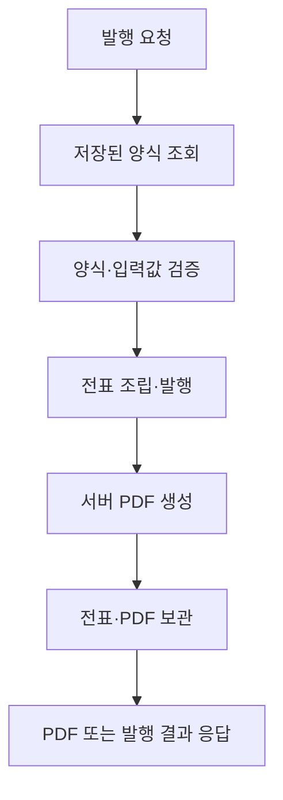

# 서버 통합 가이드

[English](server-integration.en.md) · [日本語](server-integration.ja.md)

SlipKit Core를 Node.js 서버에서 사용하여 `.slip` 파일을 검증하고, 전표를 발행하며, PDF를 생성·보관하는 방법을 설명합니다.

이 문서에서는 NestJS를 대표 예제로 사용하지만, 검증·렌더링·보관 원칙은 Express, Fastify, 배치 작업자와 다른 Node.js 서버에서도 같습니다.

> [!NOTE]
> Core API 자체의 사용법은 [Core 사용 가이드](core.md)를 참고하세요.
> 이 문서는 Core를 서버 애플리케이션의 수명 주기, 저장소와 HTTP 요청에 연결하는 방법을 다룹니다.

> [!IMPORTANT]
> SlipKit은 현재 공개 전 검토 단계이며 `@omdc-slipkit/*` 패키지는 npm 레지스트리에 아직 배포되지 않았습니다.
> 현재는 저장소에 포함된 소스 코드와 데모를 기준으로 확인할 수 있습니다.

## 서버가 담당하는 범위

이 가이드에서는 서버가 다음 작업을 담당한다고 가정합니다.

1. 사용할 양식을 신뢰할 수 있는 저장소에서 불러옵니다.
2. 요청 데이터와 `.slip` 파일을 검증합니다.
3. 양식과 입력값으로 전표를 만듭니다.
4. 전표를 발행 상태로 잠그고 다시 검증합니다.
5. 서버에서 PDF를 생성합니다.
6. 전표 `.slip`과 필요한 PDF를 보관합니다.



클라이언트가 생성한 PDF를 서버에 올려 원본처럼 보관하는 흐름은 사용하지 않습니다. 서버가 직접 검증과 렌더링을 수행해야 보관된 PDF가 해당 전표에서 생성된 산출물임을 애플리케이션 흐름 안에서 확인할 수 있습니다.

> [!WARNING]
> 전표의 `issued: true`는 입력을 잠그는 업무 상태입니다.
> 전자서명이나 암호학적 진위 보장이 아니므로 사용자 권한, 변경 이력과 감사 기록은 서버에서 별도로 관리해야 합니다.

## 설치와 실행 환경

서버에서는 `@omdc-slipkit/core`를 사용합니다.

```bash
npm install @omdc-slipkit/core
```

동봉 폰트를 사용하려면 `@omdc-slipkit/elements`도 설치합니다.

```bash
npm install @omdc-slipkit/core @omdc-slipkit/elements
```

지원하는 Node.js 버전은 22.13 이상입니다.

`@omdc-slipkit/core`는 ESM으로 배포되지만 ESM과 CommonJS 프로젝트에서 모두 사용할 수 있습니다. TypeScript에서는 프로젝트의 출력 형식과 관계없이 일반적인 정적 import를 사용합니다.

```ts
import {
  createSlipKit,
  parseSlipFile,
  validateSlipFile,
} from '@omdc-slipkit/core';
```

CommonJS 파일에서 직접 사용할 때도 패키지 이름으로 불러올 수 있습니다.

```js
const {
  createSlipKit,
  parseSlipFile,
  validateSlipFile,
} = require('@omdc-slipkit/core');
```

> [!IMPORTANT]
> `dist/index.js` 같은 패키지 내부 파일을 직접 불러오지 마세요.
> 공개된 패키지 이름과 exports 경로만 사용해야 이후 배포 구조가 변경되어도 영향을 받지 않습니다.

## NestJS에 Core 등록하기

PDF를 만들 때 사용하는 폰트와 로케일은 요청마다 달라지지 않는 경우가 많습니다. NestJS Provider에서 `createSlipKit`을 한 번 호출하고 같은 인스턴스를 재사용합니다.

예제는 다음 구조를 사용합니다.

```text
src/
├── slipkit/
│   ├── slipkit.module.ts
│   ├── slipkit.tokens.ts
│   └── slip-issuance.service.ts
└── vouchers/
    ├── voucher.controller.ts
    └── voucher.repository.ts

fonts/
├── Pretendard-Regular.otf
└── Pretendard-Bold.otf
```

### Provider 토큰 만들기

`src/slipkit/slipkit.tokens.ts`:

```ts
export const SLIP_KIT = Symbol('SLIP_KIT');
```

### SlipKit 인스턴스 등록하기

`src/slipkit/slipkit.module.ts`:

```ts
import {
  Module,
  type Provider,
} from '@nestjs/common';
import { readFile } from 'node:fs/promises';
import { resolve } from 'node:path';

import {
  createSlipKit,
  type SlipFont,
  type SlipKit,
} from '@omdc-slipkit/core';

import { SlipIssuanceService } from './slip-issuance.service';
import { SLIP_KIT } from './slipkit.tokens';

const slipKitProvider: Provider<SlipKit> = {
  provide: SLIP_KIT,
  useFactory: () => {
    const fontDirectory =
      process.env.SLIPKIT_FONT_DIR ?? 'fonts';

    return createSlipKit({
      locale: 'ko-KR',
      getFonts: async (): Promise<readonly SlipFont[]> => {
        const [regular, bold] = await Promise.all([
          readFile(
            resolve(
              fontDirectory,
              'Pretendard-Regular.otf',
            ),
          ),
          readFile(
            resolve(
              fontDirectory,
              'Pretendard-Bold.otf',
            ),
          ),
        ]);

        return [
          {
            name: 'Pretendard',
            data: regular,
            fallback: true,
          },
          {
            name: 'Pretendard-Bold',
            data: bold,
          },
        ];
      },
    });
  },
};

@Module({
  providers: [
    slipKitProvider,
    SlipIssuanceService,
  ],
  exports: [
    SLIP_KIT,
    SlipIssuanceService,
  ],
})
export class SlipKitModule {}
```

상대 경로로 지정한 `SLIPKIT_FONT_DIR`는 서버 프로세스의 현재 작업 디렉터리를 기준으로 해석됩니다. 컨테이너나 서버리스 환경에서는 배포된 폰트의 절대 경로를 환경 변수로 전달하는 편이 안전합니다.

같은 `SlipKit` 인스턴스를 재사용하면 `getFonts`는 첫 렌더링에서 한 번 해석되고 이후 렌더링에서 같은 결과가 재사용됩니다. 폰트 파일을 요청마다 다시 읽지 않습니다.

> [!CAUTION]
> `renderSlipToPdf` 편의 함수는 호출할 때마다 새 렌더러를 만듭니다.
> 여러 요청을 처리하는 서버에서는 Provider로 등록한 `SlipKit` 인스턴스의 `render`를 사용하세요.

## 동봉 폰트 사용하기

서버에 별도 폰트 파일을 배포하기 어렵다면 `@omdc-slipkit/elements`의 동봉 폰트를 사용할 수 있습니다.

```ts
import { Module } from '@nestjs/common';

import {
  createSlipKit,
  type SlipKit,
} from '@omdc-slipkit/core';
import {
  PRETENDARD_FONTS,
} from '@omdc-slipkit/elements/fonts/pretendard';

import { SLIP_KIT } from './slipkit.tokens';

@Module({
  providers: [
    {
      provide: SLIP_KIT,
      useFactory: (): SlipKit =>
        createSlipKit({
          locale: 'ko-KR',
          getFonts: () => PRETENDARD_FONTS,
        }),
    },
  ],
  exports: [SLIP_KIT],
})
export class SlipKitModule {}
```

일본어 기본 폰트는 다음 경로에서 불러옵니다.

```ts
import {
  NOTO_SANS_JP_FONTS,
} from '@omdc-slipkit/elements/fonts/noto-sans-jp';
```

동봉 폰트 모듈은 서버에서 사용할 수 있지만 폰트 데이터가 JavaScript 번들에 포함됩니다. 배포 크기와 시작 시간이 중요하다면 TTF·OTF 파일을 서버 자원으로 배포하고 `getFonts`에서 읽는 방식을 사용하세요.

폰트 이름과 굵기 연결 방법은 [환경 설정 가이드](configuration.md)를 참고하세요.

## 요청 데이터 검증하기

NestJS는 JSON 요청 본문을 JavaScript 객체로 변환합니다. 이미 파싱된 객체는 `parseSlipFile`이 아니라 `validateSlipFile`로 검증합니다.

```ts
import {
  validateSlipFile,
  type SlipFile,
} from '@omdc-slipkit/core';

export function validateRequestFile(
  body: unknown,
): SlipFile {
  return validateSlipFile(body);
}
```

반대로 데이터베이스나 파일에서 JSON 문자열을 읽었다면 `parseSlipFile`을 사용합니다.

```ts
import {
  parseSlipFile,
  type SlipFile,
} from '@omdc-slipkit/core';

export function parseStoredFile(
  json: string,
): SlipFile {
  return parseSlipFile(json);
}
```

TypeScript 타입만 지정해서는 HTTP 요청 데이터가 검증되지 않습니다.

```ts
// 잘못된 예 — 타입 단언은 실행 중 검증을 하지 않습니다.
const file = body as SlipFile;
```

> [!IMPORTANT]
> HTTP 요청, 파일 업로드, 메시지 큐와 데이터베이스처럼 애플리케이션 외부에서 들어온 값은 신뢰하지 말고 `parseSlipFile` 또는 `validateSlipFile`로 확인하세요.

### 발행 요청의 입력값 확인하기

전표 발행 API가 양식 전체를 클라이언트에서 받으면 클라이언트가 양식 스냅샷을 임의로 바꿀 수 있습니다. 발행 요청에서는 양식 식별자와 전표 값만 받고, 양식은 서버 저장소에서 다시 조회하는 방식을 권장합니다.

다음 함수는 예제 요청의 최소 구조를 확인합니다.

```ts
import {
  BadRequestException,
} from '@nestjs/common';

import type {
  JsonValue,
} from '@omdc-slipkit/core';

export interface IssueVoucherRequest {
  templateId: string;
  values: Record<string, JsonValue>;
}

function isRecord(
  value: unknown,
): value is Record<string, unknown> {
  return (
    typeof value === 'object' &&
    value !== null &&
    !Array.isArray(value)
  );
}

export function readIssueVoucherRequest(
  body: unknown,
): IssueVoucherRequest {
  if (!isRecord(body)) {
    throw new BadRequestException(
      '요청 본문은 객체여야 합니다.',
    );
  }

  if (
    typeof body.templateId !== 'string' ||
    body.templateId.length === 0
  ) {
    throw new BadRequestException(
      'templateId가 필요합니다.',
    );
  }

  if (!isRecord(body.values)) {
    throw new BadRequestException(
      'values는 객체여야 합니다.',
    );
  }

  return {
    templateId: body.templateId,
    values: body.values as Record<string, JsonValue>,
  };
}
```

이 함수는 API 요청의 바깥 구조만 확인합니다. 실제 전표 규칙은 양식에서 전표를 만든 뒤 `validateSlipFile`로 검사합니다.

## 전표 발행과 PDF 생성 연결하기

`src/slipkit/slip-issuance.service.ts`:

```ts
import {
  BadRequestException,
  Inject,
  Injectable,
} from '@nestjs/common';

import {
  parseSlipFile,
  serializeSlipFile,
  validateSlipFile,
  type JsonValue,
  type SlipKit,
  type SlipVoucherFile,
} from '@omdc-slipkit/core';

import { SLIP_KIT } from './slipkit.tokens';

export interface IssuedVoucherResult {
  voucher: SlipVoucherFile;
  slipJson: string;
  pdf: Uint8Array;
}

@Injectable()
export class SlipIssuanceService {
  constructor(
    @Inject(SLIP_KIT)
    private readonly slip: SlipKit,
  ) {}

  async issue(
    templateJson: string,
    values: Record<string, JsonValue>,
  ): Promise<IssuedVoucherResult> {
    const template = parseSlipFile(templateJson);

    if (template.kind !== 'template') {
      throw new BadRequestException(
        '저장된 파일이 양식이 아닙니다.',
      );
    }

    const draft = this.slip.buildVoucher(
      template,
      values,
    );

    const validated = validateSlipFile({
      ...draft,
      issued: true,
    });

    if (validated.kind !== 'voucher') {
      throw new Error(
        '전표 발행 결과의 종류가 올바르지 않습니다.',
      );
    }

    const pdf = await this.slip.render(validated);

    return {
      voucher: validated,
      slipJson: serializeSlipFile(validated),
      pdf,
    };
  }
}
```

`buildVoucher`는 발행 전 상태인 `issued: false` 전표를 만듭니다. 예제에서는 값을 확정한 뒤 `issued: true`로 바꾸고 전체 전표를 다시 검증합니다.

발행 검증에서는 다음 항목도 확인됩니다.

- 양식 스냅샷과 전표 값의 구조
- 문서, 페이지와 요소의 구조 상한
- 발행 전표가 참조하는 이미지의 형식
- 외부 URL 이미지가 발행 전표에 남아 있지 않은지

외부 URL 이미지를 사용했다면 발행 전에 서버가 해당 이미지를 가져와 `data:` Base64 값으로 바꿔야 합니다. SlipKit Core가 외부 URL을 대신 요청하지는 않습니다.

## 애플리케이션 저장소 연결하기

SlipKit은 특정 데이터베이스나 ORM을 요구하지 않습니다. 서버에서는 애플리케이션이 사용하는 데이터베이스, 오브젝트 스토리지 또는 파일 저장소에 직접 저장할 수 있습니다.

다음 인터페이스는 이 가이드에서 사용하는 애플리케이션 측 저장소 예제입니다. SlipKit이 제공하는 클래스가 아닙니다.

`src/vouchers/voucher.repository.ts`:

```ts
export interface SaveIssuedVoucherInput {
  id: string;
  slipJson: string;
  pdf: Uint8Array;
}

export abstract class VoucherRepository {
  abstract loadTemplateJson(
    id: string,
  ): Promise<string | null>;

  abstract saveIssued(
    input: SaveIssuedVoucherInput,
  ): Promise<void>;
}
```

호스트 애플리케이션에서 이 인터페이스를 데이터베이스나 파일 저장 방식에 맞게 구현하고 NestJS Provider로 등록합니다.

```ts
{
  provide: VoucherRepository,
  useClass: DatabaseVoucherRepository,
}
```

서버 저장에 SlipKit의 `StorageAdapter`를 반드시 구현할 필요는 없습니다. 디자이너와 서버가 같은 저장소 추상화를 공유해야 할 때만 선택적으로 구현하세요.

## PDF 응답 만들기

다음 Controller는 서버에 저장된 양식을 조회하고 전표와 PDF를 만든 뒤, 저장을 마치고 PDF를 응답합니다.

`src/vouchers/voucher.controller.ts`:

```ts
import {
  Body,
  Controller,
  NotFoundException,
  Post,
  StreamableFile,
} from '@nestjs/common';
import { randomUUID } from 'node:crypto';

import {
  readIssueVoucherRequest,
} from './issue-voucher.request';
import {
  VoucherRepository,
} from './voucher.repository';
import {
  SlipIssuanceService,
} from '../slipkit/slip-issuance.service';

@Controller('vouchers')
export class VoucherController {
  constructor(
    private readonly repository: VoucherRepository,
    private readonly issuance: SlipIssuanceService,
  ) {}

  @Post('issue')
  async issue(
    @Body() body: unknown,
  ): Promise<StreamableFile> {
    const request =
      readIssueVoucherRequest(body);

    const templateJson =
      await this.repository.loadTemplateJson(
        request.templateId,
      );

    if (templateJson === null) {
      throw new NotFoundException(
        '양식을 찾을 수 없습니다.',
      );
    }

    const result = await this.issuance.issue(
      templateJson,
      request.values,
    );

    const voucherId = randomUUID();

    await this.repository.saveIssued({
      id: voucherId,
      slipJson: result.slipJson,
      pdf: result.pdf,
    });

    return new StreamableFile(
      Buffer.from(result.pdf),
      {
        type: 'application/pdf',
        disposition:
          `attachment; filename="${voucherId}.pdf"`,
      },
    );
  }
}
```

`StreamableFile`을 사용하면 Express와 Fastify 어댑터에서 같은 방식으로 PDF를 응답할 수 있습니다.

PDF를 바로 내려줄 필요가 없다면 Controller는 발행 ID만 반환하고, 별도의 조회 API나 작업 완료 알림을 통해 PDF를 제공해도 됩니다.

## 전표와 PDF 보관하기

전표를 보관할 때는 `values`만 저장하지 말고 직렬화된 `SlipVoucherFile` 전체를 저장하세요.

전표에는 다음 정보가 함께 들어 있습니다.

- 작성 당시의 양식 스냅샷
- 전표에 입력한 값
- 파일 형식 버전
- 발행 상태

PDF는 열람·인쇄용 파생 산출물입니다. 다음 기준으로 보관 여부를 결정합니다.

| 용도 | 권장 방식 |
|---|---|
| 필요할 때마다 최신 지원 환경에서 출력 | 전표 `.slip`을 보관하고 요청 시 PDF 생성 |
| 발행 시점의 PDF 파일 자체를 보존 | 발행 시 `.slip`과 PDF를 함께 보관 |
| 대량 발행이나 생성 시간이 긴 문서 | 작업 큐에서 PDF 생성 후 결과 보관 |

> [!CAUTION]
> 같은 전표에서 같은 배치 결과를 재현하려면 렌더러 버전, 폰트와 로케일 설정도 같아야 합니다.
> 장기 보관이 필요하다면 발행 당시의 PDF와 사용한 SlipKit 버전·설정 정보를 함께 기록하세요.

### 저장 실패 처리

데이터베이스와 오브젝트 스토리지를 함께 사용하면 두 저장소를 하나의 트랜잭션으로 묶을 수 없는 경우가 있습니다.

이 경우 다음 중 하나를 사용합니다.

- PDF를 임시 위치에 저장한 뒤 데이터베이스 반영이 끝나면 확정 위치로 이동
- 발행 상태를 `처리 중`과 `완료`로 나누고 실패한 작업을 재시도
- 작업 큐나 outbox를 이용해 저장 작업을 순서대로 완료
- 같은 발행 요청이 반복되어도 결과가 중복 생성되지 않도록 멱등 키 사용

전표만 저장되고 PDF가 누락되거나, PDF만 저장되고 전표가 누락되는 상태를 정상 발행으로 처리하지 마세요.

## 동시 실행과 메모리 관리

PDF 생성은 폰트와 이미지 데이터를 메모리에 올리고 문서 배치를 계산합니다. 동시에 많은 문서를 렌더링하면 메모리 사용량과 응답 시간이 급격히 늘어날 수 있습니다.

다음 원칙을 권장합니다.

- 하나의 `SlipKit` 인스턴스를 재사용합니다.
- 무제한 `Promise.all`로 PDF를 동시에 생성하지 않습니다.
- 동시 렌더 수를 제한하거나 작업 큐를 사용합니다.
- 큰 문서와 이미지가 많은 문서는 요청 처리 프로세스와 분리된 작업자에서 생성합니다.
- 요청 본문과 이미지 크기 제한을 HTTP 서버에서 별도로 설정합니다.
- 처리 시간, PDF 크기, 실패율과 메모리 사용량을 기록합니다.

> [!NOTE]
> SlipKit 스키마에는 페이지와 요소 개수 상한이 있지만 HTTP 요청 전체의 바이트 크기를 대신 제한하지는 않습니다.
> Base64 이미지가 포함된 요청은 커질 수 있으므로 NestJS의 HTTP 어댑터와 프록시에서도 본문 크기 제한을 설정하세요.

## 오류 처리

서버에서는 오류의 발생 위치에 따라 응답과 기록 방식을 구분합니다.

| 오류 | 일반적인 원인 | 권장 처리 |
|---|---|---|
| `SlipParseError` | 잘못된 JSON, 지원하지 않는 구조, 발행 규칙 위반 | 외부 요청이면 400 응답, 저장된 양식이면 서버 데이터 오류로 기록 |
| `SlipRenderError` | 잘못된 렌더 데이터, 폰트 설정 또는 PDF 생성 실패 | 요청 문제와 서버 설정 문제를 구분하여 4xx 또는 5xx 처리 |
| `SlipEncryptionError` | 키 누락, 잘못된 키, 손상된 암호화 봉투 | 일반화된 오류를 응답하고 상세 원인은 서버 로그에만 기록 |
| 저장소 오류 | DB, 파일 또는 오브젝트 스토리지 실패 | 발행 완료로 처리하지 않고 재시도 또는 복구 상태로 전환 |

클라이언트 입력 때문에 발생한 오류와 서버에 저장된 양식·폰트·키 설정 때문에 발생한 오류를 같은 400 응답으로 처리하지 마세요.

암호화 키, 데이터베이스 연결 정보, 원본 전표 전체와 내부 파일 경로는 오류 응답에 포함하지 않습니다.

## 보안과 운영 시 확인할 사항

SlipKit은 다음 기능을 직접 제공하지 않습니다.

- 사용자 인증
- 양식과 전표 접근 권한
- 발행 권한
- 요청 횟수 제한
- 감사 로그
- 데이터베이스 트랜잭션
- 파일 보존 기간과 삭제 정책
- PDF의 전자서명이나 법적 진위 보장

서버 애플리케이션에서 다음 항목을 별도로 구현해야 합니다.

- 요청 사용자가 해당 양식을 사용할 수 있는지 확인
- 발행 전표를 조회하거나 내려받을 권한 확인
- 양식 ID를 이용한 다른 사용자 데이터 접근 차단
- 발행 요청 중복 방지
- 저장 데이터 암호화와 키 관리
- 전표와 PDF의 생성자·생성 시각·사용 버전 기록
- 보관 기간이 끝난 데이터의 안전한 삭제

## 피해야 할 구현

- 클라이언트가 보낸 객체를 타입 단언만 하고 렌더링하기
- 클라이언트가 보낸 양식 스냅샷을 확인 없이 발행 기준으로 사용하기
- 클라이언트가 만든 PDF를 검증된 원본으로 간주하기
- `createSlipKit`을 요청마다 새로 만들기
- 폰트 파일을 렌더 요청마다 직접 다시 읽기
- 발행 전표의 `values`만 저장하기
- `issued: true`를 전자서명이나 위변조 방지 표시로 사용하기
- PDF 생성 작업을 제한 없이 동시에 실행하기
- 데이터베이스와 PDF 저장 중 하나만 성공한 상태를 발행 완료로 처리하기
- `@omdc-slipkit/elements` 루트 패키지를 Node.js 서버 UI처럼 사용하기

## 서버 통합 확인 목록

- [ ] Node.js 22.13 이상을 사용한다.
- [ ] `@omdc-slipkit/core`의 공개 패키지 경로로 import한다.
- [ ] `createSlipKit`을 싱글턴 Provider로 등록했다.
- [ ] 한글·일본어 출력에 필요한 폰트를 공급한다.
- [ ] 외부 요청과 저장소에서 읽은 `.slip` 파일을 검증한다.
- [ ] 발행 기준 양식을 서버의 신뢰할 수 있는 저장소에서 읽는다.
- [ ] 발행 전에 외부 URL 이미지를 내장 데이터로 변환한다.
- [ ] 발행 상태로 변경한 전표를 다시 검증한다.
- [ ] 전표 전체와 필요한 PDF를 함께 보관한다.
- [ ] 발행 실패와 부분 저장 상태를 복구할 수 있다.
- [ ] 동시 PDF 생성 수와 요청 본문 크기를 제한한다.
- [ ] 인증, 권한, 감사 기록과 보존 정책을 서버에서 관리한다.
- [ ] 발행 당시의 SlipKit 버전과 렌더 설정을 기록한다.

## 관련 문서

- [Core 사용 가이드](core.md)
- [애플리케이션 통합 가이드](integration.md)
- [환경 설정 가이드](configuration.md)
- [API 참조](api-reference.md)
- [아키텍처](../ARCHITECTURE.md)
- [파일 형식 명세](../SPEC.md)
